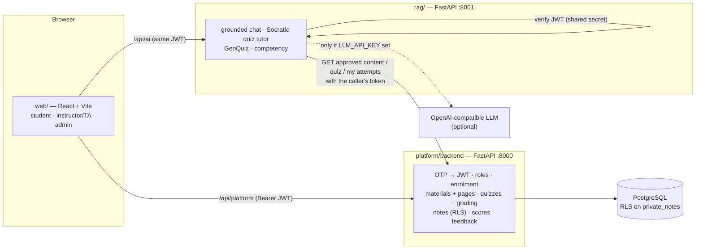

# Integration report — one product from the three Day 2 branches

**Branch:** `feature/day03` · **Date:** 16 Sep 2026 · **Editor:** aetrna300bpm (with AI assistance, reviewed by running every flow) · **Open decisions:** [OPEN_QUESTIONS.md](OPEN_QUESTIONS.md)

The Day 2 pairs each built a working piece in isolation:

| Pair | Branch | What it had | What was missing for a connected product |
|---|---|---|---|
| Platform & Access | `feature/tranvananhanhanh-platform-access-day02` | FastAPI + PostgreSQL, OTP/JWT, RLS notes, server-graded quiz engine, 29 tests | No page text for materials, no endpoint the AI could read, question types differed from the AI contract |
| AI & Quality | `feature/TinNguyenn-rag-day02` (includes `ngatt-17`) | Hybrid retrieval, grounded chat, GenQuiz (3 types), competency analysis, 23 tests | Mock tokens, fixture course ids (`course-a`), no link to real materials or quiz attempts |
| Experience & Workflows | `research/Tung205-day02` | Three separate Vite apps (student, teacher, admin) with the target quiz screen | All data hard-coded; no sign-in; no API calls |

This branch connects them into one runnable product: **one web app → Platform API → PostgreSQL**, with the **AI service** reading course content *through* the Platform.

---

## 1. Architecture

Design rules that make the pieces fit:

1. **The Platform is the only authority on access.** The AI service has no database credentials. For every course-scoped call it asks the Platform with the *caller's own token*, so enrolment (403), material approval and "answer key only after submission" are enforced once, in one place.
2. **Approved content only.** `GET /courses/{id}/materials/content` returns approved materials for every role; the AI adapter filters again (defence in depth). Seeded `DRAFT-CANARY` text proves drafts never reach answers.
3. **Private notes stay out of AI and analytics.** Notes are only read/written by their owner through the RLS table; no AI endpoint accepts or fetches them.
4. **Instructor review gate stays on the Platform.** AI-generated questions are returned to the editor, saved as a `draft` quiz with `source = ai_draft`, and only `PATCH …/status` publishes them.

### Repository layout after integration

| Path | Owner pair | Notes |
|---|---|---|
| `web/` | Experience | **New.** Single app for all roles, built from `prototypes/vin-uni` (quiz exam view, sidebar, workspace) with teacher/admin screens rebuilt on real endpoints |
| `platform/backend/`, `platform/database/` | Platform | Extended (see §3) — existing 29 tests unchanged and passing |
| `rag/` | AI & Quality | Real auth + Platform client; `mock_auth.py` removed as planned in the pair's own README |
| `scripts/smoke_e2e.py` | All | Cross-service end-to-end check |
| `prototypes/vin-uni`, `prototypes/teacher`, `prototypes/admin` | Experience | Kept unchanged as reference; candidates to retire once `web/` is accepted |

---

## 2. Run it locally

Step-by-step commands for macOS/Linux and Windows, walkthroughs for the three roles, every test suite and troubleshooting are in **[docs/RUN_AND_TEST.md](../../RUN_AND_TEST.md)**. Prerequisites: Python 3.11+, Node 22, PostgreSQL 14+; no Docker or API key needed.

Seeded accounts (dev OTP is printed on the sign-in screen; master code `000000` while `ALLOW_DEV_MASTER_OTP=true`):

| Account | Sees |
|---|---|
| `student_a@vinuni.edu.vn` | COMP2030 (Operating Systems) and **CS-AI3010**, where the quiz demo *"Bài tập 8: Kiểm tra kiến thức E-Commerce & AI"* lives |
| `student_b@vinuni.edu.vn` | COMP3010 only (used for denial checks) |
| `instructor@vinuni.edu.vn` | Manages COMP2030 and CS-AI3010 |
| `admin@vinuni.edu.vn` | All courses, members, feedback, course creation |

---

## 3. Contract changes (migration `003_integration.sql`)

| Change | Why | Compatibility |
|---|---|---|
| `material_pages(material_id, page_number, content)` | Citations need real page text; the AI reads it via the Platform | Additive |
| Material status `failed`, `page_count`, `processing_error`, `original_filename` | README lifecycle: ready/failed/retry | Additive |
| Question types `single_choice` / `multiple_choice` (select all) / `short_answer` | Aligns with the AI pair's circulated contract | Existing `multiple_choice` rows renamed to `single_choice` — **see Q3** |
| `quiz_questions.topic`, `accepted_answers`, `citation` | Competency by topic, AI keywords, "Căn cứ giáo trình" in review | Additive; hidden from students until submission |
| `quizzes.description`, `due_at` | Exam header ("Hướng Dẫn Kiểm Tra", "Hạn nộp") | Additive |
| `private_notes.material_id`, `page_number` | Notes per slide in the 3-in-1 workspace | Additive; RLS policy unchanged |
| Seed: page text for all approved materials, a Course B material, course **CS-AI3010** with the 5-question demo quiz | Runnable demo that reproduces the target quiz screen with real data | Synthetic content only |

### New / changed Platform endpoints

| Method & path | Who | Purpose |
|---|---|---|
| `GET /courses/readiness` | staff (scoped), admin (all) | Dashboard counts: students, material lifecycle, quiz review, feedback count |
| `GET /courses/{id}/materials/content` | enrolled | **AI retrieval source** — approved materials with page text |
| `GET /courses/{id}/materials/{mid}` · `/pages` · `/file` | enrolled (students: approved only, else 404) | Reader and citations |
| `POST /courses/{id}/materials/upload` | instructor/TA/admin | Multipart PDF/TXT/MD → per-page extraction → `draft` or `failed` |
| `POST /courses/{id}/materials/{mid}/reprocess` · `DELETE …/{mid}` | staff | Retry / removal |
| `PUT /courses/{id}/quizzes/{qid}` | staff | Edit a draft without attempts (review step) |
| `GET /courses/{id}/quizzes/{qid}/question-stats` | staff | Per-question correctness on first attempts (misconceptions) |
| `GET/POST /courses/{id}/notes` | owner | Optional `material_id`/`page_number` anchor, `?material_id=` filter |

### AI service endpoints

| Method & path | Who | Purpose |
|---|---|---|
| `POST /courses/{id}/chat` | enrolled | Grounded answer + citations; `generation = llm | extractive | guardrail` |
| `POST /courses/{id}/quiz-tutor` | enrolled | Socratic tutor. No `attempt_id` → **hint** mode (answer key never loaded). With `attempt_id` → **review** of the caller's own attempt |
| `POST /api/ai/courses/{id}/quizzes/{qid}/competency` | the student | Strengths/weaknesses from the graded attempt, recommending the cited pages |
| `POST /quiz/from-material` | staff | Draft questions from an approved material (503 without `LLM_API_KEY`) |
| `/quiz/from-bank`, `/quiz/from-note`, `/api/ai/gen-quiz`, `/api/ai/analyze-competency` | as before | Now on real auth; students may only analyse themselves |

---

## 4. What each role can do in `web/`

| Journey (README) | Screen | Backed by |
|---|---|---|
| Sign in with VinUni email + code | `/login` | `POST /auth/request-otp`, `/auth/verify-otp` |
| Student: open assigned course, read approved material, ask, inspect citation, save private note | Course Home → material workspace (notes · page · AI) | materials/pages, AI chat, notes (RLS) |
| Student: take published practice, formative feedback | **Quiz exam view** (target screenshot): question list, timer, one-by-one / all, Slides tab, Socratic tutor; review with explanations, citations, competency | quizzes, submit, my-attempts, AI tutor + competency |
| Student: composite review quiz | Quizzes tab / "Làm đề củng cố" | `POST …/quizzes/comprehensive` (instructor-published questions only) |
| Student: private study space | My Notes (Owner-only badge) | notes |
| Student: explicit feedback | Feedback tab (anonymous) | feedback |
| Instructor: upload, process, approve/unpublish/remove, retry | Materials | materials manage/upload/status/reprocess/delete |
| Instructor: generate draft practice, review, edit, publish | Quizzes → editor | AI from-material → Platform draft → publish |
| Instructor: results & misconceptions | Quiz results, Students | attempts, question-stats, scores |
| Admin: assign users, readiness, feedback, create course | Dashboard, Members, Feedback, Admin | readiness, enrol/unenrol, feedback, users, courses |

---

## 5. Evidence (run on 16 Sep 2026, isolated PostgreSQL 16 instance)

| Check | Result |
|---|---|
| Platform tests — original suite `tests/test_access_control.py` | **29/29 passed** before and after the changes |
| Platform tests — new `tests/test_integration_contract.py` (content filter, draft pages 404, select-all grading, answer-key hiding, draft editing gate, note anchors, upload lifecycle, readiness scoping) | **14/14 passed**; whole suite re-run twice (idempotent) |
| AI tests (`rag/tests`, `rag/test_rag.py`) — real JWTs, faked Platform, LLM mocked where used | **42/42 passed** (was 23; T04–T08 previously passed only because generation failures returned placeholder questions) |
| AI pair's `eval_benchmark.py` | Unchanged: Hit@3 100%, MRR 0.95, off-topic blocking 100% |
| `scripts/smoke_e2e.py` against live services | **25/25 checks passed** (grounded answer + citation, off-topic limitation, draft canary absent, note privacy for B/instructor/admin, cross-course denial on both services, forged token, hint does not reveal answer, server grading, review explanation with page 14 citation, competency, AI draft stays draft) |
| `web`: `tsc -b`, `eslint`, `vite build` | Clean (0 lint findings) |
| Browser walkthrough | Student sign-in with a real generated code → course list scoped to enrolment → exam view matches the target layout → hint with clickable citations → citation opens slide page 14 → submit → graded review, competency, "HỎI AI" explanation → study workspace answer saved to private note → instructor: AI generation shows the no-LLM message, validation blocks a question without a correct answer, quiz saved & published → admin readiness and members → student denied on Course B |

A bug found and fixed during the walkthrough: typing into the first blank option in the quiz editor silently marked it as the correct answer.

---

## 6. Real vs. fallback behaviour

| Area | State |
|---|---|
| Auth, roles, enrolment, RLS notes, grading, publishing gate | **Real** (PostgreSQL) |
| Material text | **Real** extraction for uploaded PDF/TXT/MD; seeded materials use synthetic page text |
| Retrieval | **Real**, in-memory hybrid BM25 + TF-IDF + RRF per request (pgvector not installed; fine for pilot-sized courses) |
| LLM answers | **Only when `LLM_API_KEY` is set.** Otherwise chat/tutor answer in *extractive* mode (sentences quoted from approved pages, labelled in the UI) and GenQuiz returns 503 — see **Q2** |
| OTP email | Console provider in dev; SendGrid/SMTP supported by the Platform pair's mailer |

---

## 7. Known gaps and next tasks

| Gap | Suggested owner | Target |
|---|---|---|
| LLM provider/key and budget (Q2) — required for "live grounded AI" at the 24 Sep demo | Mentor decision → AI pair | 18 Sep |
| Chat history is per browser session only (README asks for user-owned history) | Platform + AI | 22 Sep |
| Optional web expansion (labelled Web sources) not implemented | AI pair | after core flows |
| Quiz timer is enforced in the browser (auto-submit); no server-side attempt start/deadline | Platform pair | 22 Sep |
| `GET /quizzes/topics` shows students the lesson title of a week whose material is still a draft (title only, no content) | Platform pair | 19 Sep |
| No account creation endpoint (admin assigns existing accounts; new users via seed/SQL) | Platform pair | 20 Sep |
| CI (pytest ×2, web lint/build) and staging deployment not set up; smoke script ready to run against staging | Deployment owner | 17–19 Sep |
| Scanned PDFs fail extraction (no OCR) — shown as `failed` with retry/remove | AI pair (later list) | post-pilot |
| Retire `prototypes/vin-uni|teacher|admin` once the Experience pair accepts `web/` | Experience pair | 18 Sep |
| Answer the questions in [OPEN_QUESTIONS.md](OPEN_QUESTIONS.md), especially Q1 (leaked key) | Team + Mentor | ASAP |
