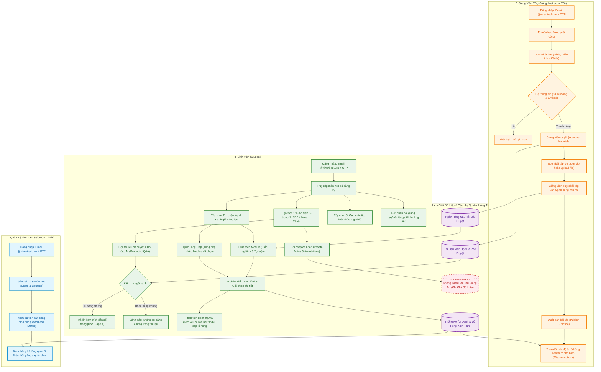
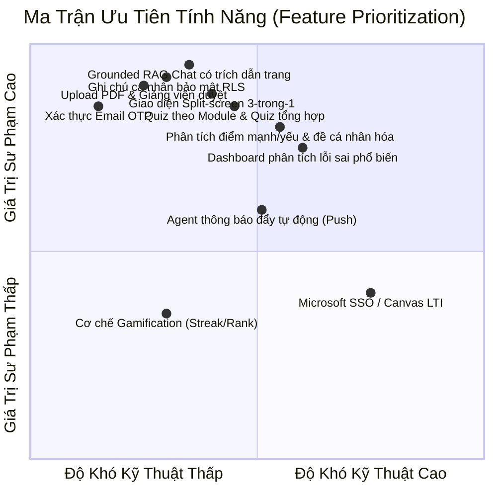
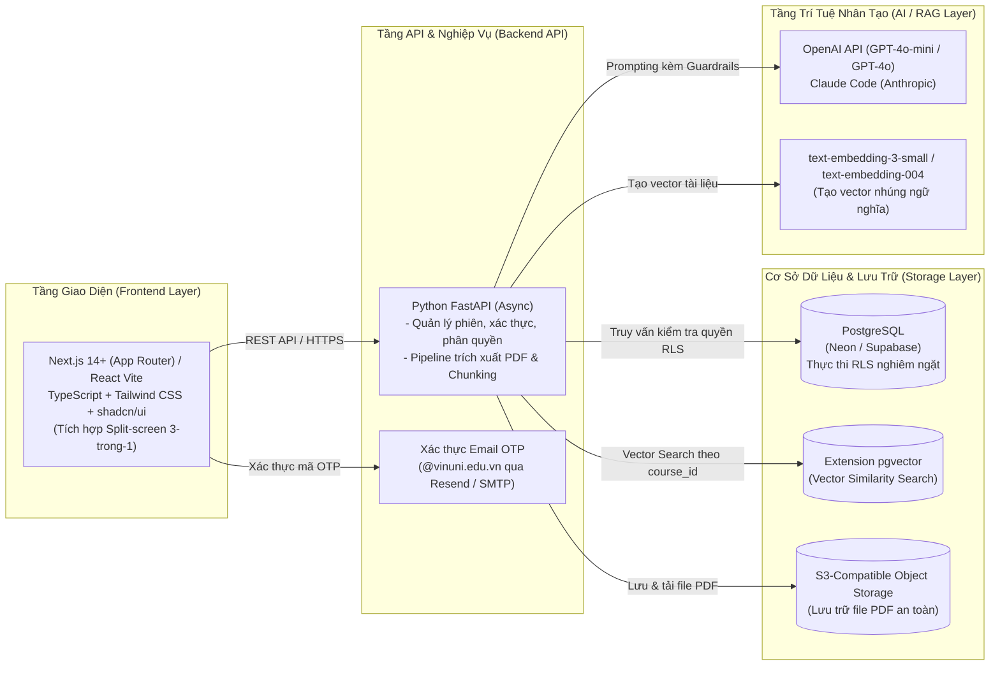

# Kế Hoạch Phát Triển Sản Phẩm Chung — CECS AI Learning Hub
**Bản Tổng Hợp Ngày 1 (Day 1 Team Synthesis)**

- **Dự án:** CECS AI Learning Hub — College of Engineering & Computer Science, VinUniversity
- **Mốc thời gian quan trọng:**
  - **24/09/2026:** Hoàn thiện và demo toàn bộ các luồng cốt lõi (Core Flows Demo).
  - **01/10/2026:** Hoàn tất kiểm thử bảo mật, quyền riêng tư và khắc phục lỗi chặn phát hành.
  - **02–04/10/2026:** Chuẩn bị dữ liệu mẫu, tổng duyệt kịch bản 3 vai trò và tài liệu hướng dẫn.
  - **05/10/2026:** Ra mắt và trình diễn chính thức (Showcase Launch) trước Hội đồng & Giảng viên.
- **Thành viên tham gia (6 thành viên):**
  - Nguyễn Thanh Tùng (`Tung205`)
  - Đỗ Quang Vinh (`aetrna300bpm`)
  - Tín Nguyễn (`TinNguyenn`)
  - Công Ngọc (`congngoc308`)
  - Tạ Thị Nga (`ngatt-17`)
  - Trần Vân Anh (`tranvananhanhanh`)

---

# 1. Sản Phẩm (Product)

## 1.1 Tầm Nhìn Sản Phẩm (Product Vision)
**CECS AI Learning Hub** là nền tảng trợ lý học tập thông minh, chuyên biệt hóa cho sinh viên và giảng viên Viện Kỹ thuật & Khoa học Máy tính (CECS) — VinUniversity.

Khác biệt hoàn toàn với các chatbot AI thương mại mở (như ChatGPT hay Claude thuần túy), hệ thống đóng vai trò như một **Gia sư Socratic 24/7 ("Tutor, Not Solver")**:
1. Mọi câu trả lời học thuật đều **bắt buộc trích dẫn chính xác từ tài liệu đã được giảng viên duyệt**, có thể nhấp chuột để nhảy thẳng tới trang tài liệu tương ứng (`[Tên tài liệu, Trang X]`).
2. Tuyệt đối **không giải bài tập hộ** mà dẫn dắt tư duy qua các bậc thang gợi ý (Scaffolded Hints) để người học tự rèn luyện khả năng giải quyết vấn đề.
3. Thiết lập không gian học tập cá nhân an toàn tuyệt đối theo nguyên tắc **"Riêng tư là riêng tư" (Private means private)**, giúp người học thoải mái thực hành, tự ghi chép và thử nghiệm mà không lo bị theo dõi hay chấm điểm.



---

## 1.2 Ba Luồng Người Dùng Trọng Tâm (Three Core User Flows)

### 1. Luồng Sinh Viên (Student Flow)
- **Đăng nhập & Điều hướng:** Sinh viên đăng nhập bằng email VinUni và mã OTP. Giao diện trang chủ hiển thị danh sách các môn học sinh viên được ghi danh (phân quyền nghiêm ngặt, tuyệt đối không truy cập được môn ngoài danh sách). Sinh viên chọn môn và chọn Module/Bài giảng muốn học.
- **Tùy chọn 1 — Học tập tương tác đa nhiệm (Split-screen 3-trong-1):**
  - Màn hình tích hợp đồng thời 3 thành phần trên cùng một không gian: **Trình đọc PDF tài liệu (bên trái) + Khung ghi chép cá nhân (ở giữa) + Cửa sổ Chat AI trợ giảng (bên phải)**.
  - Sinh viên vừa đọc slide/giáo trình, vừa highlight hoặc ghi chép ý chính, vừa hỏi đáp với AI về các khái niệm khó hiểu mà không cần chuyển qua lại giữa nhiều tab.
  - **Hỏi đáp có căn cứ (Grounded Q&A):** AI trả lời dựa trên tài liệu đã duyệt của môn học, đính kèm số trang cụ thể (`[Slide 12, Lecture 03]`). Khi sinh viên bấm vào trích dẫn, trình đọc PDF sẽ tự động nhảy đến đúng trang tài liệu. Nếu tài liệu không chứa thông tin, AI sẽ thông báo trung thực: *"Tài liệu học phần hiện không có đủ thông tin để trả lời câu hỏi này"*.
  - **Tùy chọn mở rộng Web (Web Expansion):** Cho phép sinh viên tra cứu thêm nguồn ngoài khi cần, nhưng hệ thống sẽ gắn nhãn cảnh báo đỏ rõ ràng: `[Nguồn Web - Nằm ngoài tài liệu chính khóa]`.
- **Tùy chọn 2 — Luyện tập & Đánh giá năng lực (Formative Practice):**
  - **Quiz theo Module:** Làm bài trắc nghiệm (MCQ) hoặc tự luận ngắn từ ngân hàng câu hỏi do giảng viên đã duyệt.
  - **Quiz Tổng Hợp (Composite Quiz):** Cho phép sinh viên tự tích chọn 2 hay nhiều module bài giảng bất kỳ (ví dụ: ôn tập giữa kỳ gồm Module 1, 2 và 4) để AI tổng hợp đề thi thử nghiệm tương ứng.
  - **Chấm điểm & Phân tích cá nhân hóa:** AI chấm bài ngay lập tức, đưa ra lời giải thích chi tiết có đối chiếu tài liệu. Đồng thời, hệ thống phân tích biểu đồ **Điểm mạnh / Điểm yếu (Strengths & Weaknesses)** của sinh viên và tự động gợi ý các câu hỏi luyện tập bù đắp đúng phần kiến thức còn hổng.
- **Tùy chọn 3 — Trò chơi học tập (Learning Games):**
  - Cho phép sinh viên ôn tập kiến thức thông qua những trò chơi, những hình thức giải đố ngắn, giúp ghi nhớ thuật ngữ và khái niệm một cách sinh động, giảm áp lực.
- **Kênh phản hồi (Feedback Channel):** Gửi phản hồi trực tiếp, ẩn danh về phương pháp giảng dạy hoặc khó khăn kỹ thuật qua một form độc lập gửi thẳng tới Admin CECS và Giảng viên.

### 2. Luồng Giảng Viên / Trợ Giảng (Instructor / TA Flow)
- **Đăng nhập & Quản lý học liệu:** Giảng viên đăng nhập, mở môn học phụ trách. Upload tài liệu (PDF slide bài giảng, giáo trình, đề tài). Theo dõi trạng thái trích xuất (`processing → ready / failed → retry`). Giảng viên bắt buộc phải kiểm tra và bấm **Phê duyệt (Approve)** thì tài liệu mới được đưa vào chỉ mục vector cho sinh viên học. Có thể ẩn (unpublish) hoặc xóa tài liệu bất cứ lúc nào.
- **Tạo lập & Duyệt đề bài tập (Question Bank & Practice Management):**
  - Giảng viên có thể tự soạn câu hỏi thủ công, upload file đề có sẵn, hoặc dùng tính năng **AI gợi ý đề từ tài liệu môn học** (chọn nguồn, chủ đề, độ khó theo thang Bloom, số lượng câu).
  - **Nguyên tắc "Human-in-the-loop":** Các câu hỏi do AI tạo ra sẽ nằm ở trạng thái `nháp (draft)`. Giảng viên bắt buộc phải kiểm tra, chỉnh sửa đáp án, và bấm **Duyệt vào ngân hàng câu hỏi (Approve to Bank)** thì bài tập mới được xuất bản cho sinh viên làm.
- **Bảng điều khiển sư phạm (Instructor Learning Insights):**
  - Theo dõi tiến độ tương tác: tỉ lệ sinh viên làm bài ở từng bài quiz, số lượt truy cập tài liệu.
  - **Bản đồ quan niệm sai lầm (Misconception Heatmap):** Nhóm các lỗi sai phổ biến từ các bài làm trắc nghiệm/tự luận của cả lớp (ví dụ: *68% sinh viên nhầm lẫn giữa Dijkstra và Bellman-Ford khi có trọng số âm*) để giảng viên kịp thời điều chỉnh bài giảng trên lớp.

### 3. Luồng Quản Trị Viên CECS (CECS Admin Flow)
- **Quản lý người dùng & Gán quyền:** Tạo môn học, gán giảng viên/trợ giảng phụ trách và import danh sách sinh viên vào đúng môn học.
- **Giám sát tính sẵn sàng (Course Readiness Oversight):** Theo dõi tiến độ chuẩn bị của từng môn trước thềm học kỳ: môn nào đã upload đủ tài liệu, môn nào đã duyệt câu hỏi thi thử, môn nào chưa sẵn sàng.
- **Thống kê vĩ mô toàn viện & Tiếp nhận phản hồi:** Xem báo cáo tương tác tổng quan cấp Viện, tiếp nhận ý kiến đóng góp của sinh viên để nâng cao chất lượng đào tạo.
- **Tuyệt đối không xâm phạm:** Quản trị viên chỉ xem báo cáo số liệu tổng hợp, **không bao giờ có quyền mở hay đọc ghi chép riêng tư của sinh viên**.

---

## 1.3 Ranh Giới Ghi Chú Riêng Tư — "Riêng Tư Là Riêng Tư" (Private Means Private)

Quyền riêng tư là nguyên tắc kiến trúc bất khả xâm phạm của dự án. Ghi chép của sinh viên phản ánh những băn khoăn, sai sót và quá trình tư duy cá nhân; nếu sinh viên lo sợ bị giảng viên hay nhà trường đánh giá, họ sẽ không dám sử dụng hệ thống.

| Tiêu chí | Ghi chú cá nhân của sinh viên (Private Notes) | Tài liệu môn học (Course Materials) | Phản hồi đóng góp (Submitted Feedback) | Bảng điều khiển phân tích (Dashboards & Analytics) |
| :--- | :--- | :--- | :--- | :--- |
| **Bản chất dữ liệu** | Ghi chú cá nhân, highlight, câu hỏi tự suy ngẫm do sinh viên tạo. | Slide bài giảng, giáo trình, đề tài do giảng viên upload. | Ý kiến đóng góp có chủ đích của sinh viên gửi tới nhà trường. | Chỉ số tổng hợp: tỉ lệ hoàn thành, chủ đề khó, lỗi sai phổ biến. |
| **Quyền truy cập** | **Duy nhất sinh viên tạo ra ghi chú (Owner-only).** | Giảng viên, TA và toàn bộ sinh viên trong môn học đó. | Giảng viên và Quản trị viên CECS. | Giảng viên (xem lớp mình) & Admin CECS (xem toàn viện). |
| **Đưa vào AI Retrieval?** | **TUYỆT ĐỐI KHÔNG** đưa vào RAG chung của môn học.<br>*(Chỉ phục vụ AI cá nhân nếu sinh viên yêu cầu)* | **CÓ**, chỉ sau khi giảng viên đã bấm Phê duyệt (Approve). | **KHÔNG**, lưu trữ độc lập tại hòm thư phản hồi. | **KHÔNG**, chỉ chứa số liệu thống kê. |
| **Hiển thị trên Logs/Dashboard?** | **NGHIÊM CẤM**. Bị chặn hoàn toàn khỏi dashboard, exports và server logs thông thường. | Hiển thị trạng thái (đang xử lý, sẵn sàng, đã duyệt). | Hiển thị trong trang quản trị phản hồi. | Hiển thị biểu đồ xu hướng ẩn danh, không chứa danh tính hay nội dung note. |
| **Cơ chế bảo vệ kỹ thuật** | Thực thi tại tầng database qua **Row-Level Security (RLS)**: `WHERE user_id = auth.uid()`. | Phân quyền theo vai trò (RBAC) và kiểm tra khóa ngoại `course_id`. | Phân quyền Admin/Instructor, có tùy chọn ẩn danh người gửi. | Hàm tính toán tổng hợp (Aggregation queries) không join bảng ghi chú cá nhân. |

---

# 2. Phạm Vi Triển Khai (Scope)

## 2.1 Bản Demo Cốt Lõi (Core Pilot — 24/09 & 05/10) so với Danh Sách Lùi Lại (Later List)

Để bảo đảm thời hạn **Demo luồng hoàn chỉnh vào 24/09** và **Ra mắt chính thức vào 05/10/2026** cho 1–4 môn học thử nghiệm tại CECS, phạm vi tính năng được phân định rõ ràng:



### Bảng Phân Định Phạm Vi Chi Tiết:

| Khu vực chức năng | Bản Demo cốt lõi (Phải chạy thật trước 24/09 & Launch 05/10) | Danh sách lùi lại sau Pilot (Later List — Post-Pilot) |
| :--- | :--- | :--- |
| **Xác thực & Phân quyền** | • Đăng nhập bằng Email OTP qua đuôi `@vinuni.edu.vn`.<br>• Phân quyền 3 vai trò (Student, Instructor, Admin) thực thi ở phía server.<br>• Phân chia phạm vi truy cập môn học nghiêm ngặt. | • Đăng nhập một lần Microsoft Azure SSO.<br>• Tự động đồng bộ danh sách lớp học từ Canvas LMS.<br>• Phân quyền trợ giảng nâng cao theo nhóm bài tập. |
| **Quản lý tài liệu** | • Hỗ trợ định dạng PDF (slide bài giảng, tài liệu đọc).<br>• Vòng đời tài liệu: Tải lên → Xử lý tách đoạn/vector hóa → Giảng viên Duyệt / Bỏ duyệt / Xóa. | • Hỗ trợ video/audio bài giảng và chuyển giọng nói thành văn bản.<br>• Đọc công thức toán phức tạp trong ảnh quét tay.<br>• Cho phép sinh viên upload tài liệu riêng lên hệ thống. |
| **Hỏi đáp AI (Grounded Chat)** | • Trả lời có căn cứ tuyệt đối từ tài liệu đã duyệt.<br>• Trích dẫn kiểm chứng được (Tên file, Số trang) có khả năng bấm nhảy trang.<br>• Thông báo từ chối trung thực khi tài liệu không đủ dữ kiện.<br>• Lịch sử chat thuộc quyền sở hữu riêng của sinh viên. | • Mở rộng tìm kiếm Web đa nguồn tự động.<br>• Voice Chat (nói chuyện trực tiếp với trợ lý ảo).<br>• Chia sẻ phiên chat công khai giữa các sinh viên. |
| **Không gian học tập & Ghi chú** | • Giao diện 3-trong-1 (PDF Reader + Note Editor + Chat AI).<br>• CRUD ghi chú cá nhân (Tạo, Đọc, Sửa, Xóa).<br>• Cách ly dữ liệu ở tầng cơ sở dữ liệu (RLS), loại khỏi RAG chung. | • Flashcard thông minh lặp lại ngắt quãng (Spaced Repetition/Anki).<br>• Vẽ sơ đồ tư duy (Mindmap) 3D tương tác đa chiều.<br>• Chia sẻ ghi chú nhóm (Collaborative study space). |
| **Bài tập & Khảo thí** | • Giảng viên tạo đề từ AI/upload → Bắt buộc duyệt câu hỏi vào ngân hàng.<br>• Sinh viên làm Quiz theo Module và **Quiz Tổng Hợp** (ghép nhiều module).<br>• AI giải thích cặn kẽ đáp án đúng/sai có dẫn chứng tài liệu.<br>• Phân tích điểm mạnh/yếu và tạo câu hỏi bổ khuyết lỗ hổng. | • **Cơ chế Điểm số (Score), Chuỗi học tập (Streak), Bảng xếp hạng (Leaderboard/Rank)** (để tránh biến tướng học vẹt).<br>• Chấm điểm bài thi chính thức có tính vào học bạ.<br>• Chạy code trực tiếp trong trình duyệt (Code runner). |
| **Agent thông báo & Thống kê** | • Dashboard tổng hợp: mức độ tích cực, tỉ lệ nộp bài, các chủ đề sinh viên hay sai sót nhất.<br>• Kênh tiếp nhận phản hồi đóng góp độc lập. | • **Agent chủ động gửi thông báo đẩy (Push Notifications / Daily Summary)**.<br>• Dự báo sớm sinh viên có nguy cơ trượt môn bằng Machine Learning.<br>• Báo cáo phân tích chuyên sâu cho Ban Giám hiệu. |

---

## 2.2 Ba Bài Học Đắt Giá Từ Nghiên Cứu Các Đại Học Tiên Tiến

Từ các bài nghiên cứu cá nhân đối chiếu với mô hình AI tại Harvard, MIT, Stanford, UMich, Purdue, Tsinghua và CMU, nhóm đúc kết 3 bài học nền tảng áp dụng trực tiếp cho CECS:

1. **Triết lý "Gia sư gợi mở, không giải bài hộ" (Tutor, Not Solver — Harvard CS50 & Purdue PeteChat):**
   - *Thực tiễn quốc tế:* CS50 Duck (Harvard) và PeteChat (Purdue) chứng minh rằng nếu AI đưa ngay lời giải hoàn chỉnh, năng lực tư duy phản biện và kỹ năng gỡ lỗi của sinh viên sẽ suy giảm nghiêm trọng. Hệ thống tại Harvard áp dụng cơ chế hướng dẫn Socratic từng bước và giới hạn lượt hỏi để buộc sinh viên phải tự suy nghĩ.
   - *Áp dụng tại CECS:* Xây dựng bộ System Prompt nghiêm ngặt cấm AI viết sẵn code hay giải trọn vẹn bài tập; thay vào đó, AI chia nhỏ vấn đề thành bậc thang gợi ý (Scaffolded Hint Ladder): Gợi ý khái niệm cốt lõi $\rightarrow$ Gợi ý giải thuật/mã giả $\rightarrow$ Đặt câu hỏi truy vấn lỗi sai.
2. **Kỷ luật dữ liệu & RAG cô lập nghiêm ngặt theo môn học (Course-Isolated RAG — UMich Maizey & PKU Xiaobei Zhixue):**
   - *Thực tiễn quốc tế:* Hệ thống Maizey (Đại học Michigan) và Tiểu Bắc Trí Học (Đại học Bắc Kinh) phục vụ hàng trăm môn học bằng cách cô lập hoàn toàn cơ sở tri thức theo từng lớp. Câu trả lời bắt buộc phải trích xuất từ tài liệu do chính giảng viên môn đó thẩm định, đính kèm số trang cụ thể để loại bỏ ảo giác (hallucination).
   - *Áp dụng tại CECS:* Mỗi tài liệu sau khi upload phải được chunking kèm metadata số trang (`page_number`, `document_id`, `course_id`). Chỉ những đoạn văn bản có cờ `approved = true` mới được đưa vào vector search; câu trả lời của AI luôn gắn kèm trích dẫn có thể nhấp chuột để mở đúng trang PDF.
3. **Giữ giảng viên trong vòng lặp kiểm duyệt (Human-in-the-Loop Practice — Stanford Code-in-Place & CMU):**
   - *Thực tiễn quốc tế:* Nghiên cứu từ Stanford Code-in-Place chỉ ra rằng đề thi và bài tập do AI tạo ra chỉ đạt độ tin cậy sư phạm cao khi có sự rà soát của giảng viên (Human-in-the-loop). Việc tự động xuất bản đề mà không kiểm duyệt dễ dẫn tới câu hỏi lệch chuẩn kiến thức hoặc đánh đố vô nghĩa.
   - *Áp dụng tại CECS:* Toàn bộ câu hỏi thi thử do AI gợi ý đều ở trạng thái nháp. Giảng viên phải xem qua, chỉnh sửa và bấm "Duyệt vào ngân hàng" thì sinh viên mới có thể tiếp cận. Đồng thời, hệ thống thu thập kết quả làm bài để tổng hợp thành bản đồ quan niệm sai lầm (Misconceptions) giúp giảng viên nắm bắt tình hình học tập của lớp.

---

# 3. Đề Xuất Công Nghệ (Tech Stack Proposal)

Nhóm thống nhất đề xuất kiến trúc tinh gọn, ưu tiên **tốc độ phát triển, độ ổn định thực chiến, chi phí thấp (<$50/tháng)** và **khả năng thực thi bảo mật cấp cơ sở dữ liệu**:



## 3.1 Chi Tiết Các Tầng Công Nghệ & Phương Án Dự Phòng (Fallback)

| Thành phần | Hướng đề xuất chính (Preferred) | Phương án dự phòng (Fallback) | Lý do lựa chọn & Đánh giá rủi ro |
| :--- | :--- | :--- | :--- |
| **Frontend** | **Next.js 14+ (App Router) + TypeScript + Tailwind CSS** | React (Vite) + Tailwind CSS | Next.js hỗ trợ server component, SEO và quản lý route tốt cho ứng dụng phân quyền; hỗ trợ dựng giao diện 3-trong-1 mượt mà. Fallback sang Vite nếu nhóm muốn đơn giản hóa tối đa việc render client-side. |
| **Backend** | **Python FastAPI** | Node.js (Express / NestJS) | FastAPI chạy async hiệu năng cao, tài liệu Swagger tự động; quan trọng nhất là tận dụng tối đa hệ sinh thái AI/Data của Python (PyMuPDF, LangChain, RAGAS) để xử lý file PDF và trích xuất số trang. |
| **Database & Vector** | **PostgreSQL tích hợp extension `pgvector`** | Supabase Database / Neon PostgreSQL | Duy trì một cơ sở dữ liệu duy nhất cho cả quan hệ người dùng, phân quyền môn học và tìm kiếm vector; giảm thiểu độ phức tạp vận hành. Hỗ trợ **Row-Level Security (RLS)** để khóa cứng ghi chú riêng tư. |
| **Lưu trữ file (Storage)** | **Supabase Storage / S3-compatible Object Storage** | Lưu trữ cục bộ bảo vệ trên VPS / Volume mount | Lưu trữ các file PDF gốc của môn học tách biệt khỏi cơ sở dữ liệu; cấp quyền đọc thông qua pre-signed URL an toàn. |
| **Xác thực (Auth)** | **Passwordless Email OTP (tên miền `@vinuni.edu.vn`)** | JWT Mock OTP trong môi trường nội bộ | Gửi mã 6 chữ số qua email trường; không phụ thuộc vào thủ tục phê duyệt phức tạp của Microsoft Azure AD SSO, bảo đảm triển khai nhanh cho pilot. |
| **AI & Retrieval** | **OpenAI API (GPT-4o-mini / GPT-4o) + Claude Code** | Azure OpenAI / Endpoint tương thích OpenAI | Tốc độ phản hồi nhanh (<2s), năng lực suy luận sư phạm xuất sắc để đưa ra gợi ý Socratic; chi phí thấp ở quy mô pilot. |
| **Hosting & CI/CD** | **Frontend trên Vercel + Backend trên Railway / VPS Docker + GitHub Actions** | Docker Compose toàn bộ trên 1 máy chủ VPS | Tự động hóa kiểm thử (CI) trên GitHub Actions mỗi khi tạo PR; Vercel và Railway cho phép triển khai môi trường Staging trong vòng vài phút mà không tốn công cấu hình server. |

---

# 4. Kế Hoạch Bàn Giao & Phân Công Trách Nhiệm (Delivery Plan)

Toàn bộ dự án tuân thủ nghiêm ngặt tiến độ:
- **Tuần 1 (11–17/09):** Thiết lập nền tảng, cơ sở dữ liệu, phân quyền và kết nối luồng chạy thử đầu tiên (Day 2).
- **Tuần 2 (18–24/09):** Hoàn thiện và tích hợp toàn bộ các luồng cốt lõi (**Hạn chót Demo: 24/09/2026**).
- **Tuần 3 (25/09–01/10):** Kiểm thử bảo mật RLS, thử nghiệm người dùng thật và sửa triệt để các lỗi chặn phát hành.
- **Tuần Chuẩn bị (02–04/10):** Dựng dữ liệu mẫu được duyệt, tổng duyệt kịch bản 3 vai trò và viết tài liệu hỗ trợ.
- **Ngày Ra Mắt (05/10/2026):** Trình diễn chính thức sản phẩm hoàn chỉnh trước Hội đồng Viện và Giảng viên.

## 4.1 Bảng Phân Công Tính Năng Cốt Lõi (Feature Ownership Table)

| Tính năng cốt lõi | Người phụ trách chính (Owner) | Người phối hợp (Reviewer) | Đầu ra kiểm chứng (Expected Demo) | Phụ thuộc (Dependencies) | Hạn hoàn thành |
| :--- | :--- | :--- | :--- | :--- | :--- |

---

# 5. Kế Hoạch Triển Khai Ngày 2 (Day 2 Plan)

Mục tiêu tối thượng của Ngày 2 là **kết nối thành công một luồng hoạt động hoàn chỉnh từ đầu đến cuối (One Connected Working Flow)**, phá bỏ rào cản tài liệu trên giấy và chuyển dịch sang code thực thi.

```
Kịch bản thử nghiệm tích hợp Ngày 2 (Minimum Integrated Scenario):
1. Admin gán Giảng viên A và Sinh viên A vào Môn A, Sinh viên B vào Môn B.
2. Môn A có 1 tài liệu đã duyệt và 1 tài liệu nháp.
3. Sinh viên A mở tài liệu đã duyệt của Môn A -> Hỏi AI -> Nhận câu trả lời kèm trích dẫn số trang hợp lệ -> Tạo và lưu một Ghi chú cá nhân.
4. Sinh viên A làm quiz và nhận thông báo kết quả kèm phân tích năng lực, hỏi về Quiz đó.
5. Hệ thống kiểm chứng xác nhận:
   - Sinh viên A truy cập Môn B -> BỊ TỪ CHỐI (Access Denied).
   - Sinh viên B, Giảng viên A và Admin cố tình đọc Ghi chú của Sinh viên A -> BỊ TỪ CHỐI Ở TẦNG DATABASE (RLS Denied).
```

## 5.1 Phân Chia 3 Cặp Lập Trình (Three Pairs)

### Cặp 1: Giao Diện & Quy Trình (Workflow + Frontend)
- **Thành viên:** **Công Ngọc (`congngoc308`) + Nguyễn Thanh Tùng (`Tung205`)**
- **Nhiệm vụ Ngày 2:**
  - Thiết lập dự án Frontend (Next.js / Vite + Tailwind CSS + shadcn/ui).
  - Xây dựng màn hình học tập của 3 vai trò: Sinh viên (Workspace 3-trong-1), Giảng viên (quản lý học liệu) và Admin (tổng quan môn học).
  - Xử lý các trạng thái: Đang tải (Loading), Lỗi truy vấn (Error), và Bị từ chối quyền truy cập (Access Denied).
  - Soạn thảo kịch bản kiểm thử trải nghiệm người dùng và chuẩn bị bộ câu hỏi test mẫu cho các luồng.

### Cặp 2: Nền Tảng, Cơ Sở Dữ Liệu & Phân Quyền (Platform & Access)
- **Thành viên:** **Đỗ Quang Vinh (`aetrna300bpm`) + Trần Vân Anh (`tranvananhanhanh`)**
- **Nhiệm vụ Ngày 2:**
  - Định nghĩa thống nhất bản quy ước dữ liệu dùng chung (Shared Contracts): quy tắc đặt ID (`user_id`, `course_id`, `material_id`), máy trạng thái tài liệu (`uploading → processing → ready → approved → unpublished`).
  - Viết script tạo dữ liệu mẫu (Seed Fixtures) cho kịch bản Day 2 (Admin, Giảng viên A, Sinh viên A, Sinh viên B, Môn A, Môn B).
  - Khởi tạo cơ sở dữ liệu PostgreSQL, thiết lập bảng `private_notes` và viết chính sách **Row-Level Security (RLS)**.
  - Viết unit test tự động chứng minh: truy vấn của User B vào note của User A sẽ trả về rỗng hoặc lỗi 403.

### Cặp 3: AI, Pipeline Trích Xuất & Chất Lượng RAG (AI & Quality)
- **Thành viên:** **Tạ Thị Nga (`ngatt-17`) + Tín Nguyễn (`TinNguyenn`)**
- **Nhiệm vụ Ngày 2:**
  - Xây dựng pipeline đọc file PDF mẫu, băm đoạn văn bản (chunking) kèm siêu dữ liệu số trang (`page_number`).
  - Tạo vector embedding (`text-embedding-3-small` / `text-embedding-004`) và lưu trữ vào PostgreSQL extension `pgvector`.
  - Viết endpoint `POST /api/chat` kết nối OpenAI API (GPT-4o-mini), áp dụng System Prompt "Tutor, Not Solver": trả về câu trả lời kèm trích dẫn `[Tên file, Trang X]` hoặc câu từ chối khi tài liệu không có thông tin.
  - Đảm bảo câu lệnh truy vấn RAG có điều kiện lọc bắt buộc: `WHERE course_id = :current_course AND status = 'approved'`.

---

# 6. Các Quyết Định Cần Mentor Phê Duyệt (Decisions Needed)

Để toàn đội triển khai thông suốt mà không gặp tắc nghẽn, nhóm đề xuất Mentor hỗ trợ phê duyệt các điểm sau:

| Vấn đề cần quyết định | Các phương án xem xét | Đề xuất lựa chọn của nhóm | Hạn chót cần chốt |
| :--- | :--- | :--- | :--- |
| **1. Quota & Ngân sách API AI** | Phương án A: Dùng OpenAI Key và Claude Code.<br>Phương án B: Dùng Azure OpenAI của VinUni. | **Chọn Phương án A (OpenAI API + Claude Code)** để tự chủ tiến độ phát triển ngay từ Day 2. | **16/09/2026** (12:00) |
| **2. Phương thức gửi Email OTP thật** | Phương án A: Dùng dịch vụ Resend API gửi mã 6 số về `@vinuni.edu.vn`.<br>Phương án B: Dùng SMTP nội bộ VinUni hoặc Mock OTP trong tuần 1. | **Chọn Phương án A (Resend API)** (gói miễn phí 3,000 email/tháng, đủ cho toàn bộ pilot). | **17/09/2026** |
| **3. Môn học và Tài liệu Pilot thực tế** | Cần 1–4 môn học thực tế thuộc CECS để lấy slide bài giảng và đề thi làm dữ liệu kiểm thử. | Xin phê duyệt từ Mentor cung cấp 1 bộ slide bài giảng chuẩn (ví dụ: môn Cấu trúc dữ liệu & Giải thuật hoặc Lập trình Python). | **18/09/2026** |

---

# 7. Bảng Tổng Hợp Đóng Góp Của Từng Thành Viên (Contributions)

| Thành viên | Vai trò chính | Đóng góp cốt lõi vào kế hoạch chung |
| :--- | :--- | :--- |

---
