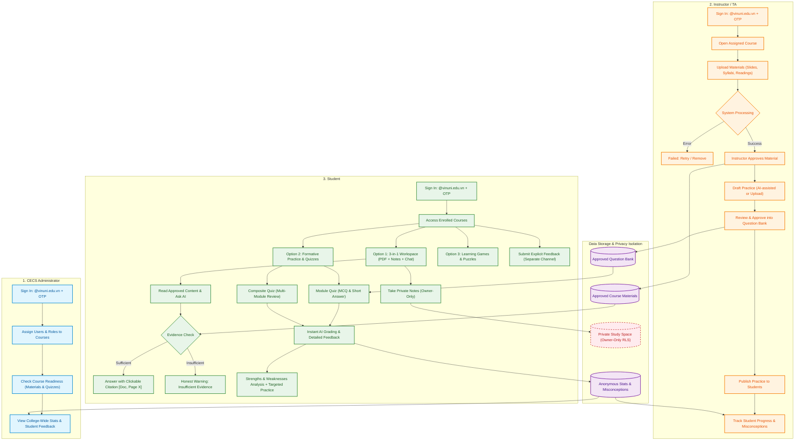
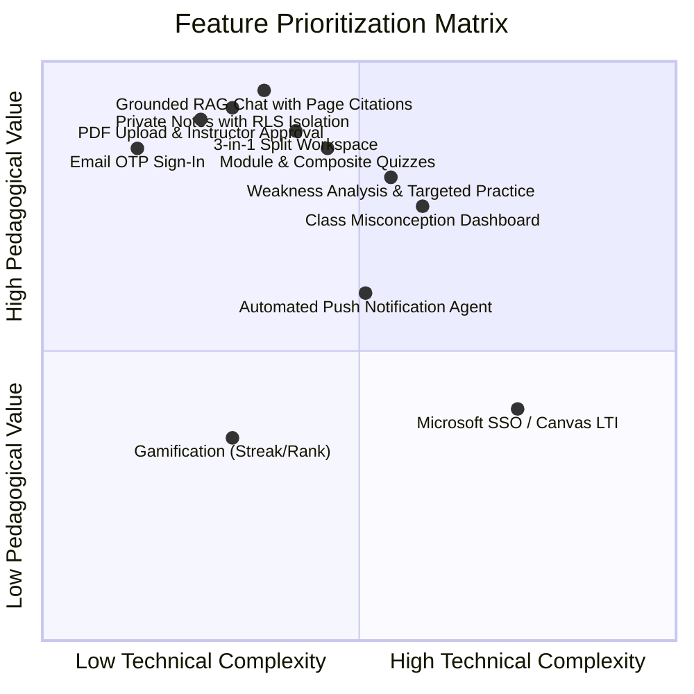
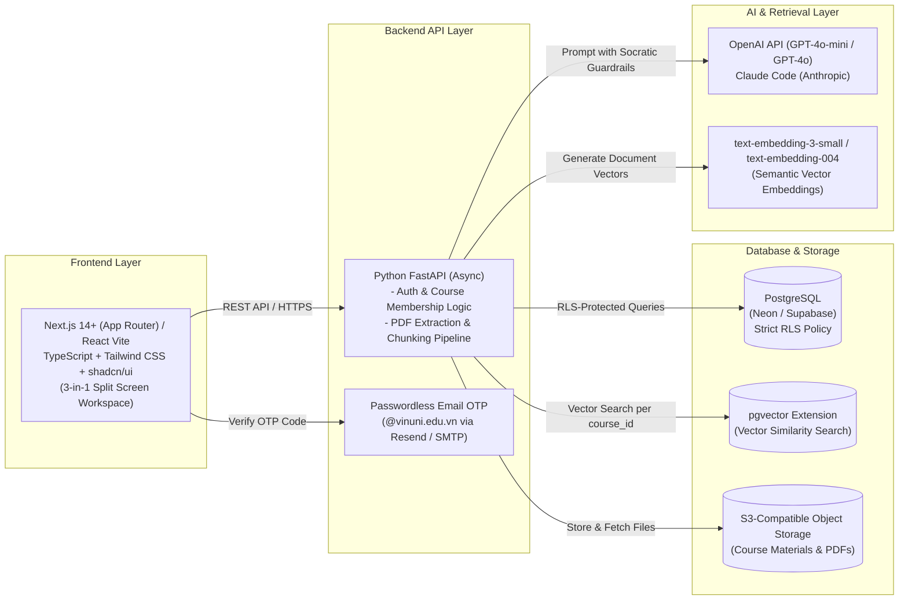

# Joint Product Delivery Plan — CECS AI Learning Hub
**Day 1 Team Synthesis**

- **Project:** CECS AI Learning Hub — College of Engineering & Computer Science, VinUniversity
- **Key Milestones:**
  - **24 September 2026:** Complete and demonstrate all core user flows (Week 2 Demo).
  - **01 October 2026:** Finish security, privacy, and user testing; resolve all release blockers.
  - **02–04 October 2026:** Prepare approved sample data, rehearse all three user journeys, and finalize support guides.
  - **05 October 2026:** Official launch and live showcase to college leaders and faculty.
- **Team Members (6 members):**
  - Nguyen Thanh Tung (`Tung205`)
  - Do Quang Vinh (`aetrna300bpm`)
  - Tin Nguyen (`TinNguyenn`)
  - Cong Ngoc (`congngoc308`)
  - Ta Thi Nga (`ngatt-17`)
  - Tran Van Anh (`tranvananhanhanh`)

---

# 1. Product

## 1.1 Product Vision
The **CECS AI Learning Hub** is a specialized, course-grounded study companion designed specifically for students and instructors at VinUniversity's College of Engineering and Computer Science (CECS). 

Unlike generic public chatbots (like plain ChatGPT or Claude), our platform acts as a **24/7 Socratic Tutor ("Tutor, Not Solver")**:
1. Every answer is **strictly grounded in instructor-approved course materials**, complete with exact, clickable page citations (`[Document, Page X]`).
2. The AI **never gives away direct homework solutions**. Instead, it guides students step-by-step using scaffolded hints to build independent problem-solving skills.
3. It guarantees an uncompromising privacy boundary: **"Private means private"**. Students have a safe personal study space to make mistakes, write notes, and explore concepts without fear of surveillance or academic grading.



---

## 1.2 Three Core User Flows

### 1. Student Flow
- **Sign In & Navigation:** Students sign in using their VinUni email and an OTP code. The dashboard only displays courses they are officially enrolled in (cross-course access is strictly blocked on the server). Students pick a course and choose a lecture module.
- **Option 1 — 3-in-1 Interactive Workspace:**
  - A clean split-screen setup combining three tools in one place: **PDF Slide Reader (left) + Private Notes Editor (center) + AI Chat Assistant (right)**.
  - Students can read slides, highlight key terms, take private notes, and ask the AI questions simultaneously without switching tabs.
  - **Grounded Q&A:** The AI answers only using approved course documents, citing exact sources and page numbers (`[Slide 12, Lecture 03]`). Clicking a citation immediately scrolls the PDF reader to that exact page. If the lecture slides lack the necessary information, the AI states honestly: *"The approved course materials do not have enough evidence to answer this question."*
  - **Optional Web Expansion:** When enabled, students can broaden their search to the open web. However, web answers are highlighted with a prominent label: `[Web Source - Outside Official Course Content]`.
- **Option 2 — Formative Practice & Self-Assessment:**
  - **Module Quiz:** Practice multiple-choice (MCQ) and short-answer questions from the instructor-approved question bank.
  - **Composite Quiz (Multi-Module):** Students can select two or more modules (e.g., Modules 1, 2, and 4 before a midterm) to generate a custom synthetic review quiz.
  - **Instant Feedback & Gap Analysis:** The AI grades answers instantly with explanations linked back to lecture slides. It updates a personal **Strengths & Weaknesses** chart and suggests targeted follow-up questions to close those gaps.
- **Option 3 — Learning Games:**
  - Interactive puzzles and mini-games to help students reinforce technical vocabulary and core concepts in an engaging, low-stress format.
- **Feedback Channel:** A dedicated form to submit constructive feedback on teaching or the platform directly to CECS admins and instructors.

### 2. Instructor / TA Flow
- **Material Management:** Instructors sign in, select their course, and upload slides, syllabi, or readings. They watch the processing pipeline (`processing → ready / failed → retry`). Crucially, materials remain invisible to students until the instructor reviews and clicks **Approve**. Materials can be unpublished or removed at any time.
- **Question Bank & Practice Curation (Human-in-the-Loop):**
  - Instructors can create questions manually, upload existing quiz files, or let AI generate draft questions based on approved slides.
  - AI-generated questions are created in `draft` status. Instructors must review, edit, and click **Approve to Bank** before questions can be published to students.
- **Teaching Insights:**
  - Track quiz completion rates and lecture engagement.
  - **Misconception Heatmap:** View aggregated, anonymized friction points (e.g., *"68% of students struggled with pointer arithmetic in Quiz 2"*), allowing instructors to address common stumbling blocks in the next live lecture.

### 3. CECS Administrator Flow
- **User & Course Management:** Set up course shells, assign instructors/TAs, and enroll student rosters with server-side permission checks.
- **Course Readiness Oversight:** Monitor which courses have uploaded sufficient slides, processed embeddings, and approved practice questions before the semester starts.
- **Macro Analytics & Feedback:** Review college-wide adoption metrics and read intentionally submitted student feedback to guide academic improvements.
- **Strict Boundary:** Admins can view aggregate metrics only. They **never have access to individual student notes**.

---

## 1.3 Data Boundaries — "Private Means Private"

Student privacy is a core architectural requirement. Private study notes contain students' raw thoughts, uncertainties, and mistakes; they must never be exposed to instructors, administrators, or peers.

| Data Type | Private Student Notes | Approved Course Materials | Submitted Feedback | Dashboards & Analytics |
| :--- | :--- | :--- | :--- | :--- |
| **What is it?** | Personal annotations, highlights, self-questions, and reflections. | Syllabi, slides, textbooks, and practice sets uploaded by faculty. | Direct comments and suggestions submitted by students. | Aggregated stats: completion rates, difficult topics, common mistakes. |
| **Who can see it?** | **Only the student who created it (Owner-only).** | Instructors, TAs, and enrolled students in that specific course. | Assigned instructors and CECS administrators. | Instructors (their own courses) & Admins (college-wide). |
| **Included in AI Retrieval?** | **NEVER** in shared class RAG.<br>*(Only used in private study space if requested by the student)* | **YES**, but only after instructor approval (`approved = true`). | **NO**, stored in a separate feedback table. | **NO**, dashboards query aggregated summary stats only. |
| **Visible in Logs/Dashboards?** | **NEVER**. Filtered out from ordinary server logs, exports, and dashboards. | File statuses are visible (processing, ready, approved). | Visible in administrative feedback inboxes. | Anonymous trends only; zero personal notes or identities. |
| **Technical Protection** | Enforced at the database level via **Row-Level Security (RLS)**: `WHERE user_id = auth.uid()`. | Role-Based Access Control (RBAC) + foreign key `course_id`. | RBAC permissions with optional anonymity. | Aggregation queries that never join with the `private_notes` table. |

---

# 2. Scope

## 2.1 Core Pilot (24 Sep & 05 Oct) vs. Later List

To guarantee a reliable demo on **24 September 2026** and a successful public launch on **05 October 2026** across 1–4 CECS courses, we have strictly prioritized our roadmap:



### Scope Breakdown:

| Functional Area | Core Pilot (Must work by 24 Sep & Launch 05 Oct) | Later List (Post-Pilot Roadmap) |
| :--- | :--- | :--- |
| **Identity & Access** | • Email OTP sign-in for `@vinuni.edu.vn` addresses.<br>• Server-enforced roles (Student, Instructor, Admin).<br>• Strict course enrollment boundaries. | • Microsoft Azure AD SSO integration.<br>• Automatic student roster sync via Canvas LMS API.<br>• Granular TA permissions per assignment. |
| **Course Materials** | • PDF slide and document upload.<br>• Lifecycle: Upload → Extract & Embed → Approve / Unpublish / Remove. | • Video/audio lecture transcription.<br>• OCR for handwritten notes and complex math formulas.<br>• Student personal file uploads. |
| **Grounded AI Chat** | • Answers strictly grounded in approved course slides.<br>• Clickable, verified citations (`[Doc, Page X]`) with page jumping.<br>• Clear fallback warning when evidence is missing.<br>• User-owned chat history. | • Open web search expansion across external search engines.<br>• Voice chat interface.<br>• Public peer-to-peer chat sharing. |
| **Study Space & Notes** | • 3-in-1 split view (PDF Reader + Note Editor + AI Chat).<br>• CRUD for private notes (Create, Read, Update, Delete).<br>• Database-level RLS isolation; excluded from shared RAG. | • Spaced-repetition flashcards (Leitner / Anki system).<br>• Interactive 3D concept mindmaps.<br>• Collaborative group notes. |
| **Quizzes & Practice** | • AI draft generation $\rightarrow$ Mandatory instructor approval into question bank.<br>• Module Quizzes + Composite Quizzes (multi-module selection).<br>• Instant grading with detailed explanations citing course slides.<br>• Strengths & weaknesses breakdown with gap-filling practice. | • **Gamification mechanics (Streak counter, Score leaderboards, Global ranks)**.<br>• Formal exam grading contributing to official course grades.<br>• In-browser live code execution sandbox. |
| **Notifications & Insights** | • Instructor dashboard: completion rates, top student misconceptions.<br>• Separate feedback submission channel. | • **Proactive Notification Agent (Daily summary push notifications)**.<br>• Early-warning machine learning model for at-risk students.<br>• Executive reporting exports for university leadership. |

---

## 2.2 Three Practical Lessons from University Research

Our individual research into leading AI learning tools (Harvard, MIT, Stanford, UMich, Purdue, CMU, and Tsinghua) yielded three core design principles for CECS:

1. **"Tutor, Not Solver" Guidance (Harvard CS50 & Purdue PeteChat):**
   - *Finding:* Handing out complete solutions hurts critical thinking and debugging ability. Harvard’s CS50 Duck and Purdue’s PeteChat restrict AI responses to Socratic hints and guiding questions.
   - *Application:* We enforce strict system prompt guardrails that decline to output complete homework code. The AI instead provides a 3-tier hint ladder: Conceptual guidance $\rightarrow$ Algorithmic pseudocode $\rightarrow$ Targeted debugging questions.
2. **Strict Course-Isolated RAG (UMich Maizey & PKU Xiaobei Zhixue):**
   - *Finding:* University-wide AI tools succeed only when answers come from verified, course-specific documents. Generic AI answers often contradict course syllabi or exam standards.
   - *Application:* Documents are chunked with explicit page-level metadata (`page_number`, `document_id`, `course_id`). The vector search strictly filters for `course_id = current_course AND status = 'approved'`. Every answer must include a clickable citation that navigates directly to the source slide.
3. **Keep Instructors in the Loop for Practice (Stanford Code-in-Place & CMU):**
   - *Finding:* Unchecked AI-generated questions frequently suffer from ambiguity or misaligned difficulty. Human oversight ensures academic quality.
   - *Application:* Practice questions drafted by AI are saved in a `draft` state. Instructors must review and approve them before they enter the active question bank. Student attempt data is aggregated into a Misconception Heatmap to help instructors plan upcoming lectures.

---

# 3. Technical Stack Proposal

Our chosen stack focuses on **rapid development, proven reliability, low operating costs (<$50/month), and rock-solid privacy enforcement**:



## 3.1 Stack Breakdown & Fallback Options

| Layer | Preferred Choice | Fallback Option | Rationale & Trade-offs |
| :--- | :--- | :--- | :--- |
| **Frontend** | **Next.js 14+ / React + TypeScript + Tailwind CSS** | React (Vite) + Tailwind CSS | Fast component development, clean routing, excellent Markdown/PDF rendering, and responsive 3-in-1 layout. |
| **Backend** | **Python FastAPI** | Node.js (Express / NestJS) | Native asynchronous performance; direct integration with Python's rich AI and document libraries (PyMuPDF, LangChain, RAGAS). Auto-generates interactive OpenAPI documentation. |
| **Database & Vectors** | **PostgreSQL with `pgvector`** | Supabase Database / Neon PostgreSQL | Single unified database for relational data (users, courses, enrollments) and vector similarity search. Simplifies operations and enables **Row-Level Security (RLS)** for private notes. |
| **File Storage** | **Supabase Storage / S3-Compatible Object Store** | Protected Local Disk / Docker Volume | Keeps large PDF files separate from the database. Files are served securely via expiring pre-signed URLs. |
| **Authentication** | **Passwordless Email OTP (`@vinuni.edu.vn`)** | Mock OTP in local development | Sends 6-digit codes via email. Fast, secure, and avoids long waiting times for Microsoft Azure AD admin approvals during the pilot. |
| **AI Models** | **OpenAI API (GPT-4o-mini / GPT-4o) + Claude Code** | Azure OpenAI / OpenAI-compatible endpoint | Fast response times (<2s), high reasoning quality for Socratic educational hints, and cost-effective at pilot scale. |
| **Hosting & CI/CD** | **Frontend on Vercel + Backend on Railway/VPS Docker + GitHub Actions** | Docker Compose on a single Linux VPS | Automated testing on every pull request. Vercel and Railway enable zero-downtime staging deployments in minutes. |

---

# 4. Delivery Plan

The team will adhere to the project milestones outlined in the repository:
- **Week 1 (11–17 Sep):** Establish application baseline, database schemas, access controls, and demonstrate the first connected flow (Day 2).
- **Week 2 (18–24 Sep):** Complete and integrate all core flows (**Core Flows Demo: 24 September 2026**).
- **Week 3 (25 Sep–01 Oct):** Perform end-to-end security/privacy testing, run user trials with sample students, and fix release blockers.
- **Launch Preparation (02–04 Oct):** Load approved sample course data, rehearse the 3-user walkthrough, and prepare quick-start guides.
- **Showcase Launch (05 Oct 2026):** Present the live working product to CECS leadership and faculty.

## 4.1 Feature Ownership Table

| Feature Area | Owner | Reviewer / Collaborator | Expected Demo Deliverable | Dependencies | Due Date |
| :--- | :--- | :--- | :--- | :--- | :--- |

---

# 5. Day 2 Plan

The primary objective of Day 2 is to **build and demonstrate one connected end-to-end working flow (One Working Flow)**, transitioning from planning documents to real executable code.

```
Day 2 Minimum Integrated Scenario:
1. Admin assigns Instructor A and Student A to Course A, and Student B to Course B.
2. Course A contains 1 approved material and 1 draft material.
3. Student A opens the approved material in Course A -> asks a question -> receives a grounded answer with an inspectable page citation -> creates and saves a private study note.
4. Student A completes a quiz, receives instant feedback with a competency breakdown, and asks follow-up questions about that quiz.
5. Verification checks confirm:
   - Student A cannot access Course B (Access Denied).
   - Student B, Instructor A, and Admin cannot read Student A's private note (Enforced at Database Layer via RLS).
```

## 5.1 Three Working Pairs

### Pair 1: Experience & Workflows (Workflow + Frontend)
- **Members:** **Cong Ngoc (`congngoc308`) + Nguyen Thanh Tung (`Tung205`)**
- **Day 2 Deliverables:**
  - Initialize the frontend repository (Next.js / Vite + Tailwind CSS + shadcn/ui).
  - Build initial screens for all three user roles: Student 3-in-1 workspace, Instructor material management, and Admin course overview.
  - Implement clear UI states: Loading, API Error, and Access Denied.
  - Draft user testing scenarios and test question sets for each role.

### Pair 2: Platform & Access (Backend & Database)
- **Members:** **Do Quang Vinh (`aetrna300bpm`) + Tran Van Anh (`tranvananhanhanh`)**
- **Day 2 Deliverables:**
  - Define and document shared data contracts: ID conventions (`user_id`, `course_id`, `material_id`), material status lifecycle (`uploading → processing → ready → approved → unpublished`).
  - Create seed fixtures for the Day 2 test scenario (Admin, Instructor A, Students A and B, Courses A and B).
  - Set up the PostgreSQL database, create the `private_notes` table, and write **Row-Level Security (RLS)** policies.
  - Implement automated tests proving cross-user note access attempts return 403 Forbidden.

### Pair 3: AI & Quality (RAG Pipeline & Evaluation)
- **Members:** **Ta Thi Nga (`ngatt-17`) + Tin Nguyen (`TinNguyenn`)**
- **Day 2 Deliverables:**
  - Build the PDF ingestion script: extract text, chunk content, and preserve page-number metadata (`page_number`).
  - Generate semantic vector embeddings (`text-embedding-3-small` / `text-embedding-004`) and store them in PostgreSQL via `pgvector`.
  - Implement the `POST /api/chat` endpoint using the OpenAI API (GPT-4o-mini) and the Socratic "Tutor, Not Solver" system prompt: returns grounded answers with citations `[Filename, Page X]` or an honest refusal when evidence is lacking.
  - Enforce mandatory query filtering: `WHERE course_id = :current_course AND status = 'approved'`.

---

# 6. Decisions Needed from Mentor

To maintain velocity without blocking development, the team requests Mentor guidance on the following decisions:

| Decision Needed | Options Under Consideration | Team's Recommended Option | Deadline |
| :--- | :--- | :--- | :--- |
| **1. AI Model API & Budget** | Option A: OpenAI API keys + Claude Code for development.<br>Option B: Azure OpenAI quota through VinUni tenant. | **Option A (OpenAI API + Claude Code)** for immediate development agility from Day 2. | **16 Sep 2026** (12:00) |
| **2. Email OTP Delivery** | Option A: Use Resend API for `@vinuni.edu.vn` emails.<br>Option B: Internal VinUni SMTP or Mock OTP in Week 1. | **Option A (Resend API)** (free tier provides 3,000 emails/month, ample for our pilot). | **17 Sep 2026** |
| **3. Sample Course Materials** | Need real lecture slides from 1–4 CECS courses to serve as gold-standard test data. | Request Mentor approval for 1 sample course slide deck (e.g., Data Structures & Algorithms or Intro Python). | **18 Sep 2026** |

---

# 7. Team Contributions

This joint delivery plan synthesizes individual research, technical discussions, and contributions from all six team members:

| Member | Primary Assigned Roles | Core Contributions to Joint Plan |
| :--- | :--- | :--- |
