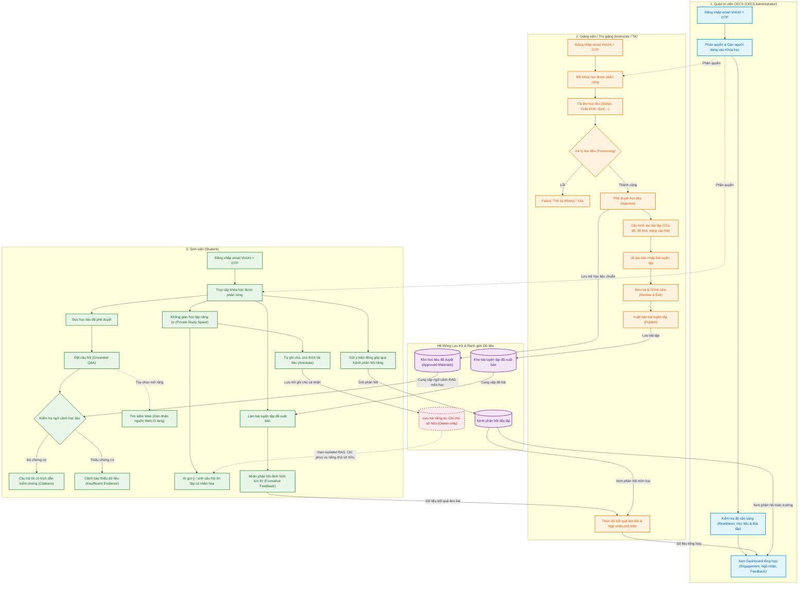
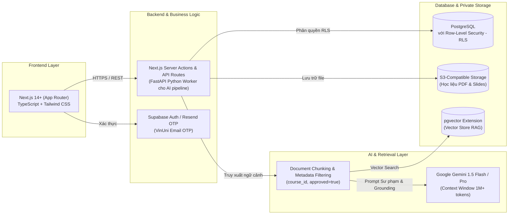

Báo cáo cá nhân

Họ và tên: Nguyễn Thanh Tùng

Mã số sinh viên: 2A202601140

# 1. Thấu hiểu sản phẩm:

## 1.1 Mô tả hành trình của Giảng viên - Sinh viên và Quản trị viên CECS 

- **Giảng viên / Trợ giảng (Instructor / TA):**
  1. *Đăng nhập & Tiếp cận:* Sử dụng email VinUni được phê duyệt và mã xác thực một lần (OTP). Không yêu cầu Microsoft SSO trong giai đoạn thử nghiệm pilot.
  2. *Tải lên học liệu:* Mở các khóa học được phân công và tải lên giáo trình, bài giảng slides, câu hỏi ôn tập, bài tập hoặc các tài liệu học tập được hỗ trợ.
  3. *Quản lý vòng đời học liệu:* Theo dõi quá trình xử lý tài liệu (trạng thái: processing / ready / failed / retry); phê duyệt (approve) học liệu để sinh viên có thể xem và truy xuất; chủ động hủy đăng (unpublish) hoặc xóa bỏ (remove) tài liệu khi cần thiết.
  4. *Tạo và xuất bản bài luyện tập:* Chọn nguồn học liệu, chủ đề, độ khó, dạng câu hỏi và số lượng để hệ thống tạo bản nháp bài luyện tập/hoạt động; tiến hành duyệt, chỉnh sửa (review & edit) và xuất bản (publish) cho sinh viên.
  5. *Theo dõi & Cải tiến giảng dạy:* Xem thống kê hoạt động khóa học, kết quả làm bài tập của sinh viên, mức độ tương tác và các ngộ nhận/lỗ hổng kiến thức phổ biến (common misconceptions) để kịp thời cải thiện bài giảng.

- **Sinh viên (Student):**
  1. *Đăng nhập & Tiếp cận khóa học:* Đăng nhập bằng email VinUni đã được xác thực và truy cập vào danh sách các khóa học được chỉ định.
  2. *Học tập & Hỏi đáp có căn cứ (Grounded Q&A):* Đọc các tài liệu học tập đã được giảng viên phê duyệt; đặt câu hỏi hỏi đáp với AI được neo chặt (grounded) trên các tài liệu này. Sinh viên có thể trực tiếp kiểm tra nguồn dẫn và vị trí đoạn trích dẫn (inspectable citations); nhận thông báo giới hạn rõ ràng khi tài liệu không đủ dữ liệu/chứng cứ (insufficient-evidence behavior).
  3. *Mở rộng tìm kiếm Web (Tùy chọn):* Tùy chọn mở rộng thảo luận ra nguồn ngoài Internet; hệ thống phải gắn nhãn phân biệt rõ nguồn Course vs Web, trích dẫn rõ ràng và giải thích rằng nội dung này mở rộng ra ngoài học liệu chính khóa.
  4. *Không gian học tập riêng tư (Private Study Space):* Chú thích (annotate) tài liệu, tự viết hoặc dùng AI tạo ghi chú/câu hỏi cá nhân; có toàn quyền lưu, chỉnh sửa hoặc xóa chúng.
  5. *Luyện tập & Phản hồi định hình:* Hoàn thành các bài luyện tập đã được xuất bản và nhận phản hồi định hình (formative feedback) tức thì kèm trích dẫn tài liệu tham chiếu.
  6. *Kênh phản hồi độc lập:* Gửi ý kiến phản hồi tường minh (explicit feedback) về công tác giảng dạy hoặc về nền tảng thông qua một kênh gửi phản hồi riêng biệt.

- **Quản trị viên CECS (CECS Administrator):**
  1. *Phân quyền người dùng:* Phân bổ, gán giảng viên/TA và sinh viên vào đúng các khóa học phụ trách/tham gia.
  2. *Kiểm tra mức độ sẵn sàng (Readiness check):* Giám sát tiến độ chuẩn bị của khóa học: tình trạng tải lên, xử lý và phê duyệt học liệu; tiến độ xem lại và xuất bản bài luyện tập.
  3. *Theo dõi tương tác & Hỗ trợ:* Xem dữ liệu tương tác tổng thể của từng khóa học và toàn viện CECS, nắm bắt các khó khăn học tập phổ biến và các phản hồi tường minh được gửi từ người dùng để định hướng nâng cao chất lượng.
  4. *Giới hạn báo cáo tổng hợp:* Chỉ tiếp cận các số liệu phân tích tổng hợp (aggregate insights); tuyệt đối không có quyền truy cập vào không gian học tập riêng tư của sinh viên.

## 1.2 Phân biệt giữa ghi chú riêng tư của sinh viên với tài liệu khóa học, phản hồi đã gửi và bảng dữ liệu điều khiển (dashboard)

Nguyên tắc bất di bất dịch của dự án là **"Private means private"** (Riêng tư phải thực sự riêng tư):
- Ranh giới này phải được bảo vệ chặt chẽ bằng cơ chế phân quyền máy chủ (server-side authorization), chứ không đơn thuần chỉ ẩn trên giao diện người dùng (UI).
- Ghi chú riêng tư (Private notes) là tính năng cốt lõi của giai đoạn pilot, hoàn toàn tách biệt với tính năng sinh viên tải tệp cá nhân (student private file uploads - tính năng này thuộc nhóm mở rộng sau, không triển khai ở pilot).
- **Về khía cạnh RAG (Retrieval-Augmented Generation):** Dự án nghiêm cấm việc đưa ghi chú riêng tư vào **Shared Retrieval** (kho truy xuất chung của lớp học). Tuy nhiên, ghi chú có thể được dùng cho **User-isolated RAG / In-Context Prompting** khép kín phục vụ riêng cho chính sinh viên đó trong Không gian học tập cá nhân (để AI hỗ trợ sinh câu hỏi ôn tập, tóm tắt bài học của riêng mình) mà không bị lộ ra ngoài.

Bảng so sánh chi tiết các luồng dữ liệu:

| Tiêu chí | Ghi chú riêng tư (Private Notes / Annotations) | Tài liệu khóa học (Course Materials) | Phản hồi đã gửi (Submitted Feedback) | Bảng dữ liệu điều khiển (Dashboard / Insights) |
| :--- | :--- | :--- | :--- | :--- |
| **Bản chất dữ liệu** | Ghi chú, câu hỏi cá nhân, chú thích bài đọc do sinh viên tự viết hoặc tạo qua AI | Giáo trình, slide bài giảng, bài tập, đề kiểm tra do giảng viên tải lên | Ý kiến đóng góp chủ động, có chủ đích của người dùng về môn học/nền tảng | Báo cáo, số liệu đo lường hoạt động, tỷ lệ hoàn thành, ngộ nhận kiến thức |
| **Quyền truy cập** | **Chỉ duy nhất sinh viên sở hữu (Owner-only access)** | Giảng viên, TA, và Sinh viên được gán vào khóa học | Giảng viên phụ trách môn học và Quản trị viên CECS | Giảng viên (xem cấp lớp) và Quản trị viên CECS (xem cấp viện/toàn trường) |
| **Có được đưa vào RAG / Retrieval?** | - **Shared RAG (toàn lớp): TUYỆT ĐỐI KHÔNG**. - **User-isolated RAG (chính sinh viên đó): CÓ THỂ** (dùng nội bộ trong Private Study Space để sinh câu hỏi cá nhân hóa). | **CÓ**, áp dụng cho toàn khóa học nhưng chỉ sau khi giảng viên đã bấm **Phê duyệt (Approved)** | **KHÔNG** | **KHÔNG** |
| **Hiển thị trên Logs / Dashboard?** | **TUYỆT ĐỐI KHÔNG**. Phải loại trừ khỏi ordinary logs, dashboard và API exports | Trạng thái hiển thị trên dashboard (đã tải, đang xử lý, đã duyệt, lỗi) | Hiển thị dạng danh sách phản hồi để giảng viên/admin đọc và xử lý | Hiển thị các chỉ số tổng hợp (aggregated metrics) |
| **Cam kết & Giao diện** | Giao diện phải hiển thị rõ thông điệp cam kết quyền riêng tư cho sinh viên an tâm | Hiển thị nguồn trích dẫn rõ ràng, minh bạch cho sinh viên tra cứu | Gửi qua kênh riêng, tách biệt hoàn toàn với không gian học tập | Chỉ cung cấp thông tin tổng hợp, không chứa bất kỳ nội dung ghi chú cá nhân nào |

## 1.3 Đề xuất 2 dấu hiệu đo lường thành công của đợt thử nghiệm pilot và 1 giả định cần kiểm chứng với người dùng

Đợt thử nghiệm pilot dự kiến triển khai trên 1–4 khóa học mùa Thu 2026 (ra mắt ngày 5/10/2026):

- **02 Dấu hiệu có thể đo lường được để đánh giá thành công của đợt Pilot (Measurable Success Signals):**
  1. *Mức độ đón nhận và tin tưởng vào Grounded AI & Luyện tập:* Có ít nhất **70% sinh viên** tham gia pilot tương tác với tính năng hỏi đáp bám sát tài liệu (Grounded Chat) hàng tuần, trong đó tỷ lệ nhấp vào xem/kiểm tra nguồn trích dẫn đối chiếu (**inspectable citations**) đạt trên **35%**, và tỷ lệ sinh viên hoàn thành các bài luyện tập đã xuất bản đạt trên **60%** có ghi nhận phản hồi định hình. Có ít nhất **70% sinh viên** sử dụng tính năng Không gian học tập riêng tư.
  2. *Mức độ sẵn sàng và hiệu quả cộng tác của Giảng viên (Instructor Adoption & Readiness):* **100% học liệu cốt lõi** được giảng viên tải lên, xử lý và phê duyệt (approved) đúng hạn; đồng thời giảng viên chủ động xem lại, chỉnh sửa và xuất bản (**review, edit & publish**) ít nhất **75% số lượng bài tập/quiz nháp** do AI sinh ra trong vòng 48 giờ thay vì bỏ qua hoặc tự soạn thủ công hoàn toàn.

- **01 Giả định quan trọng cần kiểm chứng lại với người dùng (Key Assumption to Validate):**
  - *Giả định về niềm tin vào tính riêng tư của sinh viên (Privacy Trust Assumption):* "Sinh viên chỉ thực sự cởi mở sử dụng hệ thống để ghi chép các lỗ hổng kiến thức, lưu lại những câu hỏi băn khoăn hoặc nhờ AI giải thích sâu nếu họ tin tưởng tuyệt đối vào cam kết **'Private means private'** rằng Giảng viên, TA hay Quản trị viên không thể đọc trộm hay đánh giá điểm số thông qua các ghi chú cá nhân đó."
  *(Cần kiểm chứng qua khảo sát/phỏng vấn thực tế sinh viên sau tuần đầu tiên sử dụng để xem thông điệp bảo mật trên UI và cơ chế server-side authz có giúp xóa bỏ hoàn toàn rào cản e ngại này hay không).*

# 2. Nghiên cứu các ứng dụng học tập AI hiện tại tại các trường đại học hàng đầu:

> Nghiên cứu được chọn lọc theo **5 trụ cột đào tạo cốt lõi của sinh viên ngành Công nghệ thông tin & Khoa học Máy tính (IT/CS)** tại VinUni CECS: *(1) Thực hành lập trình & gỡ lỗi, (2) Hỏi đáp bám sát học liệu đa môn học, (3) Toán rời rạc & Xác suất thống kê, (4) Không gian tự học cá nhân hóa đa ngữ cảnh, (5) Thực hành nghiên cứu khoa học & Viết báo cáo kỹ thuật/Đồ án Capstone*.
> Phân biệt rõ giữa: Thông báo thử nghiệm (Announcement) / Dịch vụ đã triển khai thực tế (Deployed Service) / Kết quả học tập đã được đánh giá định lượng (Evaluated Outcome).
> Ngày truy cập đối soát tài liệu: **14/09/2026**.

| Ứng dụng và nguồn | Trụ cột IT/CS & Vấn đề học tập | Tính năng công nghệ & Sư phạm chính | Bằng chứng thực tế & Hạn chế | Bài học khác biệt áp dụng cho CECS |
| :--- | :--- | :--- | :--- | :--- |
| **1. CS50.ai / The CS50 Duck** *(Harvard University & Yale University)*  [CS50.ai Platform](https://cs50.ai) Nghiên cứu: [SIGCSE 2024 / arXiv:2401.07409](https://arxiv.org/abs/2401.07409) Ngày công bố: 03/2024 • Ngày truy cập: 14/09/2026 | **Trụ cột:** Thực hành lập trình & Gỡ lỗi thời gian thực (Hands-on Coding & IDE Debugging).  **Vấn đề:** Sinh viên debug code ban đêm không có TA; nếu dùng ChatGPT thông thường thì AI sẽ viết hộ mã nguồn toàn bộ, triệt tiêu tư duy giải quyết vấn đề (*problem-solving*). | • Tích hợp trực tiếp vào môi trường lập trình VS Code (`cs50.dev`). • Thiết lập **Pedagogical Guardrails**: kiên quyết chỉ gợi mở tư duy (Socratic questioning), hướng dẫn sinh viên tự phát hiện bug cú pháp/thuật toán, từ chối viết sẵn mã giải. • Dashboard cho giảng viên kiểm soát quy tắc sư phạm và mức độ gợi ý. | **Trạng thái:** *Deployed & Evaluated Outcome*.  **Bằng chứng:** Đã triển khai cho hàng nghìn sinh viên CS50 tại Harvard/Yale và online; nghiên cứu SIGCSE 2024 xác nhận giúp sinh viên tự debug nhanh hơn, giảm tải áp lực trực đêm cho TA mà vẫn giữ vững liêm chính học thuật.  **Hạn chế:** Nguy cơ gợi ý quá mức (*over-hinting*) khi sinh viên cố tình hỏi dồn; chi phí token API cao vào đợt nộp bài. | • **Rào chắn sư phạm không giải hộ code:** AI của CECS chỉ đóng vai trò người phản biện, tuyệt đối từ chối viết code hộ trong các bài lab lập trình của sinh viên. • Tích hợp kiểm tra chuẩn phong cách code (*code style*) và giải thích lỗi biên dịch bám sát slide bài giảng. |
| **2. Maizey** *(University of Michigan)*  [U-Mich Maizey Platform](https://its.umich.edu/computing/ai/maizey) Sáng kiến: [U-Mich ITS AI Initiatives](https://genai.umich.edu/) Ngày công bố: 2023 – 2024 • Ngày truy cập: 14/09/2026 | **Trụ cột:** Hỏi đáp có căn cứ đa môn học IT/CS (Toán kỹ thuật, Mạng máy tính, Hệ điều hành, Kiến trúc máy tính...).  **Vấn đề:** Mỗi môn học có hàng trăm trang slide, giáo trình và tài liệu đọc chuyên sâu; AI thông thường hay bịa đặt (*hallucinate*) hoặc trả lời chung chung không đúng trọng tâm kiến thức của giáo sư. | • Nền tảng GenAI cấp trường tích hợp sâu vào Canvas LMS. • Cho phép giảng viên **mọi môn học** tự tải lên syllabus, bài giảng slide, PDF nghiên cứu để sinh ra trợ lý AI riêng cho môn học chỉ trong vài phút. • Phản hồi bám sát 100% ngữ cảnh tài liệu khóa học với trích dẫn minh bạch từng trang nguồn. | **Trạng thái:** *Deployed Service & University-wide Evaluation*.  **Bằng chứng:** Đã triển khai trên hàng trăm khóa học tại Đại học Michigan; sinh viên tin cậy cao nhờ câu trả lời bám sát đề cương thi và tài liệu đọc của giảng viên.  **Hạn chế:** Phụ thuộc vào chất lượng tài liệu tải lên; nếu giảng viên tải tài liệu định dạng bảng biểu phức tạp hoặc công thức toán dạng ảnh thì vector search dễ bị nhiễu. | • **Chuẩn hóa quy trình Grounded RAG đa môn học:** Minh chứng mô hình CECS AI Learning Hub có thể phục vụ xuất sắc cả các môn lý thuyết IT (Mạng, OS, Cơ sở dữ liệu) chứ không chỉ bài tập code. • Cần có cơ chế cảnh báo khi thiếu bằng chứng (*insufficient evidence*) như CECS đã quy định. |
| **3. CMU Open Learning Initiative (OLI) & Cognitive Tutors** *(Carnegie Mellon University)*  [CMU OLI Platform](https://oli.cmu.edu/) Sáng kiến: [Simon Initiative Learning Engineering](https://www.cmu.edu/simon/) Ngày công bố: Bản GenAI 2024 • Ngày truy cập: 14/09/2026 | **Trụ cột:** Toán rời rạc, Giải tích & Xác suất thống kê cho Khoa học Dữ liệu (Discrete Math, Calculus & Probability).  **Vấn đề:** Sinh viên giải bài toán định lượng nhiều bước thường chỉ biết kết quả cuối cùng Đúng/Sai, không rõ mình bị "hổng" ở bước logic trung gian nào (ví dụ: biến đổi đại số, quy tắc Bayes hay suy luận đệ quy). | • Ứng dụng Khoa học Nhận thức: Phân tách kiến thức thành các vi kỹ năng (**Knowledge Components**). • AI theo dõi từng bước biến đổi công thức của sinh viên, chỉ ra chính xác bước suy luận logic bị sai lệch. • Tự động điều chỉnh độ khó và sinh câu hỏi luyện tập thích ứng (**Adaptive Practice**) để lấp lỗ hổng kiến thức. | **Trạng thái:** *Deployed & Rigorously Evaluated Outcome* (Từng đoạt giải thưởng Global Learning XPRIZE).  **Bằng chứng:** Nghiên cứu của CMU chứng minh sinh viên dùng OLI nắm vững kiến thức toán/thống kê nhanh gấp 2 lần so với cách học truyền thống.  **Hạn chế:** Việc thiết lập ma trận Knowledge Components cho một môn học mới đòi hỏi thời gian đầu tư công phu của các chuyên gia sư phạm. | • **Phát hiện ngộ nhận theo bước logic (Misconceptions Tracking):** Áp dụng để phân tích kết quả làm bài tập trắc nghiệm/tự luận của sinh viên CECS, gom cụm các ngộ nhận phổ biến (*common misconceptions*) báo cáo lên dashboard của giảng viên. • AI hỗ trợ giảng viên tạo bài tập luyện tập phân cấp theo độ khó. |
| **4. PyTutor** *(MIT RAISE, Georgia State University & Quinsigamond Community College)*  [MIT RAISE PyTutor](https://raise.mit.edu/research/research-projects/pytutor/) Ngày công bố: 2023 – 2024 • Ngày truy cập: 14/09/2026 | **Trụ cột:** Không gian tự học cá nhân hóa đa ngữ cảnh (Multi-source Context Private Tutoring).  **Vấn đề:** Sinh viên tự học ở nhà thường thiếu sự kết nối giữa bài giảng lý thuyết trên lớp với bài tập đang viết dở và các câu hỏi thắc mắc trong quá khứ của chính mình. | • Môi trường học tập tương tác kết hợp trình chạy code và bảng trắng. • AI gia sư nạp ngữ cảnh từ 3 nguồn độc lập: **(1) Học liệu khóa học, (2) Bài làm/code hiện tại, và (3) Lịch sử tương tác trước đó của sinh viên**. • Mô hình ngôn ngữ được tinh chỉnh bằng học tăng cường để đưa ra phản hồi mang tính nâng đỡ sư phạm. | **Trạng thái:** *Deployed Service* tại các trường đối tác cho các lớp nhập môn lập trình.  **Bằng chứng:** Sinh viên cảm thấy có gia sư riêng đồng hành 1-1, giải tỏa tâm lý e ngại khi đặt các câu hỏi kiến thức nền tảng.  **Hạn chế:** Tiềm ẩn nguy cơ rò rỉ dữ liệu cá nhân nếu toàn bộ code và lịch sử học tập bị gom vào chung kho dữ liệu chia sẻ; chưa có đánh giá định lượng dài hạn về điểm thi. | • **Thiết kế Không gian học tập riêng tư (Private Study Space):** Cho phép AI nạp ngữ cảnh bài làm và ghi chú cá nhân của sinh viên để sinh câu hỏi tự ôn tập. • **Bài học ranh giới bảo mật:** Phải bảo vệ nghiêm ngặt bằng kiến trúc *User-isolated RAG* (*"Private means private"*), tuyệt đối không để rò rỉ ghi chú cá nhân sang dữ liệu chung của lớp. |
| **5. AcaWriter** *(University of Technology Sydney & University of Edinburgh)*  [AcaWriter Platform](https://acawriter.uts.edu.au/) Trung tâm: [UTS Connected Intelligence Centre](https://cic.uts.edu.au/tools/acawriter/) Ngày công bố: 2023 – 2024 • Ngày truy cập: 14/09/2026 | **Trụ cột:** Thực hành nghiên cứu khoa học, Viết báo cáo kỹ thuật & Đồ án tốt nghiệp (Capstone / Research Practice).  **Vấn đề:** Sinh viên IT thường có xu hướng viết báo cáo kỹ thuật/luận văn lan man, thiếu luận điểm chứng minh (*evidence*), thiếu phân tích phản biện (*counter-argument*) hoặc lạm dụng AI viết hộ dẫn đến đạo văn. | • Công nghệ phân tích cấu trúc lập luận học thuật (**Rhetorical Moves Analytics**). • Không viết thay sinh viên; hệ thống quét văn bản và highlight trực quan các thành phần: Đặt vấn đề, Bằng chứng thực nghiệm, Giả thuyết kỹ thuật, Giới hạn nghiên cứu. • Đưa ra phản hồi tự động gợi ý cách củng cố luận điểm trước khi nộp bài cho giảng viên. | **Trạng thái:** *Deployed Service & Evaluated Learning Outcome* tại UTS và Edinburgh.  **Bằng chứng:** Được ứng dụng rộng rãi cho sinh viên làm đồ án kỹ thuật và học viên sau đại học; tăng đáng kể chất lượng lập luận khoa học và sự tự tin khi viết báo cáo nghiên cứu.  **Hạn chế:** Chưa tối ưu hóa tốt cho các bài báo cáo chứa nhiều công thức toán học hoặc mã nguồn xen kẽ. | • **Phản hồi định hình cho viết học thuật:** CECS có thể áp dụng cơ chế phản hồi cấu trúc lập luận cho sinh viên khi làm báo cáo đồ án môn học hoặc tiểu luận kỹ thuật. • Giúp sinh viên hình thành tư duy phản biện khoa học và trích dẫn minh bạch tài liệu tham khảo theo đúng chuẩn mực quốc tế. |

---

### 2.1 Đúc kết 5 bài học cốt lõi không trùng lặp cho CECS AI Learning Hub (Takeaways)

1. **Rào chắn sư phạm kiên quyết không làm thay (Từ CS50.ai):** Chatbot trong các bài lab của CECS phải tuân thủ nghiêm ngặt *Pedagogical Guardrails* — chỉ đóng vai trò người phản biện gợi mở tư duy (Socratic questioning), kiên quyết từ chối xuất code giải hoàn chỉnh để bảo vệ năng lực tư duy lập trình tự thân của sinh viên.
2. **Nền tảng Grounded RAG mở rộng cho mọi môn học IT (Từ Maizey):** CECS AI Hub không bị giới hạn ở môn lập trình mà sẵn sàng phục vụ các môn lý thuyết nền tảng (Toán kỹ thuật, Mạng máy tính, Hệ điều hành). Chỉ tài liệu giảng viên đã duyệt (`Approved Materials`) mới được đưa vào RAG và câu trả lời phải kèm trích dẫn kiểm chứng được (`Inspectable Citations`).
3. **Phân tích lỗi tư duy theo bước biến đổi & Adaptive Practice (Từ CMU OLI):** Thay vì chỉ đánh giá Đúng/Sai ở kết quả cuối cùng, hệ thống cần hỗ trợ bóc tách các ngộ nhận kiến thức phổ biến (*Common Misconceptions*) trong bài tập Toán/Xác suất/Thuật toán, giúp giảng viên nắm bắt lỗ hổng của lớp học qua dashboard tổng hợp.
4. **Cô lập tuyệt đối không gian tự học cá nhân hóa (Từ PyTutor):** Cho phép AI nạp ngữ cảnh ghi chú và bài làm của sinh viên để tạo gia sư riêng trong Không gian học tập cá nhân, nhưng phải thực thi nguyên tắc **"Private means private"** ở tầng máy chủ (*server-side isolated storage*), tuyệt đối không để rò rỉ sang RAG chung của lớp học.
5. **Định hình tư duy nghiên cứu và lập luận khoa học (Từ AcaWriter):** Cung cấp phản hồi định hình hướng dẫn sinh viên cách xây dựng luận cứ kỹ thuật chặt chẽ, trích dẫn nguồn minh bạch trong các bài báo cáo đồ án, chuẩn bị hành trang vững chắc cho sinh viên tham gia nghiên cứu khoa học chuẩn quốc tế.

---

# 3. Đề xuất ý tưởng sản phẩm và nền tảng công nghệ cho CECS 

## 3.1 Phác thảo 3 luồng trải nghiệm người dùng tích hợp các phương pháp học chủ động sáng tạo

Hệ thống được thiết kế tối ưu hóa cho cả ba đối tượng, kết hợp các phương pháp sư phạm hiện đại như **Kỹ thuật Feynman, Active Recall, Spaced Repetition, và Sơ đồ tư duy ngữ nghĩa (Semantic Mindmap)**:

### 1. Luồng trải nghiệm của Sinh viên (Student Experience)
- **Hỏi đáp có căn cứ & Sơ đồ tư duy trực quan (Grounded Q&A & Semantic Mindmap):**
  - Sinh viên truy cập vào các môn học được chỉ định, đọc học liệu chính khóa đã được duyệt.
  - Đặt câu hỏi hỏi đáp với AI được neo chặt (grounded) trên tài liệu với trích dẫn có thể kiểm chứng (`Inspectable Citations`). Khi tài liệu không đủ thông tin, AI sẽ thông báo rõ giới hạn thiếu bằng chứng (`insufficient-evidence`).
  - Hệ thống tự động trích xuất các khái niệm chính trong bài giảng và trực quan hóa thành **Bản đồ tư duy ngữ nghĩa (Interactive Mindmap)**, giúp sinh viên nắm bắt cấu trúc phân tầng và mối liên hệ giữa các chương học (ví dụ: mối liên hệ giữa *Con trỏ -> Cấp phát động -> Danh sách liên kết* trong môn Cấu trúc dữ liệu).
- **Không gian học tập riêng tư (Private Study Space) với phương pháp học chủ động:**
  - **Phòng luyện Kỹ thuật Feynman (Feynman Active Recall Room):** Thay vì chỉ hỏi để AI trả lời, sinh viên kích hoạt chế độ *"Giảng giải cho AI"*. Sinh viên tự diễn giải lại một khái niệm kỹ thuật phức tạp (ví dụ: *Định lý Giới hạn Trung tâm, Cơ chế bắt tay TCP 3 bước, hay Thuật toán Dijkstra*). AI đóng vai trò một "người học tò mò", liên tục đặt câu hỏi truy vấn sâu để giúp sinh viên phát hiện ra những điểm mình hiểu mơ hồ hoặc dùng sai thuật ngữ bản chất.
  - **Tạo Flashcard & Câu hỏi truy hồi (Active Recall & Spaced Repetition):** AI tự động gợi ý các bộ câu hỏi truy hồi nhận thức từ ghi chú cá nhân của sinh viên và các điểm mấu chốt trong slide bài giảng để ôn tập ngắt quãng.
  - **Trợ lý lập Đề cương tự học & Đề thi thử (Smart Exam Simulator):** AI tự động tổng hợp toàn bộ học liệu đã duyệt thành đề cương ôn tập trọng tâm bám sát chuẩn đầu ra của môn học, đồng thời tạo ra các đề thi thử mô phỏng theo cấu trúc đề thi chính thức kèm phản hồi định hình chi tiết.
- **Cam kết bảo mật tuyệt đối:** Mọi ghi chú, nhật ký luyện tập Feynman và câu hỏi tự học đều được mã hóa và bảo vệ bằng nguyên tắc **"Private means private"** (chỉ riêng chủ sở hữu có quyền xem và chỉnh sửa).

### 2. Luồng trải nghiệm của Giảng viên / Trợ giảng (Instructor / TA Experience)
- **Quản lý & Duyệt học liệu chuẩn hóa:** Giảng viên tải lên slides, giáo trình, ngân hàng câu hỏi; hệ thống tự động xử lý và trích xuất mục lục, thuật ngữ cốt lõi để giảng viên kiểm duyệt và bấm **Phê duyệt (Approve)**.
- **Tạo & Xuất bản bài luyện tập phân hóa (Bloom's Taxonomy):** AI hỗ trợ tạo câu hỏi trắc nghiệm/tự luận theo 4 mức độ nhận thức (Nhận biết, Thông hiểu, Vận dụng, Phân tích); Giảng viên chủ động xem lại, chỉnh sửa (review & edit) nội dung trước khi xuất bản cho sinh viên.
- **Bản đồ nhiệt ngộ nhận kiến thức (Collective Misconception Heatmap):**
  - Hệ thống tự động phân tích và gom cụm các khó khăn, lỗi sai logic mà sinh viên hay mắc phải nhất từ **kết quả làm bài luyện tập** và các **chủ đề hỏi đáp ẩn danh** trong tuần.
  - Hiển thị trực quan thành **Bản đồ nhiệt ngộ nhận** trên Dashboard của giảng viên (ví dụ: cảnh báo *70% sinh viên lớp đang hiểu sai về biến con trỏ void hoặc nhầm lẫn giữa độ phức tạp thời gian và không gian*).
  - Giúp giảng viên nắm bắt chính xác "điểm nghẽn" của sinh viên để điều chỉnh bài giảng trên lớp kịp thời (*Evidence-based Teaching*) mà **tuyệt đối không cần xâm phạm ghi chú riêng tư của từng cá nhân**.

### 3. Luồng trải nghiệm của Quản trị viên CECS (CECS Administrator Experience)
- Phân quyền tài khoản và gán giảng viên, sinh viên vào đúng các khóa học phụ trách.
- Kiểm tra mức độ sẵn sàng học liệu (**Course Readiness**): Giám sát tỷ lệ tài liệu đã được duyệt, số lượng bài luyện tập đã xuất bản trước thềm học kỳ mới.
- Theo dõi các chỉ số đo lường học thuật toàn diện (Academic Health Insights) cấp viện để hỗ trợ điều phối trợ giảng và nâng cao chất lượng đào tạo.

---

## 3.2 Đề xuất phiên bản Pilot tối giản (Simplest Useful Pilot) vs Danh sách phát triển sau (Later List)

Để đảm bảo ra mắt sản phẩm đúng thời hạn cam kết vào ngày **05/10/2026** (trình diễn toàn bộ tính năng cốt lõi trước ngày **24/09/2026** theo đúng README.md), các tính năng được phân định rõ ràng: việc gì cần làm ngay cho đợt thử nghiệm và việc gì có thể để lại sau:

| Nhóm tính năng | Bản Pilot tối giản (Cần có trước 24/09 & Ra mắt 05/10) | Danh sách để sau (Sau đợt Pilot) |
| :--- | :--- | :--- |
| **Đăng nhập & Tài khoản** | • Đăng nhập bằng mã 6 số gửi về email `@vinuni.edu.vn` (không cần nhớ mật khẩu). • Phân quyền 3 vai trò (Sinh viên, Giảng viên, Quản trị viên) kiểm tra an toàn trên máy chủ. | • Đăng nhập bằng tài khoản Microsoft (SSO). • Tự động đồng bộ danh sách lớp từ Canvas LMS. |
| **Quản lý học liệu** | • Tải lên tài liệu PDF (slide bài giảng, giáo trình, đề cương). • Quản lý tài liệu: tải lên, xử lý, duyệt cho sinh viên xem hoặc xóa bỏ. | • Tự động chuyển video và âm thanh bài giảng thành văn bản. • Chạy code trực tiếp trên trình duyệt (như Jupyter Notebook). |
| **Hỏi đáp AI (Grounded Chat)** | • AI trả lời bám sát tài liệu môn học đã duyệt. • Bấm vào trích dẫn xem ngay số trang/slide; cảnh báo rõ ràng khi tài liệu không có câu trả lời. • Tùy chọn tìm kiếm Web có dán nhãn rõ nguồn từ `Môn học` hay từ `Web`. | • Nói chuyện trực tiếp với AI bằng giọng nói. • Đọc công thức toán viết tay từ ảnh chụp. |
| **Không gian tự học riêng tư** | • Viết ghi chú cá nhân, tô đậm tài liệu và tạo câu hỏi tự học. • Chỉ sinh viên mới xem được ghi chú của mình; không đưa vào kho tìm kiếm chung của lớp. • Tự động tạo thẻ flashcard từ ghi chú để ôn tập. | • Cho phép sinh viên tải tệp riêng lên máy chủ. • Sơ đồ tư duy 3D tương tác. • Luyện nói tiếng Anh/thuyết trình với AI giọng nói. |
| **Bài luyện tập & Câu hỏi** | • AI tạo đề trắc nghiệm/tự luận từ tài liệu môn học. • Giảng viên xem, chỉnh sửa và duyệt câu hỏi trước khi học sinh làm bài. • Phản hồi ngay lý do Đúng/Sai và dẫn link về trang slide liên quan. | • AI tự động chấm thi và cho điểm chính thức. • Đề thi tự động đổi độ khó theo năng lực làm bài của sinh viên. |
| **Thống kê & Báo cáo** | • Thống kê cơ bản: số lượt làm bài, câu hỏi nhiều bạn làm sai, trạng thái tài liệu (tuyệt đối không xem ghi chú riêng). | • AI dự đoán sớm sinh viên có nguy cơ trượt môn. |

---

## 3.3 Đề xuất kiến trúc công nghệ (Proposed Tech Stack Direction)

Lựa chọn công nghệ ưu tiên tính **đơn giản, ổn định, chi phí tối ưu, dễ bảo trì** và phù hợp với năng lực triển khai cấp tốc của đội ngũ trong 3 tuần:

* **Giao diện (Frontend):**
  - **Lựa chọn:** **Next.js (React) + TypeScript + Tailwind CSS**.
  - **Lý do:** Khả năng dựng trang nhanh, hỗ trợ Server-Side Rendering (SSR) tối ưu tốc độ tải trang, hỗ trợ Markdown và render sơ đồ Mermaid mượt mà, dễ phân chia component theo tính năng.
* **Tầng Backend & Xử lý nghiệp vụ:**
  - **Lựa chọn:** **Next.js API Routes & Server Actions** làm backend chính; tích hợp thêm **FastAPI (Python)** microservice nhẹ cho pipeline xử lý tài liệu (RAG chunking, OCR, semantic indexing).
  - **Lý do:** Tinh gọn số lượng dịch vụ phải quản lý trong đợt pilot, đồng thời tận dụng hệ sinh thái AI phong phú của Python khi cần bóc tách tài liệu.
* **Cơ sở dữ liệu & Lưu trữ bảo mật (Database & Private Storage):**
  - **Lựa chọn:** **PostgreSQL (trên Supabase hoặc Neon)** kết hợp lưu trữ file trên **S3-compatible Cloud Storage**.
  - **Bảo mật then chốt:** Kích hoạt tính năng **Row-Level Security (RLS)** trên bảng `private_notes`. Bất kỳ truy vấn nào không mang đúng `auth.uid() = owner_id` đều bị chặn cứng ở tầng database, đảm bảo dữ liệu ghi chú riêng tư của sinh viên không bao giờ bị rò rỉ qua các truy vấn chéo hay lỗi code ở tầng ứng dụng.
* **Trí tuệ nhân tạo & Truy xuất ngữ nghĩa (AI & Retrieval Engine):**
  - **Lựa chọn Model:** **Gpt 4o mini** (cho các tác vụ hỏi đáp nhanh, tóm tắt bài học với chi phí token cực thấp và độ trễ dưới 2 giây) kết hợp **Gpt 4o** (cho các tác vụ suy luận sâu như sinh câu hỏi luyện tập theo chuẩn Bloom hay đóng vai Feynman).
  - **Vector Database:** Sử dụng **`pgvector`** tích hợp trực tiếp ngay trong PostgreSQL. Giúp tránh việc phải thiết lập thêm một dịch vụ Vector DB độc lập (như Pinecone/Qdrant), đơn giản hóa hạ tầng sao lưu (backup) và phục hồi dữ liệu cho giai đoạn pilot.
* **Xác thực người dùng (Authentication):**
  - **Lựa chọn:** **Passwordless Email OTP** gửi mã xác thực 6 chữ số tới email có đuôi `@vinuni.edu.vn` (thông qua dịch vụ Resend API hoặc Supabase Auth). Không yêu cầu mật khẩu phức tạp, không phụ thuộc vào việc cấp quyền Microsoft SSO từ IT nhà trường trong đợt pilot.
* **Hạ tầng triển khai & Vận hành (Hosting & DevOps):**
  - **Lựa chọn:** Triển khai Frontend & API trên **Vercel** (kết nối CI/CD tự động từ GitHub task branch); Database trên **Supabase**; Giám sát lỗi qua **Sentry** và theo dõi chi phí/token usage qua dashboard quản trị.

---

## 3.4 Đề xuất các ý tưởng giáo dục đột phá hướng tới Giải thưởng Quốc tế (QS Reimagine Education Awards)

Nhằm đồng hành cùng chiến lược đưa VinUni vào top các trường đại học trẻ hàng đầu thế giới (**VinUni QS-100 Ambition**), các ý tưởng đột phá đề xuất cho CECS AI Learning Hub có thể định vị cạnh tranh trực tiếp tại các hạng mục danh giá như **AI in Education** và **Innovation in Higher Education** của giải thưởng [QS Reimagine Education Awards](https://www.qs.com/conferences/reimagine/apply):

1. **Ý tưởng 1: "The Feynman Active-Recall Lab: Turning Generative AI into Curious Learners" (Phòng luyện học chủ động Feynman: Biến AI thành người học tò mò)**
   - *Tính mới:* Khắc phục triệt để hiện tượng sinh viên dùng AI một cách thụ động (chỉ hỏi và chép câu trả lời). Hệ thống đảo ngược vai trò: Sinh viên đóng vai người thầy để giảng lại các thuật toán, công thức kỹ thuật phức tạp cho AI nghe; AI đóng vai học trò liên tục đặt câu hỏi phản biện Socratic.
   - *Tác động giáo dục (Pedagogical Impact):* Thúc đẩy tư duy phản biện (*Critical Thinking*), giúp sinh viên tự chuyển hóa kiến thức từ "biết sơ qua" thành "làm chủ bản chất", giải quyết triệt để vấn đề gian lận học thuật trong giáo dục đại học.
2. **Ý tưởng 2: "Zero-Knowledge Personalized Study Sanctuary with Semantic Mindmapping" (Không gian tự học cá nhân hóa với kiến trúc bảo mật cách ly tuyệt đối & Sơ đồ tư duy)**
   - *Tính mới:* Nền tảng đại học đầu tiên cam kết bảo vệ không gian riêng tư của sinh viên bằng phân quyền máy chủ (*server-side isolated RAG*). Tích hợp sơ đồ tư duy tương tác tự động sinh từ giáo trình môn học và hệ thống câu hỏi truy hồi ngắt quãng (*Spaced Repetition*) bám sát ghi chú cá nhân của sinh viên.
   - *Tác động giáo dục:* Tạo ra môi trường an toàn tâm lý (*Psychological Safety*) tuyệt đối để sinh viên thoải mái thử sai, bộc lộ điểm yếu học thuật cá nhân mà không lo sợ bị đánh giá điểm số hay lưu vết quản trị.
3. **Ý tưởng 3: "Privacy-Preserving Collective Misconception Heatmap" (Bản đồ nhiệt ngộ nhận kiến thức tập thể bảo toàn quyền riêng tư)**
   - *Tính mới:* Thuật toán AI tự động tổng hợp, phân tích ngữ nghĩa các khó khăn và lỗi sai logic phổ biến từ các phiên hỏi đáp và kết quả làm bài tập của toàn bộ sinh viên, sau đó trực quan hóa thành bản đồ nhiệt ngộ nhận cho giảng viên mà **hoàn toàn không xâm phạm hay giải mã dữ liệu cá nhân**.
   - *Tác động giáo dục:* Giúp giảng viên VinUni chuyển đổi phương pháp đào tạo sang **Giảng dạy thực chứng dựa trên dữ liệu (Evidence-based Teaching)**, nắm bắt chính xác "bệnh" của lớp học trước khi bước vào giảng đường.
4. **Ý tưởng 4: "The Scaffolded Clue Ladder: Bậc thang gợi ý chống phụ thuộc vào AI" (Anti-Dependency Pedagogical Stepper)**
   - *Tính mới:* Khắc phục thói quen có hại của sinh viên là copy nguyên đề bài hoặc mã lỗi nhờ AI giải hộ từ A-Z. Khi sinh viên gặp khó khăn, AI thực thi cơ chế **Bậc thang 3 nấc**: Nấc 1 (Nhắc lại khái niệm lý thuyết và vị trí slide cần xem) $\rightarrow$ Nấc 2 (Gợi ý mã giả/luồng tư duy thuật toán) $\rightarrow$ Nấc 3 (Đặt câu hỏi Socratic phản biện để sinh viên tự phát hiện lỗi biên/logic). AI tuyệt đối từ chối cung cấp mã nguồn giải sẵn.
   - *Tác động giáo dục:* Rèn luyện sức bền tư duy và năng lực tự debug độc lập, giúp sinh viên tự tin giải quyết bài toán khi đối mặt với các kỳ thi phòng lab không có AI hỗ trợ.
5. **Ý tưởng 5: "Pomodoro Deep-Work & Micro-Synthesis Check-in" (Nhịp học tập trung Pomodoro kết hợp Đúc kết vi mô 1 câu)**
   - *Tính mới:* Tích hợp đồng hồ Pomodoro 25 phút học sâu ngay trong Không gian tự học. Khi chu kỳ kết thúc, hệ thống tạm dừng màn hình và kích hoạt một câu hỏi phản tư duy nhất: *"Khái niệm cốt lõi nào bạn vừa làm chủ trong 25 phút vừa qua? Hãy tóm tắt lại bằng đúng 1 câu."* Câu trả lời được tự động lưu vào Nhật ký học tập (Study Log).
   - *Tác động giáo dục:* Trị dứt điểm sự xao nhãng và thói quen trì hoãn khi ngồi trước máy tính, rèn luyện kỹ năng siêu nhận thức (metacognition) và năng lực chắt lọc bản chất kiến thức, tăng vượt bậc năng suất học tập mà không tốn chi phí gọi AI.
6. **Ý tưởng 6: "Adaptive Spaced Repetition Engine: Hộp thẻ nhớ ngắt quãng thích ứng chống đường cong quên lãng" (The Ebbinghaus Shield)**
   - *Tính mới:* Bất kỳ thuật ngữ chuyên môn, cấu trúc mã lệnh hoặc định lý nào được sinh viên đánh dấu (highlight) hay ghi chú trong học liệu đều được tự động chuyển thành thẻ Flashcard 2 mặt. Hệ thống tự động xếp lịch ôn tập ngắt quãng (Ngày 1, 3, 7, 14) theo thuật toán Leitner cá nhân hóa.
   - *Tác động giáo dục:* Đánh bại đường cong quên lãng Ebbinghaus (ngăn chặn tình trạng quên 70% kiến thức chỉ sau 48 giờ), biến việc ôn tập thành thói quen vi mô (Micro-learning 3–5 phút mỗi ngày) để khắc sâu kiến thức nền tảng vào trí nhớ dài hạn.

---

# 4. Nguyện vọng chuyên môn và đóng góp cá nhân

### 4.1 Kinh nghiệm liên quan (Relevant Experience)
- **Lập trình & Phát triển ứng dụng (Dev Code):** Có nền tảng vững vàng về lập trình Fullstack/Backend, thiết kế cấu trúc dữ liệu, xây dựng RESTful APIs và quản lý luồng dữ liệu ứng dụng.
- **Xây dựng AI Agent & Thiết kế Workflow:** Có thế mạnh và kinh nghiệm thực chiến trong việc lên ý tưởng sản phẩm (ideation), thiết kế logic workflow, tích hợp LLM APIs (OpenAI / Anthropic / Google Gemini) và xây dựng các tác tử AI (AI Agents/RAG pipeline) với prompt engineering chuyên sâu.
- **Tư duy kiến trúc hệ thống:** Có khả năng chuyển hóa các yêu cầu bài toán sư phạm thành các giải pháp kỹ thuật cụ thể, tinh gọn và dễ mở rộng.

### 4.2 Hai mảng công việc ưu tiên nhận (Two Preferred Work Areas)
1. **Mảng 1 — AI Engine & Retrieval Core (Tác tử hỏi đáp & Không gian học tập cá nhân):**
   - Làm chủ (own) module hỏi đáp bám sát học liệu (**Grounded Q&A Engine**): Tích hợp mô hình GPT-4o / GPT-4o-mini, hiện thực hóa cơ chế trích dẫn nguồn có thể kiểm chứng (`inspectable citations`), xử lý hành vi khi tài liệu thiếu chứng cứ (`insufficient-evidence behavior`) và thiết lập rào chắn sư phạm (**Pedagogical Guardrails**).
   - Thiết kế và phát triển tính năng Không gian học tập riêng tư (**Private Study Space**): Xây dựng luồng tạo ghi chú, câu hỏi tự học cá nhân hóa với ranh giới bảo mật nghiêm ngặt.
2. **Mảng 2 — Backend Workflow & Quản lý vòng đời học liệu:**
   - Xây dựng luồng quản lý vòng đời tài liệu môn học (`upload -> processing -> approve/unpublish/remove`) và cơ chế gán quyền người dùng vào khóa học.
   - Cấu hình và hiện thực hóa cơ chế bảo mật phía máy chủ (**Server-side Authorization**) kết hợp Row-Level Security (RLS) trên cơ sở dữ liệu để đảm bảo nguyên tắc *"Private means private"*.

### 4.3 Một mục tiêu học hỏi cá nhân (One Learning Goal)
- **Nắm vững quy trình Đánh giá hệ thống AI (AI Evaluation & Benchmarking) và Tự động hóa CI/CD:**
  - Học hỏi phương pháp thiết lập bộ chỉ số đo lường định lượng (eval metrics) cho hệ thống RAG/Agent (như *Faithfulness, Answer Relevancy, Context Recall, Hallucination Rate*).
  - Tiếp cận quy trình xây dựng đường ống CI/CD tự động hóa kiểm thử và triển khai ứng dụng AI lên môi trường Staging/Production.

### 4.4 Sự hỗ trợ cần từ đội ngũ (Support Needed)
- **Hạ tầng & CI/CD Pipeline:** Cần sự đồng hành và hỗ trợ từ các thành viên phụ trách DevOps/Infra để thiết lập môi trường Staging ổn định, cấu hình GitHub Actions tự động build/test/deploy.
- **Xây dựng bộ dữ liệu đánh giá (Eval & Metrics):** Cần đội ngũ phối hợp xây dựng bộ câu hỏi chuẩn (ground truth test suite) từ học liệu mẫu của giảng viên để đánh giá và đo lường độ chuẩn xác của chatbot trước khi thử nghiệm pilot.
- **Review & Phản biện giải pháp:** Cần đồng đội tham gia review chéo (code review) và kiểm thử các kịch bản phân quyền dữ liệu để tránh lỗi bảo mật tiềm ẩn.

### 4.5 Phần việc cụ thể đóng góp trong Ngày 2 (Concrete Day 2 Contribution)
- **Cam kết hoàn thành:** Xây dựng và kết nối thông suốt **01 luồng nghiệp vụ hoạt động thực tế (One Working Flow)**:
  1. Dựng khung pipeline Grounded Chat cơ bản kết nối với GPT-4o-mini qua API.
  2. Nạp dữ liệu học liệu mẫu đã duyệt, thực hiện truy xuất ngữ cảnh và trả về câu trả lời có trích dẫn nguồn (tên tài liệu, số trang/vị trí) có thể nhấp kiểm tra được trên giao diện.
  3. Viết kịch bản kiểm thử bảo mật (privacy access test) chứng minh phía máy chủ (server-side) chặn tuyệt đối việc người dùng khác truy cập vào bảng ghi chú cá nhân (`private_notes`).

---

*Tuyên bố về việc sử dụng AI (AI Assistance Disclosure):* Báo cáo nghiên cứu Ngày 1 được hỗ trợ bởi công cụ AI (Google Antigravity) trong việc tìm kiếm tài liệu học thuật đối chứng, tra cứu các quy chuẩn dự án từ README.md và định dạng văn bản Markdown. Toàn bộ nội dung phân tích, lựa chọn công nghệ, ý tưởng sản phẩm và cam kết nhận việc đều đã được tác giả trực tiếp kiểm tra, thẩm định kỹ lưỡng và hoàn toàn chịu trách nhiệm làm chủ (own) khi triển khai cùng đội ngũ.

