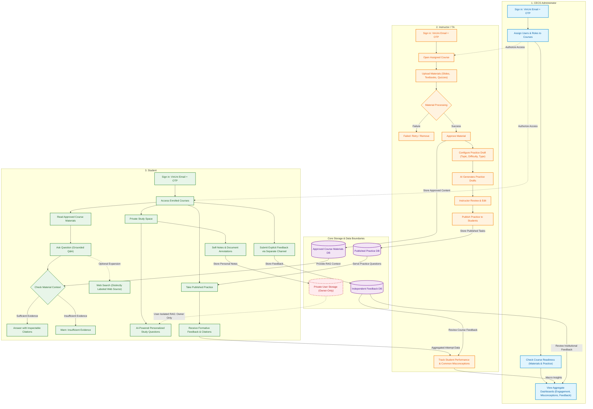
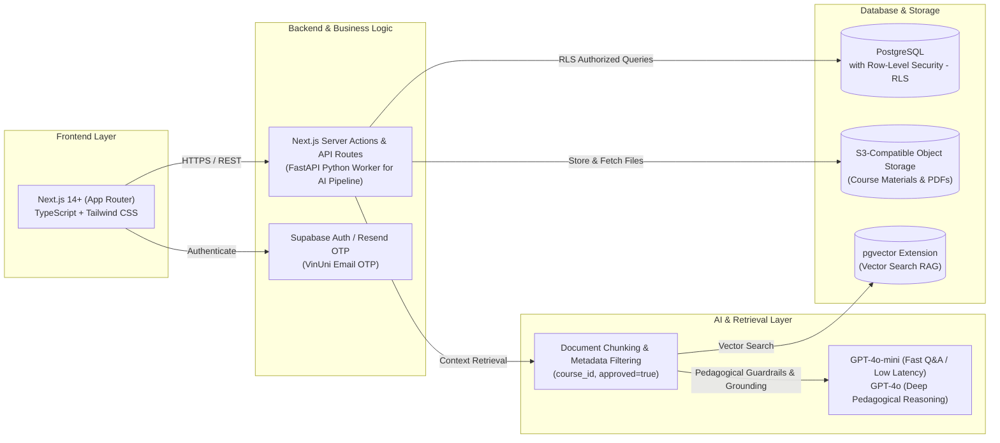

# Individual Research Report

**Full Name:** Nguyen Thanh Tung  
**Student ID:** 2A202601140  

---

# 1. Product Understanding

## 1.1 Instructor, Student, and CECS Administrator Journeys

- **Instructor / Teaching Assistant (TA):**
  1. *Sign in:* Log in using a VinUni email and a one-time code (OTP). Microsoft SSO is not needed for the pilot.
  2. *Upload Course Materials:* Open assigned courses and upload lecture slides, textbooks, problem sets, and syllabi.
  3. *Manage Content:* Check file status (`processing / ready / failed / retry`). Approve processed materials so students can access them. Hide or remove files anytime.
  4. *Create & Publish Practice:* Choose topics and difficulty levels to let AI draft practice questions. Review, edit, and publish them to students.
  5. *Track Progress:* View course activity numbers, quiz results, and common student mistakes to adjust upcoming lectures.

- **Student:**
  1. *Sign in:* Log in with a VinUni email and open enrolled courses.
  2. *Ask Questions (Grounded Q&A):* Read course materials and ask questions. The AI answers using only approved documents, showing clickable citations with page numbers. If the answer is not in the material, the AI clearly states that it does not have enough evidence.
  3. *Optional Web Search:* Turn on web search when needed. The system clearly labels whether information came from the course or the web.
  4. *Private Study Space:* Write personal notes, highlight texts, and create self-study questions. Students have full control to save, edit, or delete their notes.
  5. *Practice & Feedback:* Solve published quizzes and get instant feedback explaining why an answer is right or wrong, linked back to course slides.
  6. *Submit Feedback:* Send direct feedback about the course or platform through a separate feedback channel.

- **CECS Administrator:**
  1. *Manage Users:* Assign instructors, TAs, and students to their courses with server-side permissions.
  2. *Check Course Readiness:* Check how many materials each course has uploaded, processed, and approved before classes begin.
  3. *Review Overall Trends:* View college-wide numbers on platform usage, common student challenges, and submitted feedback.
  4. *Privacy Protection:* Admins only see high-level statistics; they can never view any student's private notes.

---

## 1.2 Distinguishing Private Notes from Course Materials, Feedback, and Dashboards

The core security rule of the project is **"Private means private"**:
- Enforced on the **server and database**, not just hidden on the screen.
- Private student notes are a required core feature for the pilot.
- **Rules on AI Search (RAG):** Private notes are **never** put into the shared class search. However, a student can use AI inside their own private space (for example, to make personal flashcards from their notes) without sharing that data with anyone else.

| Data Type | Private Student Notes | Approved Course Materials | Submitted Feedback | Dashboards & Analytics |
| :--- | :--- | :--- | :--- | :--- |
| **What is it?** | Personal notes, highlights, and self-study questions written by the student. | Syllabi, slides, textbooks, and quizzes uploaded by teachers. | Direct student comments about teaching or the platform. | Overall system numbers: completion rates, difficult topics, and common errors. |
| **Who can see it?** | **Only the student who wrote it.** | Teachers, TAs, and enrolled students in that course. | Assigned teachers and CECS administrators. | Teachers (course stats) and Admins (college stats). |
| **Used for AI Search?** | • Shared Class Search: **NO**. • Private Self-Study: **YES** (only for that student). | **YES**, but only after the teacher approves the file. | **NO**. Stored separately in a feedback box. | **NO**. Dashboards only show summary statistics. |
| **Shown in Logs or Dashboards?** | **NEVER**. Blocked from normal server logs, reports, and dashboards. | File status is shown (processing, ready, approved). | Shown in a private feedback inbox for teachers/admins. | Shows anonymous trends only; zero personal notes. |
| **User Guarantee** | Clear notice that teachers and admins cannot see private notes. | Answers always link back to exact source pages or slides. | Kept separate from regular learning chats. | Clear data rules defined before building the app. |

---

## 1.3 Two Measurable Success Signals and One Key User Assumption

The pilot will run across 1–4 courses in Fall 2026 (Launch date: **5 October 2026**):

- **Two Measurable Success Signals:**
  1. *Student Engagement:* At least **70% of enrolled students** use the grounded chatbot weekly; at least **35% of chatbot questions lead to citation clicks** (checking the source); quiz completion rate exceeds **60%**; and at least **70% of students** use their Private Study Space.
  2. *Teacher Readiness:* **100% of core materials** are uploaded, processed, and approved before lectures; teachers review and publish at least **75% of AI-generated practice drafts** within 48 hours instead of starting from scratch.

- **One Key User Assumption to Test:**
  - *Privacy Trust:* "Students will only use the AI to ask about their weaknesses and keep personal study notes if they completely trust that teachers and admins cannot see or grade their private notes."  
  *(How to test: Interview students after week 1 and check server logs to confirm that private notes are strictly protected).*

---

# 2. Research on Current AI Learning Applications at Leading Universities

> Focus area: **Computer Science & Information Technology (IT/CS)** education across leading global institutions. Distinguishing between: *Announcement* / *Deployed Service* / *Evaluated Learning Outcome*.  
> Verification date: **14 September 2026**.

| Application & Source | Course Area & Problem | Key Features | Real Evidence & Limits | Takeaway for CECS |
| :--- | :--- | :--- | :--- | :--- |
| **1. CS50.ai / The CS50 Duck** *(Harvard University & Yale University)*  [CS50.ai Platform](https://cs50.ai) Paper: [SIGCSE 2024 / arXiv:2401.07409](https://arxiv.org/abs/2401.07409) Source Date: 03/2024 • Access Date: 14/09/2026 | **Focus:** Coding labs & debugging.  **Problem:** Students get stuck on bugs late at night without TA help; generic ChatGPT writes code for them, hurting their ability to learn. | • Built directly into VS Code (`cs50.dev`). • Teaching rules: AI gives hints and asks guiding questions to help students find bugs, refusing to write ready-made solutions. • Teacher dashboard to set rules and see common student bottlenecks. | **Status:** *Deployed & Evaluated Outcome*.  **Evidence:** Used by thousands of students at Harvard and Yale. Research shows students debug faster without needing late-night TA shifts.  **Limits:** AI may give away too much if asked repeatedly; high API costs during deadline weeks. | • **Never write full code solutions for students:** The chatbot should act as a helpful guide, explaining error messages and pointing back to lecture slides instead of doing the homework. |
| **2. Maizey** *(University of Michigan)*  [U-Mich Maizey Platform](https://its.umich.edu/computing/ai/maizey) Initiative: [U-Mich ITS AI Initiatives](https://genai.umich.edu/) Source Date: 2023 – 2024 • Access Date: 14/09/2026 | **Focus:** Theory courses (Networks, OS, Discrete Math).  **Problem:** Courses have hundreds of pages of slides and readings; generic AI makes up fake facts or gives answers that don't match the exam. | • Campus-wide AI tool connected to Canvas LMS. • Professors upload slides and readings to create a custom course chatbot in minutes. • Answers strictly from course documents with exact page numbers. | **Status:** *Deployed Service & Evaluation*.  **Evidence:** Deployed across hundreds of courses. High student trust because answers match lecture slides and exam outlines.  **Limits:** Hard to read complex tables or math formulas saved as image files. | • **Support all CS subjects, not just coding:** Validates that the CECS AI Learning Hub must support theory courses using lecture slides with exact page citations and warnings when evidence is missing. |
| **3. CMU Open Learning Initiative (OLI) & Cognitive Tutors** *(Carnegie Mellon University)*  [CMU OLI Platform](https://oli.cmu.edu/) Initiative: [Simon Initiative Learning Engineering](https://www.cmu.edu/simon/) Source Date: GenAI Update 2024 • Access Date: 14/09/2026 | **Focus:** Math, Calculus & Probability for Data Science.  **Problem:** In multi-step math problems, students only see a final Right/Wrong score, not knowing which exact reasoning step went wrong. | • Breaks problems down step by step to find where the student made a logic error. • Automatically suggests practice questions to fix that specific gap. | **Status:** *Deployed & Rigorously Evaluated*.  **Evidence:** Proven in university studies: students master math concepts in half the usual time.  **Limits:** Takes a lot of effort for professors to design all problem steps initially. | • **Group common mistakes together:** Analyze student quiz errors to see where most students get confused, and show these trends on teacher dashboards to guide class lectures. |
| **4. PyTutor** *(MIT RAISE, Georgia State University & Quinsigamond Community College)*  [MIT RAISE PyTutor](https://raise.mit.edu/research/research-projects/pytutor/) Source Date: 2023 – 2024 • Access Date: 14/09/2026 | **Focus:** Personal self-study for introductory programming.  **Problem:** Students studying at home have trouble connecting lecture slides with their current code and past questions. | • Interactive workspace with code editor and whiteboard. • AI tutor uses 3 inputs: course slides, student's current code, and past questions. • Gives supportive, step-by-step guidance. | **Status:** *Deployed Service* in CS1 courses.  **Evidence:** Students feel supported by an empathetic tutor and are less shy about asking basic questions.  **Limits:** Student code and questions could leak if saved into shared class search. | • **Private Study Space with strict protection:** Give students personal tools that use their notes and practice work, while keeping their private data strictly isolated (*"Private means private"*). |
| **5. AcaWriter** *(University of Technology Sydney & University of Edinburgh)*  [AcaWriter Platform](https://acawriter.uts.edu.au/) Center: [UTS Connected Intelligence Centre](https://cic.uts.edu.au/tools/acawriter/) Source Date: 2023 – 2024 • Access Date: 14/09/2026 | **Focus:** Capstone reports and technical writing.  **Problem:** Students write messy technical reports without clear evidence or copy-paste AI text, risking plagiarism. | • Checks writing structure: problem statement, evidence, testing results, and limitations. • Gives feedback on how to make arguments clearer without writing the text for them. | **Status:** *Deployed Service & Evaluated Outcome*.  **Evidence:** Used in engineering and research courses; improves report clarity and proper citation habits.  **Limits:** Does not parse complex code blocks well. | • **Help students write clear reports:** Provide automated feedback on report structure for capstone and lab reports, teaching students how to write clear, honest research papers. |

---

## 2.1 Five Core Takeaways for CECS AI Learning Hub

1. **Guide students with hints, never write code for them (CS50.ai):** For programming exercises, the chatbot should give helpful hints and ask guiding questions rather than writing complete code solutions, helping students develop independent problem-solving skills.
2. **Support all computer science courses, not just coding (Maizey):** Support theory courses (such as Networks, Operating Systems, and Discrete Math) by searching approved lecture slides and textbooks with exact page numbers.
3. **Diagnose step-by-step logic errors (CMU OLI):** Break down math and logic problems into steps to see where students get confused, and summarize common errors for teachers.
4. **Keep personal tutoring workspaces private (PyTutor):** Give students personal study tools that use their notes and past questions, while keeping private notes strictly isolated from the class (*"Private means private"*).
5. **Help students write clear technical reports (AcaWriter):** Guide students to organize their capstone and lab reports with clear problem statements, evidence, and proper citations.

---

# 3. Proposed Product Concepts & Technical Architecture for CECS

## 3.1 Three User Experience Flows for Active Learning

The system supports three user groups and helps students study effectively using active learning techniques:

### 1. Student Experience Flow
- **Ask Questions with Source Links:**
  - Students open their courses and read approved lecture slides and textbooks.
  - Ask questions and get answers based strictly on course documents, with clickable page numbers. If the documents do not have the answer, the AI clearly warns the student.
  - A clean visual mindmap shows how core lecture concepts connect with each other.
- **Private Study Tools:**
  - **Teach-the-AI Mode (Feynman Technique):** Students explain a concept in their own words. The AI plays the role of a curious student, asking follow-up questions to check if the student truly understands.
  - **Smart Review Flashcards:** AI turns personal notes into flashcards for quick daily review.
  - **Exam Practice:** Generates practice questions matching course topics, with explanations pointing back to the lecture slides.
- **Privacy Guarantee:** All personal notes and practice history are strictly private to the student (*"Private means private"*).

### 2. Instructor / TA Experience Flow
- **Upload & Approve Materials:** Teachers upload slides and textbooks. The system extracts the text cleanly, and the teacher reviews and clicks **Approve**.
- **Create Practice Sets:** AI drafts practice questions at different difficulty levels. Teachers review, edit, and publish them to students.
- **Common Mistakes Summary:**
  - The system groups together common mistakes from quizzes and questions.
  - Shows an overview on the teacher dashboard (for example: *Notice: 65% of students struggle with pointer arithmetic*).
  - Helps teachers address difficult topics during class without exposing any student's private identity.

### 3. CECS Administrator Experience Flow
- Manage user accounts and course enrollments.
- Check course readiness: ensure materials and practice sets are uploaded and approved before classes start.
- Review college-wide usage trends to support teachers and allocate TAs effectively.

---

## 3.2 Simplest Useful Pilot vs. Later List

To guarantee a successful product showcase by **5 October 2026** (with core flows working by **24 September 2026** per README.md), we clearly divide features into what is needed for the pilot and what can wait until later:

| Functional Area | Simplest Useful Pilot (Must-Have by 24 Sep & Launch 05 Oct) | Later List (Deferred Post-Pilot) |
| :--- | :--- | :--- |
| **Auth & Access** | • Sign in with a 6-digit code sent to VinUni email (no password needed). • User roles (Student, Instructor, Admin) checked safely on the server. | • Single Sign-On (SSO) with Microsoft accounts. • Automatic student list syncing with Canvas LMS. |
| **Material Management** | • Upload PDF files (slides, textbooks, syllabi). • Manage files: upload, process, approve for students, or delete. | • Turning video and audio lecture recordings into text. • Running code directly inside the browser (like Jupyter Notebooks). |
| **Grounded AI Chat** | • AI answers based only on approved course documents. • Clickable citations with page numbers, and warnings when evidence is missing. • Optional web search that clearly labels course vs. web sources. | • Voice chat and speaking directly with the AI. • Reading handwritten math formulas from photos. |
| **Private Study Space** | • Personal notes, text highlights, and self-study questions. • Only the student can see their notes; blocked from shared class search. • Simple flashcards created from notes. | • Letting students upload their own personal files. • Interactive 3D mindmaps. • Practicing out loud with voice AI. |
| **Practice & Quizzes** | • AI creates practice questions from approved course documents. • Teachers must review, edit, and approve questions before publishing. • Instant feedback showing why an answer is right or wrong, with slide links. | • AI grading exams and giving official final grades. • Tests that automatically change difficulty while a student takes them. |
| **Analytics & Insights** | • Basic stats: student activity, quiz completion rates, and difficult topics (private notes are never shown). | • AI predicting which students might fall behind early in the semester. |

---

## 3.3 Proposed Tech Stack Direction

The architecture emphasizes **simplicity, rock-solid reliability, low operational cost, and rapid development**:

* **Frontend:**
  - **Choice:** **Next.js 14+ (App Router) + TypeScript + Tailwind CSS**.
  - **Why:** Fast UI development, quick page loading, easy rendering for Markdown notes and diagrams, and a clean component structure.
* **Backend & API Layer:**
  - **Choice:** **Next.js API Routes** for core business logic, paired with a simple **FastAPI (Python)** service for extracting text and chunking PDF documents.
  - **Why:** Keeps server setup simple during the pilot while taking advantage of Python's strong document processing tools.
* **Database & Secure Storage:**
  - **Choice:** **PostgreSQL (on Supabase or Neon)** with **S3-compatible Object Storage** for PDF files.
  - **Privacy Rule:** Use **Row-Level Security (RLS)** on the `private_notes` table (`auth.uid() = owner_id`). This ensures that private notes are safely locked at the database level, preventing any accidental data leaks.
* **AI Engine & Search:**
  - **Models:** **GPT-4o-mini** for fast, affordable everyday Q&A (< 2s response); **GPT-4o** for multi-step reasoning, generating practice questions, and the Feynman study mode.
  - **Vector Search:** **`pgvector`** built right into PostgreSQL. Searches document chunks without the extra cost or complexity of running a separate vector database during the pilot.
* **Authentication:**
  - **Choice:** **Passwordless Email OTP** sending a 6-digit code to `@vinuni.edu.vn` emails via Resend or Supabase Auth. Simple, secure, and avoids waiting for external Microsoft IT approvals.
* **Hosting & Deployment:**
  - **Choice:** Frontend and APIs on **Vercel** with GitHub Actions CI/CD; Database on **Supabase**; Error tracking with **Sentry**.

---

## 3.4 Educational Innovations for Students and QS Reimagine Education Awards

To support VinUni's strategic goal of reaching the global top 100 young universities (**VinUni QS-100 Ambition**), these features are designed for student learning and can be submitted to the [QS Reimagine Education Awards](https://www.qs.com/conferences/reimagine/apply) under **AI in Education** and **Innovation in Higher Education**:

1. **Teach-the-AI Mode (The Feynman Lab):**
   - *Idea:* Instead of students passively asking AI for answers, students learn by explaining difficult concepts (such as Dijkstra's algorithm or TCP handshakes) to the AI in their own words. The AI plays the role of a curious student asking follow-up questions.
   - *Why it helps:* Helps students truly understand concepts rather than memorizing, while preventing passive copy-pasting from AI.
2. **Private Study Space with Mindmaps:**
   - *Idea:* A personal study space with automatic visual mindmaps generated from course syllabi, plus private flashcards.
   - *Why it helps:* Gives students a safe place to practice, make mistakes, and ask basic questions without fear that teachers or admins are watching or grading them (*"Private means private"*).
3. **Classroom Common Mistakes Summary for Teachers:**
   - *Idea:* Groups common student errors from quizzes and chatbot topics into a simple dashboard for teachers, without showing any student's name or private notes.
   - *Why it helps:* Teachers immediately see which topics students struggle with before stepping into class, allowing them to adjust their lectures.
4. **Step-by-Step Hint Ladder (Anti-Dependency):**
   - *Idea:* When students get stuck on coding or math problems, the AI never gives away the full solution. It provides 3 small steps: Step 1 (the key concept and slide number) $\rightarrow$ Step 2 (pseudocode or algorithm outline) $\rightarrow$ Step 3 (a guiding question to help find the bug).
   - *Why it helps:* Helps students learn how to solve problems and debug on their own, preparing them for unassisted exams.
5. **25-Minute Focus Timer with 1-Sentence Summary:**
   - *Idea:* A built-in 25-minute Pomodoro timer in the Private Study Space. When time runs out, a pop-up asks: *"What was the main concept you learned in this sprint? Write it in one sentence."* The answer is saved to their personal study log.
   - *Why it helps:* Reduces distractions, helps students focus, and trains them to summarize core ideas without using expensive AI tokens.
6. **Smart Review Flashcards (Spaced Repetition):**
   - *Idea:* Any concept or keyword highlighted in lecture slides is turned into a 2-sided flashcard. The system reminds students to review after 1, 3, 7, and 14 days.
   - *Why it helps:* Prevents students from forgetting what they learned within 48 hours and turns revision into a quick 3-minute daily habit.

---

# 4. Professional Interests and Individual Contribution

### 4.1 Relevant Experience
- **Software Development (Dev Code):** Strong fullstack and backend foundation with experience in building RESTful APIs, relational data modeling, and clean application workflows.
- **AI Agent & Workflow Design:** Hands-on experience in product design, multi-step LLM workflows (OpenAI, Anthropic, Google Gemini), and prompt engineering with structured outputs.
- **System Architecture:** Ability to turn educational requirements into simple, reliable, and easy-to-maintain software.

### 4.2 Two Preferred Work Areas
1. **Area 1 — AI Core & Retrieval Engine (Grounded Q&A & Private Study Space):**
   - Build the **Grounded Q&A Engine**: connect GPT-4o / GPT-4o-mini, extract clickable source citations, add warnings when documents lack evidence, and set up teaching guardrails (hints instead of full solutions).
   - Build the **Private Study Space**: create note-taking tools, flashcard generators, and self-study practice under strict private data isolation.
2. **Area 2 — Backend Workflow & Course Management:**
   - Build the course material lifecycle (`upload -> processing -> approve/unpublish/remove`) and user course assignments.
   - Set up **Server-side Authorization** and PostgreSQL Row-Level Security (RLS) to enforce the *"Private means private"* guarantee.

### 4.3 One Learning Goal
- **Mastering AI Evaluation (Eval & Benchmarking) & Production CI/CD:**
  - Learn to measure chatbot quality using quantitative metrics (such as faithfulness, answer relevancy, and hallucination rates).
  - Gain hands-on experience setting up automated testing and deployment pipelines on GitHub Actions.

### 4.4 Support Needed from the Team
- **DevOps & Infrastructure:** Work with teammates experienced in cloud setup to build a stable staging environment and GitHub Actions workflows.
- **Evaluation Datasets:** Team help in creating a set of test questions and answers from sample courses to measure chatbot accuracy before the pilot.
- **Code Review:** Peer review on security rules and private data isolation to make sure there are no leaks.

### 4.5 Concrete Day 2 Contribution
- **Measurable Commitment:** Build and demonstrate **one complete working flow from start to finish (One Working Flow)**:
  1. Set up the core Grounded Chat pipeline connected to GPT-4o-mini via API.
  2. Ingest approved sample course materials, search relevant text chunks, and return answers with clickable citations (document name and page number) on the screen.
  3. Write automated server-side security tests showing that private notes cannot be accessed by any other user or teacher.

