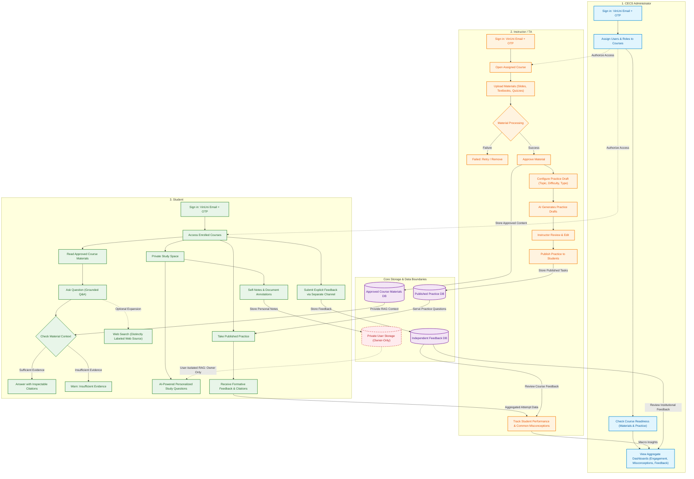
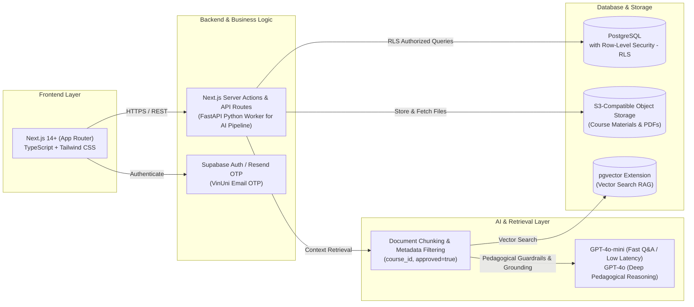

# Individual Research Report

**Full Name:** Nguyen Thanh Tung  
**Student ID:** 2A202601140  

---

# 1. Product Understanding

## 1.1 Instructor, Student, and CECS Administrator Journeys

- **Instructor / Teaching Assistant (TA):**
  1. *Sign-in & Access:* Sign in using an approved VinUni email and a one-time password (OTP) code. Microsoft SSO is not required for the pilot phase.
  2. *Upload Course Materials:* Access assigned courses and upload textbooks, lecture slides, quiz banks, assignments, or other supported instructional materials.
  3. *Manage Material Lifecycle:* Monitor document processing status (`processing / ready / failed / retry`); approve processed materials for student access; unpublish or remove materials whenever necessary.
  4. *Generate & Publish Practice Activities:* Select source materials, topics, difficulty levels, question types, and quantities to generate draft practice activities; review, edit, and publish them to students.
  5. *Track & Enhance Teaching Quality:* Review course activity metrics, student practice results, engagement levels, and common learning misconceptions to refine teaching strategies promptly.

- **Student:**
  1. *Sign-in & Course Access:* Sign in with a verified VinUni email and open assigned courses.
  2. *Grounded Q&A Learning:* Read approved course materials; ask questions grounded strictly in these materials. Inspect supporting source citations down to exact locations (`inspectable citations`); receive a transparent notification when evidence is insufficient (`insufficient-evidence behavior`) rather than ungrounded hallucinations.
  3. *Optional Web Search Expansion:* Optionally expand discussions to the public web; the system must clearly label sources as `Course` vs. `Web`, provide external citations, and explicitly state that the response extends beyond approved course content.
  4. *Private Study Space:* Annotate reading materials, independently write or use AI to generate personal notes and self-study questions; retain full control to save, edit, or delete them.
  5. *Formative Practice:* Complete published practice activities and receive instant formative feedback accompanied by reference citations to course materials.
  6. *Independent Feedback Channel:* Submit explicit feedback regarding teaching quality or platform experience through a dedicated, separate feedback channel.

- **CECS Administrator:**
  1. *Role & Course Allocation:* Assign instructors/TAs and students to their respective courses with strict server-side authorization.
  2. *Course Readiness Checks:* Inspect readiness indicators across courses: material upload volume, processing and approval status, and practice review/publication progress.
  3. *Engagement Monitoring & Support:* Observe overall course and college engagement trends, common academic difficulties, and explicitly submitted feedback to guide strategic institutional improvements.
  4. *Aggregate Insights Boundary:* Access macro-level statistical insights only; strictly prohibited from accessing students' private study spaces.

---

## 1.2 Distinguishing Private Notes from Course Materials, Submitted Feedback, and Dashboards

The core security principle of the project is **"Private means private"**:
- This boundary must be strictly enforced via **server-side authorization**, not merely hidden on the client UI.
- Private student notes are a mandatory core feature of the pilot, strictly distinct from optional student file uploads (which are deferred to the "Later List").
- **Regarding RAG (Retrieval-Augmented Generation):** The project strictly prohibits injecting private notes into the **Shared Retrieval Index** (class-wide RAG). However, notes may be leveraged via **User-isolated RAG / In-Context Prompting** strictly for that individual student inside their Private Study Space (e.g., generating personal self-check flashcards) without data leakage.

| Evaluation Dimension | Private Student Notes & Annotations | Approved Course Materials | Submitted Explicit Feedback | Dashboards & Analytics Insights |
| :--- | :--- | :--- | :--- | :--- |
| **Data Nature** | Personal annotations, self-notes, and study questions generated or written by the student. | Syllabi, lecture slides, textbooks, problem sets uploaded by instructors. | Deliberate, structured input submitted by users regarding teaching or platform experience. | Aggregated system metrics: completion rates, topic difficulty, common misconceptions. |
| **Access Control** | **Strictly Owner-Only Access**. | Course instructors, TAs, and enrolled students. | Assigned instructors and CECS administrators. | Instructors (course-level) and CECS administrators (college-level). |
| **Used for RAG / Retrieval?** | • **Shared RAG (Class-wide): STRICTLY NO**. • **User-Isolated RAG: PERMITTED** strictly within the owner's private space. | **YES**, but only after the instructor explicitly grants **Approved** status. | **NO**. Kept strictly in dedicated feedback storage. | **NO**. Dashboards only aggregate metadata. |
| **Presence in Logs / Dashboards?** | **STRICTLY PROHIBITED**. Excluded from ordinary logs, API exports, and dashboards. | Processing status visible on dashboards (ready, failed, approved). | Displayed in dedicated feedback queues for faculty review. | Displays aggregated, anonymized trends only; zero personal notes. |
| **Trust & UI Guarantees** | Prominent UI privacy statement assuring zero surveillance by faculty/admin. | Verifiable source attribution with inspectable page/line citations. | Submitted via a dedicated channel separate from learning chat. | Predefined data boundaries documented before implementation. |

---

## 1.3 Two Measurable Pilot Success Signals and One Key User Assumption

The pilot will run across 1–4 courses in Fall 2026 (Launch date: **5 October 2026**):

- **Two Measurable Success Signals:**
  1. *Grounded AI Adoption & Citation Trust:* At least **70% of enrolled students** interact with the Grounded Chatbot weekly; at least **35% of chatbot queries result in inspectable citation clicks** (verifying source attribution); practice completion rate exceeds **60%** with formative feedback; and at least **70% of students** actively utilize their Private Study Space.
  2. *Instructor Adoption & Content Readiness:* **100% of core course materials** are uploaded, processed, and approved before weekly lectures; instructors actively review, edit, and publish at least **75% of AI-generated practice drafts** within 48 hours rather than ignoring them or authoring questions from scratch.

- **One Key User Assumption to Validate:**
  - *Privacy Trust Assumption:* "Students will only genuinely use the AI platform to reveal their conceptual gaps, ask fundamental questions, and draft personal study notes if they possess absolute trust in the **'Private means private'** guarantee—believing that instructors, TAs, and administrators cannot monitor, inspect, or grade them based on their private space."  
  *(Validation method: Conduct post-week-1 user interviews and verify server-side authorization logs to confirm that security enforcement eliminates student hesitation).*

---

# 2. Research on Current AI Learning Applications at Leading Universities

> Focus area: **Computer Science & Information Technology (IT/CS)** education across leading global institutions. Distinguishing between: *Announcement* / *Deployed Service* / *Evaluated Learning Outcome*.  
> Verification date: **14 September 2026**.

| Application & Source | IT/CS Pillar & Problem Addressed | Key Pedagogical & Technical Features | Empirical Evidence & Limitations | Distinct Takeaway for CECS |
| :--- | :--- | :--- | :--- | :--- |
| **1. CS50.ai / The CS50 Duck** *(Harvard University & Yale University)*  🔗 [CS50.ai Platform](https://cs50.ai) 📄 [SIGCSE 2024 / arXiv:2401.07409](https://arxiv.org/abs/2401.07409) 📅 *03/2024* • 👁️ *14/09/2026* | **Pillar:** Hands-on Coding & Real-time IDE Debugging.  **Problem:** Students struggle with syntax/logic bugs late at night without TA support; generic ChatGPT solves exercises directly, eroding problem-solving abilities. | • Embedded natively into VS Code (`cs50.dev`). • Enforces **Pedagogical Guardrails**: strictly applies Socratic questioning to guide debugging; refuses to output ready-made code. • Instructor dashboard to customize pedagogical rules and monitor common bottlenecks. | **Status:** *Deployed & Evaluated Outcome*.  **Evidence:** Scaled across thousands of CS50 students at Harvard, Yale, and edX; SIGCSE 2024 paper proves faster autonomous debugging and reduced TA night shifts while preserving academic integrity.  **Limitations:** Risk of over-hinting when prompted aggressively; high token inference costs during peak assignment deadlines. | • **Strict Pedagogical Guardrails:** The CECS chatbot must serve as a reflective guide, strictly refusing to write code solutions for programming lab exercises. • Implement code style checking and compiler error explanations mapped directly to lecture slides. |
| **2. Maizey** *(University of Michigan)*  🔗 [U-Mich Maizey Platform](https://its.umich.edu/computing/ai/maizey) 📄 [U-Mich ITS AI Initiatives](https://genai.umich.edu/) 📅 *2023 – 2024* • 👁️ *14/09/2026* | **Pillar:** Course-Grounded RAG across Core IT/CS Curricula (Computer Networks, OS, Computer Architecture, Discrete Math).  **Problem:** Courses involve hundreds of pages of bespoke slides and academic readings; generic LLMs hallucinate or deliver generic answers irrelevant to professors' exam scopes. | • Institutional GenAI platform integrated with Canvas LMS. • Enables instructors across **all disciplines** to upload syllabi, slides, and research papers to spin up a custom course chatbot in minutes. • Grounded strictly in uploaded materials with page-level citations. | **Status:** *Deployed Service & University-wide Evaluation*.  **Evidence:** Deployed across hundreds of courses; high student trust driven by answers aligning directly with professors' syllabi and lecture slides.  **Limitations:** Vector search performance degrades if instructors upload complex tables or mathematical formulas stored as low-resolution images. | • **Course-Grounded RAG beyond coding:** Validates that the CECS AI Learning Hub must support theoretical IT/CS subjects (Networks, OS, Database Systems), not just coding labs. • Enforce mandatory citation checks and `insufficient-evidence` warnings. |
| **3. CMU Open Learning Initiative (OLI) & Cognitive Tutors** *(Carnegie Mellon University)*  🔗 [CMU OLI Platform](https://oli.cmu.edu/) 📄 [Simon Initiative Learning Engineering](https://www.cmu.edu/simon/) 📅 *GenAI Update: 2024* • 👁️ *14/09/2026* | **Pillar:** Discrete Math, Calculus & Probability for Data Science.  **Problem:** In multi-step quantitative problem solving, students only receive binary Right/Wrong scores, obscuring the exact intermediate reasoning step where their mental model failed (e.g., Bayes theorem, recursive logic). | • Cognitive Science foundation: Maps knowledge into fine-grained **Knowledge Components**. • Analyzes intermediate derivation steps to identify conceptual flaws. • Generates **Adaptive Practice** tasks targeting specific student knowledge gaps. | **Status:** *Deployed & Rigorously Evaluated Outcome* (Global Learning XPRIZE winner).  **Evidence:** CMU studies demonstrate that students using OLI master math and statistics concepts in half the time compared to traditional instruction.  **Limitations:** High initial authoring effort required from domain experts to construct the Knowledge Component matrix. | • **Step-level Misconception Tracking:** Aggregate student practice results to identify recurring misconceptions in Discrete Math and Algorithm Analysis, feeding insights to faculty dashboards. • Facilitate instructor authoring of leveled practice problems. |
| **4. PyTutor** *(MIT RAISE, Georgia State University & Quinsigamond Community College)*  🔗 [MIT RAISE PyTutor](https://raise.mit.edu/research/research-projects/pytutor/) 📅 *2023 – 2024* • 👁️ *14/09/2026* | **Pillar:** Multi-source Context Private Tutoring.  **Problem:** Students studying at home lack cohesion between classroom slides, current in-progress code, and past self-study inquiries. | • Interactive workspace combining executable code and an interactive whiteboard. • Context-aware AI synthesizes 3 sources: **(1) Course materials, (2) Current student work, and (3) Prior interaction history**. • Fine-tuned with reinforcement learning to provide constructive pedagogical dialogue. | **Status:** *Deployed Service* across partner institutions in CS1 courses.  **Evidence:** Students report feeling supported by an empathetic 1-on-1 tutor, reducing hesitation when seeking foundational help.  **Limitations:** Risks leaking private student data if history is aggregated into shared vector indexes; long-term grade impact data still pending. | • **Context-Rich Private Study Space:** Allow AI to leverage current notes and practice work to generate personalized self-quizzes. • **Strict Privacy Boundary:** Enforce *User-isolated RAG* (*"Private means private"*), never pooling individual notes into shared course retrieval. |
| **5. AcaWriter** *(University of Technology Sydney & University of Edinburgh)*  🔗 [AcaWriter Platform](https://acawriter.uts.edu.au/) 📄 [UTS Connected Intelligence Centre](https://cic.uts.edu.au/tools/acawriter/) 📅 *2023 – 2024* • 👁️ *14/09/2026* | **Pillar:** Research Practice, Technical Reporting & Capstone Projects.  **Problem:** Computing students frequently write unstructured technical reports lacking empirical evidence, counter-arguments, or resort to uncritical AI text generation leading to plagiarism. | • **Rhetorical Moves Analytics** analyzes scientific argumentation structures. • Does not ghostwrite; highlights key structural components: Problem Framing, Empirical Evidence, Hypotheses, Limitations. • Provides automated formative feedback prompting students to strengthen logical rigor. | **Status:** *Deployed Service & Evaluated Learning Outcome* across UTS and Edinburgh.  **Evidence:** Extensively evaluated in engineering capstones and postgraduate research; significantly enhances argumentation clarity and citation transparency.  **Limitations:** Sub-optimal parsing for papers with dense embedded mathematical formulas or inline code snippets. | • **Formative Feedback for Technical Writing:** CECS can offer automated structural feedback for capstone projects and research methodology reports. • Trains students in scientific rigor, transparent citation standards, and academic integrity. |

---

## 2.1 Five Core Non-Overlapping Takeaways for CECS AI Learning Hub

1. **Non-Negotiable Pedagogical Guardrails (from CS50.ai):** In programming lab contexts, the CECS chatbot must act as a Socratic sparring partner, strictly declining to generate complete code solutions to cultivate students' independent problem-solving skills.
2. **Standardized Grounded RAG Across All IT Disciplines (from Maizey):** The platform must accommodate theoretical computing subjects (Computer Networks, Operating Systems, Theory of Computation) via verified course document retrieval (`Approved Materials`) with inspectable page-level citations.
3. **Step-by-Step Misconception Diagnosis & Adaptive Practice (from CMU OLI):** Go beyond binary grading by decomposing complex quantitative and algorithmic problems into reasoning steps, surfacing aggregate common misconceptions to faculty dashboards.
4. **Strict Isolation in Multi-Source Private Tutoring (from PyTutor):** Provide a rich, personalized self-study environment powered by personal context, while strictly safeguarding data with server-side isolation (*"Private means private"*).
5. **Formative Feedback for Scientific Rigor & Argumentation (from AcaWriter):** Scaffold technical report writing and capstone documentation with automated rhetorical analysis, training students to produce verifiable, research-grade work.

---

# 3. Proposed Product Concepts & Technical Architecture for CECS

## 3.1 Three User Experience Flows Integrating Active Learning Methodologies

The system harmonizes three distinct personas with contemporary pedagogical techniques, including the **Feynman Technique, Active Recall, Spaced Repetition, and Semantic Mindmapping**:

### 1. Student Experience Flow
- **Grounded Q&A & Semantic Mindmapping:**
  - Students open enrolled courses and access approved instructional materials.
  - Ask questions grounded strictly in official materials with inspectable citations (`Inspectable Citations`). When source evidence is insufficient, the AI issues an honest limitation disclaimer (`insufficient-evidence`).
  - The system automatically extracts core lecture concepts to construct an **Interactive Semantic Mindmap**, enabling students to visualize hierarchical knowledge dependencies (e.g., *Pointers $\rightarrow$ Dynamic Memory Allocation $\rightarrow$ Linked Lists* in Data Structures).
- **Private Study Space with Active Learning Tools:**
  - **The Feynman Active-Recall Room:** Students invert roles by choosing to *"Teach the AI"*. The student explains a complex technical concept (e.g., *Central Limit Theorem, TCP 3-Way Handshake, Dijkstra's Algorithm*) in their own words. The AI adopts the persona of a curious learner, asking probing questions to unmask logical gaps or superficial memorization.
  - **Automated Active Recall & Spaced Repetition Flashcards:** The AI auto-generates retrieval-practice flashcards derived from the student's personal notes and lecture slides for spaced self-testing.
  - **Smart Exam Simulator & Study Guide:** Generates high-yield study outlines aligned with Course Learning Outcomes (CLOs), alongside mock exams offering formative feedback linked directly back to lecture slides.
- **Privacy Guarantee:** All personal notes, Feynman practice transcripts, and self-test records remain strictly encrypted and inaccessible to instructors or administrators (*"Private means private"*).

### 2. Instructor / TA Experience Flow
- **Curated Material Ingestion & Approval:** Instructors upload slides, textbooks, and quizzes. The system automatically structures content, extracts key terms, and verifies parsing before the instructor grants **Approval**.
- **Bloom's Taxonomy-Aligned Practice Authoring:** AI drafts leveled practice problems across cognitive tiers (Remembering, Understanding, Applying, Analyzing); instructors retain full editorial authority to review, adjust, and publish.
- **Collective Misconception Heatmap:**
  - The system synthesizes student practice performance and anonymized Q&A themes to detect systemic knowledge gaps.
  - Visualized as a **Misconception Heatmap** on the instructor dashboard (e.g., *Alert: 68% of students struggle with void pointer casting or confuse time vs. space complexity*).
  - Empowers faculty to deliver **Evidence-based Teaching** during live lectures without compromising individual student privacy.

### 3. CECS Administrator Experience Flow
- Manage server-side user provisioning and course enrollments.
- Monitor **Course Readiness**: Track material approval rates and published practice volume ahead of each academic semester.
- Review college-level academic health metrics to optimize TA resource allocation and curriculum design.

---

## 3.2 Simplest Useful Pilot vs. Later List

To guarantee a successful product showcase by **5 October 2026** (with core flows operational by **24 September 2026** per README.md), feature scope is strictly partitioned:

| Functional Area | Simplest Useful Pilot (Must-Have by 24 Sep & Launch 05 Oct) | Later List (Deferred Post-Pilot) |
| :--- | :--- | :--- |
| **Auth & Access** | • Passwordless email OTP verification via `@vinuni.edu.vn`. • Role-based access control (Student, Instructor/TA, Admin) with server-side authorization. | • Microsoft Single Sign-On (SSO) integration. • Automated Canvas LMS roster synchronization via LTI 1.3 standard. |
| **Material Management** | • Standard file uploads (PDF slides, textbooks, syllabi). • Full lifecycle: `upload -> processing (ready/failed/retry) -> approve / unpublish / remove`. | • Automated video lecture transcription and audio parsing. • Live, interactive Jupyter Notebook cloud execution environments. |
| **Grounded AI Chat** | • Live RAG retrieval grounded in approved materials (`DB_Approved`). • Inspectable page-level citations and `insufficient-evidence` fallbacks. • Optional Web expansion with distinct `Course` vs. `Web` source labeling. | • Real-time voice-driven multimodal conversational interfaces. • Multi-modal mathematical equation parsing from handwritten notes. |
| **Private Study Space** | • Personal notes, document annotations, and private self-quizzes. • Strict owner-only access; excluded from shared RAG and ordinary logs. • Text-based active recall flashcard generation. | • Student private file uploads to personal cloud storage. • Advanced 3D kinetic concept graphs. • Real-time speech-to-speech Feynman simulation rooms. |
| **Practice & Activities** | • AI generates draft practice from approved course content. • Mandatory instructor review, edit, and publish workflow (`Review & Edit & Publish`). • Formative feedback delivered to students with source citations. | • Fully automated summative AI grading without human oversight. • Real-time dynamic Computerized Adaptive Testing (CAT) engines. |
| **Analytics & Insights** | • Basic activity counts, processing status, and aggregate topic difficulty summaries (private notes strictly excluded). | • Predictive student attrition modeling and early-warning academic risk engines. |

---

## 3.3 Proposed Tech Stack Direction

The architecture emphasizes **simplicity, rock-solid reliability, low operational cost, and rapid development**:

* **Frontend:**
  - **Choice:** **Next.js 14+ (App Router) + TypeScript + Tailwind CSS**.
  - **Rationale:** Rapid UI assembly, server-side rendering (SSR) for low latency, native Markdown and Mermaid rendering support, modular component architecture.
* **Backend & API Layer:**
  - **Choice:** **Next.js Server Actions & API Routes** as the core backend, paired with a lightweight **FastAPI (Python)** service for heavy AI document parsing and chunking pipelines.
  - **Rationale:** Minimizes infrastructure overhead during the pilot while capitalizing on Python's mature data processing ecosystem.
* **Database & Secure Storage:**
  - **Choice:** **PostgreSQL (hosted on Supabase or Neon)** with **S3-compatible Object Storage**.
  - **Security Pillar:** Enable **Row-Level Security (RLS)** on the `private_notes` table. Enforcing `auth.uid() = owner_id` at the database engine level guarantees that private student notes cannot leak through application-layer bugs or shared queries.
* **AI Engine & Vector Retrieval:**
  - **Model Selection:** **GPT-4o-mini** for high-speed, cost-effective grounded conversational Q&A (< 2s latency); **GPT-4o** for multi-step pedagogical reasoning, Bloom-leveled practice generation, and Feynman Socratic simulation.
  - **Vector Database:** **`pgvector`** embedded natively within PostgreSQL. Eliminates the cost and operational complexity of running a standalone vector database (e.g., Pinecone/Qdrant) during the pilot.
* **Authentication:**
  - **Choice:** **Passwordless Email OTP** dispatching 6-digit codes to `@vinuni.edu.vn` addresses via Resend API or Supabase Auth. Simple, secure, and independent of external Microsoft Azure AD approval delays.
* **Hosting & Operations:**
  - **Choice:** Frontend and APIs deployed on **Vercel** with automated GitHub Actions CI/CD; Database on **Supabase**; Error tracking via **Sentry**; usage and token cost monitoring via administrative dashboards.

---

## 3.4 World-Class Educational Innovations for QS Reimagine Education Awards

To directly champion VinUni's strategic journey toward the global top 100 young universities (**VinUni QS-100 Ambition**), these high-impact features are positioned for competitive submission to the [QS Reimagine Education Awards](https://www.qs.com/conferences/reimagine/apply) under the **AI in Education** and **Innovation in Higher Education** categories:

1. **The Feynman Active-Recall Lab: Inverting Generative AI into Curious Learners**
   - *Innovation:* Overcomes the global challenge of passive AI dependence. The system inverts standard roles: students act as instructors explaining complex technical algorithms to the AI, while the AI role-plays as an inquisitive novice asking Socratic counter-questions.
   - *Pedagogical Impact:* Deepens conceptual mastery, cultivates critical thinking, and neutralizes generative AI cheating by transforming AI into an active assessment tool.
2. **Zero-Knowledge Personalized Study Sanctuary with Semantic Mindmapping**
   - *Innovation:* Pioneering an institutional architecture guaranteeing mathematical privacy isolation via server-side RLS (*"Private means private"*). Features dynamically generated semantic mindmaps from syllabi and spaced-retrieval flashcards tailored to individual private notes.
   - *Pedagogical Impact:* Fosters an uncompromising environment of **Psychological Safety**, allowing students to explore vulnerabilities and practice self-regulated learning without fear of academic surveillance.
3. **Privacy-Preserving Collective Misconception Heatmap**
   - *Innovation:* Semantic clustering algorithms aggregate anonymized learning friction points from practice attempts and Q&A interactions, synthesizing collective class misconceptions for faculty while keeping personal notes completely inaccessible.
   - *Pedagogical Impact:* Empowers instructors to transition from reactive lecturing to proactive **Evidence-Based Teaching**, resolving class-wide stumbling blocks before stepping into the lecture hall.
4. **The Scaffolded Clue Ladder: Anti-Dependency Pedagogical Stepper**
   - *Innovation:* Eliminates the passive crutch of students copying problem statements into LLMs for instant solutions. When stuck, the AI enforces a strict 3-tiered hint ladder: Tier 1 (Core concept & slide citation) $\rightarrow$ Tier 2 (Pseudocode / algorithmic mental model) $\rightarrow$ Tier 3 (Socratic probing questions to identify edge cases). The AI strictly declines to output complete code solutions.
   - *Pedagogical Impact:* Scaffolds independent problem-solving resilience, directly preparing students for unassisted closed-book exams while cultivating metacognitive debugging habits.
5. **Pomodoro Deep-Work & Micro-Synthesis Check-in**
   - *Innovation:* Integrates a 25-minute Pomodoro focus timer directly into the Private Study Space. Upon timer expiration, the UI temporarily pauses study materials and presents a mandatory reflection prompt: *"What was the single most essential concept you grasped during this 25-minute sprint? Synthesize it in one concise sentence."* The response is logged automatically into the student's personal Study Journal.
   - *Pedagogical Impact:* Neutralizes online distractions and procrastination, cultivates metacognitive synthesis skills, and dramatically boosts focused study productivity without consuming AI token budget.
6. **Adaptive Spaced Repetition Engine: The Ebbinghaus Shield**
   - *Innovation:* Any technical keyword, syntax pattern, or theoretical concept highlighted by the student within approved course materials is auto-converted into a dual-sided retrieval flashcard. The platform schedules micro-review intervals based on proven spaced repetition principles (Days 1, 3, 7, and 14) via a personalized Leitner system.
   - *Pedagogical Impact:* Defeats the Ebbinghaus forgetting curve (preventing the loss of ~70% of new information within 48 hours), establishing daily 3-minute active recall habits that cement foundational CS knowledge into long-term memory.

---

# 4. Professional Interests and Individual Contribution

### 4.1 Relevant Experience
- **Software Development (Dev Code):** Solid fullstack and backend foundation with proficiency in building RESTful APIs, relational data modeling, and asynchronous workflow execution.
- **AI Agent & Workflow Architecture:** Practical experience in product ideation, complex agentic workflow design, LLM orchestration (OpenAI / Anthropic / Google Gemini), and advanced prompt engineering with structured outputs.
- **System Architecture & UX Focus:** Proven ability to translate ambiguous educational requirements into robust, minimalist, and maintainable software systems.

### 4.2 Two Preferred Work Areas
1. **Area 1 — AI Core & Retrieval Engine (Grounded Q&A & Private Study Space):**
   - Take full ownership of the **Grounded Q&A Engine**: integrate GPT-4o / GPT-4o-mini, implement inspectable citation metadata extraction, enforce `insufficient-evidence` fallback logic, and program rigorous **Pedagogical Guardrails**.
   - Design and build the **Private Study Space**: establish the student note-taking workflow and personalized active-recall study generators under strict data isolation.
2. **Area 2 — Backend Workflow & Course Lifecycle Management:**
   - Engineer the end-to-end course material lifecycle (`upload -> processing -> approve/unpublish/remove`) and role-based course assignment logic.
   - Implement **Server-side Authorization** and PostgreSQL Row-Level Security (RLS) policies to substantiate the *"Private means private"* guarantee.

### 4.3 One Learning Goal
- **Mastering AI Evaluation (Eval & Benchmarking) & Production CI/CD:**
  - Learn to establish rigorous quantitative evaluation pipelines for RAG systems using formal metrics (such as *Faithfulness, Answer Relevancy, Context Precision, and Hallucination Rates*).
  - Acquire hands-on proficiency in building automated CI/CD deployment pipelines on GitHub Actions tailored for AI applications.

### 4.4 Support Needed from the Team
- **DevOps & Infrastructure:** Collaboration with team members experienced in cloud infrastructure to establish a stable staging environment and automate GitHub Actions workflows.
- **Evaluation Datasets (Eval & Metrics):** Team assistance in assembling a verified ground-truth question-and-answer test suite from sample course materials to benchmark chatbot retrieval accuracy before the pilot.
- **Peer Code Review:** Active architectural critique and cross-review on security enforcement and data isolation mechanisms.

### 4.5 Concrete Day 2 Contribution
- **Measurable Commitment:** Build and demonstrate **one complete end-to-end working flow (One Working Flow)**:
  1. Construct the core Grounded Chat pipeline integrated with the GPT-4o-mini API.
  2. Ingest approved sample course materials, execute vector retrieval, and output grounded answers with inspectable source citations (filename, page/section) clickable on the UI.
  3. Write automated server-side privacy access tests demonstrating that cross-user queries to `private_notes` are strictly denied at the database layer.

