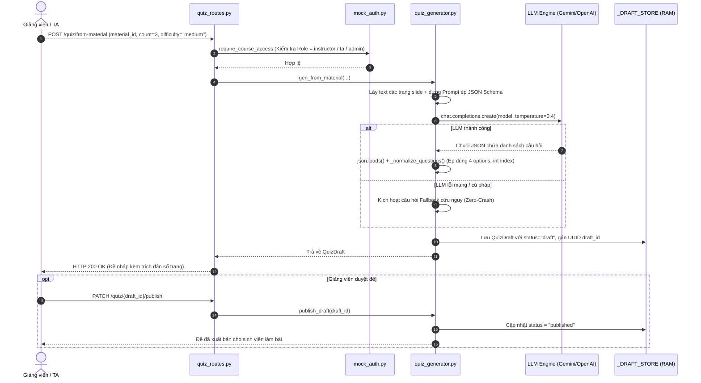
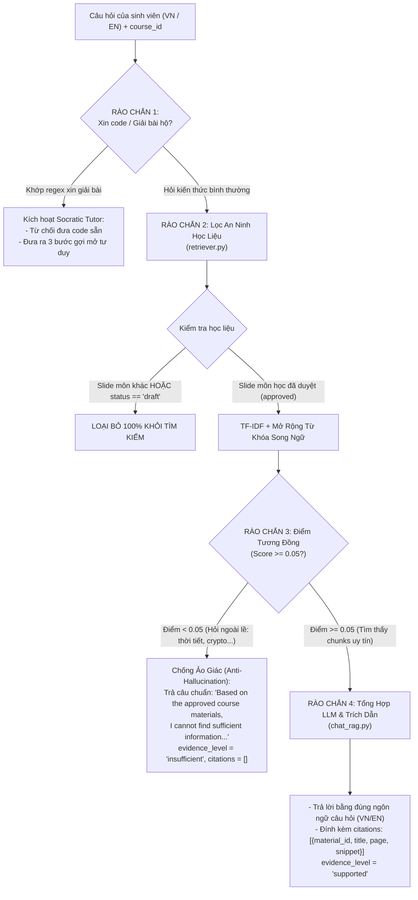
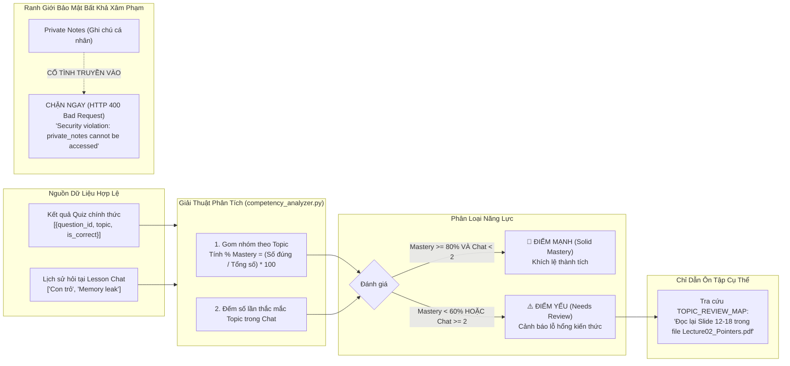

# BÁO CÁO KỸ THUẬT & LOGIC CHI TIẾT 3 KHỐI LÕI AI (TEAM 3)
**Phân hệ:** AI & Quality Engine (`rag/`)  
**Đơn vị thực hiện:** Team 3 (AI & Quality) — CECS AI Learning Hub  
**Dự án:** CECS AI Learning Hub — Viện Kỹ thuật & Khoa học Máy tính, VinUniversity  
**Phiên bản:** Cập nhật Day 02 (16/09/2026)  

---

## MỤC LỤC
1. [Bảng Tra Cứu Toàn Bộ File Mã Nguồn Trong `rag/`](#1-bảng-tra-cứu-toàn-bộ-file-mã-nguồn-trong-rag)
2. [Khối 1: GenQuiz Engine (Sinh Đề Tự Động 3 Dạng)](#2-khối-1-genquiz-engine-sinh-đề-tự-động-3-dạng)
3. [Khối 2: Grounded Chat RAG (Hỏi Đáp Bám Sát Slide & 4 Rào Chắn)](#3-khối-2-grounded-chat-rag-hỏi-đáp-bám-sát-slide--4-rào-chắn)
4. [Khối 3: Competency Analyst (Phân Tích Điểm Mạnh / Điểm Yếu & Lỗ Hổng)](#4-khối-3-competency-analyst-phân-tích-điểm-mạnh--điểm-yếu--lỗ-hổng)
5. [Đặc Tả Hợp Đồng API 3 Khối Lõi (Team 3 API Contracts)](#5-đặc-tả-hợp-đồng-api-3-khối-lõi-team-3-api-contracts)
6. [Bằng Chứng Kiểm Thử Tự Động (22/22 Passed) & Lệnh Test Terminal](#6-bằng-chứng-kiểm-thử-tự-động-2222-passed--lệnh-test-terminal)

---

# 1. BẢNG TRA CỨU TOÀN BỘ FILE MÃ NGUỒN TRONG `rag/`

| Khối chức năng | File mã nguồn | Vai trò cốt lõi & Trách nhiệm kỹ thuật |
|---|---|---|
| **Hạ tầng & Cấu hình** | [`rag/main.py`](file:///d:/Dowloads/Vin/CECS/CECS_AI_LearningHub/rag/main.py) | Khởi tạo FastAPI app, đăng ký toàn bộ routers, CORS, chạy port 8001. |
| | [`rag/config.py`](file:///d:/Dowloads/Vin/CECS/CECS_AI_LearningHub/rag/config.py) | Quản lý đa nhà cung cấp LLM (Gemini, OpenAI, DeepSeek, xKiro), tự động phát hiện API Key & Base URL. |
| | [`rag/mock_auth.py`](file:///d:/Dowloads/Vin/CECS/CECS_AI_LearningHub/rag/mock_auth.py) | Xác thực Bearer Token & phân quyền theo môn học (RBAC: Student, Instructor, TA, Admin). |
| | [`rag/routes/health_routes.py`](file:///d:/Dowloads/Vin/CECS/CECS_AI_LearningHub/rag/routes/health_routes.py) | Endpoint `GET /health` giám sát sức khỏe dịch vụ. |
| **Khối 1: GenQuiz** | [`rag/quiz_generator.py`](file:///d:/Dowloads/Vin/CECS/CECS_AI_LearningHub/rag/quiz_generator.py) | **Trái tim sinh đề 3 dạng:** Prompting ép JSON schema, gọi LLM, chuẩn hóa 4 options, fallback tự động, Draft Store. |
| | [`rag/routes/quiz_routes.py`](file:///d:/Dowloads/Vin/CECS/CECS_AI_LearningHub/rag/routes/quiz_routes.py) | Endpoints tạo đề từ slide (`from-material`), ngân hàng (`from-bank`), ghi chú (`from-note`), duyệt đề (`publish`). |
| | [`rag/run_quiz_demo.py`](file:///d:/Dowloads/Vin/CECS/CECS_AI_LearningHub/rag/run_quiz_demo.py) | Script demo terminal tạo câu hỏi 3 dạng trực tiếp từ file bài giảng. |
| | [`rag/sample_lecture_cs101.txt`](file:///d:/Dowloads/Vin/CECS/CECS_AI_LearningHub/rag/sample_lecture_cs101.txt) | File bài giảng mẫu C Programming phục vụ sinh đề và test. |
| **Khối 2: Chat RAG** | [`rag/chat_rag.py`](file:///d:/Dowloads/Vin/CECS/CECS_AI_LearningHub/rag/chat_rag.py) | **Điều phối Chat RAG:** Truy xuất chunk, lọc ngưỡng (0.05), ghép ngữ cảnh đầy đủ, gọi Gemini/LLM trả lời + trích dẫn trang. |
| | [`rag/grounded_chat.py`](file:///d:/Dowloads/Vin/CECS/CECS_AI_LearningHub/rag/grounded_chat.py) | **4 Rào chắn bảo vệ:** Chặn xin giải hộ (Socratic), chặn slide draft, chặn môn khác, chống ảo giác (Anti-Hallucination). |
| | [`rag/retriever.py`](file:///d:/Dowloads/Vin/CECS/CECS_AI_LearningHub/rag/retriever.py) | **Máy tìm kiếm TF-IDF & Cosine Similarity:** Mở rộng từ khóa song ngữ Anh-Việt (`_expand_query_tokens`) và xếp hạng chunk. |
| | [`rag/routes/chat_routes.py`](file:///d:/Dowloads/Vin/CECS/CECS_AI_LearningHub/rag/routes/chat_routes.py) | Endpoint `POST /courses/{course_id}/chat` kiểm tra quyền ghi danh và trả lời kèm trích dẫn số trang. |
| | [`rag/fixtures/sample_material.py`](file:///d:/Dowloads/Vin/CECS/CECS_AI_LearningHub/rag/fixtures/sample_material.py) | Dữ liệu slide bài giảng mẫu (approved vs draft, hỗ trợ alias `CS101` / `course-a`). |
| | [`rag/chat_cli.py`](file:///d:/Dowloads/Vin/CECS/CECS_AI_LearningHub/rag/chat_cli.py) | Công cụ Terminal tương tác trực tiếp với Chat RAG LLM thật (Gemini). |
| **Khối 3: Analyst** | [`rag/competency_analyzer.py`](file:///d:/Dowloads/Vin/CECS/CECS_AI_LearningHub/rag/competency_analyzer.py) | **Giải thuật phân tích năng lực:** Tính % Mastery theo topic, phân loại Strengths vs Weaknesses, tra cứu `TOPIC_REVIEW_MAP` chỉ đích danh slide ôn tập. |
| | [`rag/demo_competency.py`](file:///d:/Dowloads/Vin/CECS/CECS_AI_LearningHub/rag/demo_competency.py) | Script demo terminal phân tích năng lực sinh viên từ quiz và thắc mắc chat. |
| **Kiểm thử tự động** | [`rag/tests/test_competency.py`](file:///d:/Dowloads/Vin/CECS/CECS_AI_LearningHub/rag/tests/test_competency.py) | 6 bài kiểm thử giải thuật mastery, ranh giới bảo mật `private_notes` và JSON contract. |
| | [`rag/tests/test_genquiz_contract.py`](file:///d:/Dowloads/Vin/CECS/CECS_AI_LearningHub/rag/tests/test_genquiz_contract.py) | 3 bài kiểm thử cấu trúc JSON 3 dạng câu hỏi (`single_choice`, `multiple_choice`, `short_answer`). |
| | [`rag/tests/test_ai_quality.py`](file:///d:/Dowloads/Vin/CECS/CECS_AI_LearningHub/rag/tests/test_ai_quality.py) | 8 bài kiểm thử chất lượng RAG, cách ly slide draft, quyền xuất bản và cách ly chéo môn học. |
| | [`rag/test_rag.py`](file:///d:/Dowloads/Vin/CECS/CECS_AI_LearningHub/rag/test_rag.py) | 5 bài kiểm thử unit độc lập cho 4 rào chắn của `grounded_chat.py`. |

---

# 2. KHỐI 1: GENQUIZ ENGINE (SINH ĐỀ TỰ ĐỘNG 3 DẠNG)

### 2.1 File đảm nhiệm & Cơ chế vận hành
* **File trung tâm:** [`rag/quiz_generator.py`](file:///d:/Dowloads/Vin/CECS/CECS_AI_LearningHub/rag/quiz_generator.py) kết hợp với [`rag/routes/quiz_routes.py`](file:///d:/Dowloads/Vin/CECS/CECS_AI_LearningHub/rag/routes/quiz_routes.py).
* **Nhiệm vụ:** Đọc hiểu văn bản slide/ngân hàng đề $\rightarrow$ Sử dụng Prompt ép kiểu chặt chẽ $\rightarrow$ Gọi LLM $\rightarrow$ Parse JSON an toàn $\rightarrow$ Chuẩn hóa 4 phương án $\rightarrow$ Lưu vào kho bản nháp (`_DRAFT_STORE`) chờ Giảng viên phê duyệt.



---

### 2.2 Quy chuẩn 3 dạng câu hỏi xuất ra (Structured JSON)

Mọi câu hỏi sinh ra bắt buộc tuân thủ 100% định dạng sau:

#### Dạng 1: `single_choice` (Trắc nghiệm 1 đáp án đúng)
* `options`: Bắt buộc đúng **4 phương án**.
* `correct_answer`: Số nguyên chỉ số mảng **(0-based index: 0, 1, 2, 3)**, tuyệt đối không dùng chữ "A", "B", "C".
```json
{
  "id": "q1",
  "type": "single_choice",
  "topic": "Kiểu dữ liệu cơ bản",
  "question": "Trong ngôn ngữ C trên hệ thống 64-bit, kiểu int thường chiếm bao nhiêu bytes?",
  "options": ["1 byte", "4 bytes", "8 bytes", "2 bytes"],
  "correct_answer": 1,
  "explanation": "Kiểu int có kích thước chuẩn 4 bytes.",
  "citation": {
    "source_file": "mat-intro-001.pdf",
    "page": 4,
    "evidence_snippet": "Data types in Python include int, float, str..."
  }
}
```

#### Dạng 2: `multiple_choice` (Trắc nghiệm nhiều đáp án đúng)
* `options`: Bắt buộc đúng **4 phương án**.
* `correct_answer`: Mảng chứa **từ 2 chỉ số đúng trở lên** (ví dụ: `[0, 2]`).
```json
{
  "id": "q2",
  "type": "multiple_choice",
  "topic": "Vòng lặp",
  "question": "Những câu lệnh nào dùng để thay đổi luồng thực thi vòng lặp?",
  "options": ["break", "pass", "continue", "def"],
  "correct_answer": [0, 2],
  "explanation": "break dừng vòng lặp, continue bỏ qua vòng lặp hiện tại.",
  "citation": {
    "source_file": "mat-control-002.pdf",
    "page": 3,
    "evidence_snippet": "Break and continue statements modify loop execution."
  }
}
```

#### Dạng 3: `short_answer` (Tự luận ngắn / Điền từ)
* `options`: Mảng rỗng `[]`.
* `correct_answer`: Chuỗi đáp án mẫu.
* `keywords`: Mảng từ khóa chấm điểm chấp nhận được.
```json
{
  "id": "q3",
  "type": "short_answer",
  "topic": "Hàm",
  "question": "Từ khóa nào trong Python được dùng để định nghĩa một hàm?",
  "options": [],
  "correct_answer": "def",
  "keywords": ["def", "keyword def"],
  "explanation": "A function is defined with the def keyword.",
  "citation": {
    "source_file": "mat-intro-001.pdf",
    "page": 3,
    "evidence_snippet": "A function is a reusable block of code defined with the def keyword."
  }
}
```

---

### 2.3 Cơ chế chống sập (Fault-Tolerance & Fallback)
1. **Làm sạch chuỗi (Sanitization):** Tự động bóc tách các thẻ markdown như ` ```json ` hay text chào hỏi trước khi parse JSON.
2. **Cân chỉnh Options (`_normalize_questions`):** Nếu LLM sinh thiếu hoặc thừa options, hàm tự động bù hoặc cắt về đúng 4 lựa chọn; nếu `correct_answer` bị trả về chuỗi `"1"`, tự động ép kiểu thành số nguyên `1`.
3. **Cơ chế Fallback (Zero-Crash):** Nếu API LLM quá tải (HTTP 429) hoặc mất mạng, hệ thống tự động sinh câu hỏi cứu nguy hợp lệ cấu trúc, không bao giờ để server quăng lỗi 500.

---

# 3. KHỐI 2: GROUNDED CHAT RAG (HỎI ĐÁP BÁM SÁT SLIDE & 4 RÀO CHẮN)

### 3.1 File đảm nhiệm & Nguyên tắc cốt lõi
* **File trung tâm:** [`rag/chat_rag.py`](file:///d:/Dowloads/Vin/CECS/CECS_AI_LearningHub/rag/chat_rag.py), [`rag/grounded_chat.py`](file:///d:/Dowloads/Vin/CECS/CECS_AI_LearningHub/rag/grounded_chat.py), [`rag/retriever.py`](file:///d:/Dowloads/Vin/CECS/CECS_AI_LearningHub/rag/retriever.py).
* **2 Nguyên tắc sư phạm bất biến:**
  1. **Grounded Retrieval (Hỏi đáp có căn cứ):** Chỉ trả lời dựa trên slide bài giảng đã duyệt (`approved_for_ai = True`). Không có thông tin $\rightarrow$ Từ chối chuẩn, cấm bịa đặt (Anti-Hallucination).
  2. **Tutor, Not Solver (Gia sư định hướng):** Sinh viên xin code giải bài tập $\rightarrow$ Tuyệt đối không đưa code mẫu, chỉ đưa 3 bước gợi mở tư duy (Socratic Method).

---

### 3.2 Sơ đồ luồng 4 Rào chắn Bảo vệ (4 Guardrails)



---

### 3.3 Thuật toán TF-IDF & Mở rộng từ khóa song ngữ Anh-Việt
Một thách thức lớn trong thực tế: **Slide bài giảng viết bằng Tiếng Anh, nhưng sinh viên lại đặt câu hỏi bằng Tiếng Việt** (ví dụ: *"biến trong python là gì"*). Nếu dùng TF-IDF thuần túy sẽ bị trả về `insufficient`.

Trong [`rag/retriever.py`](file:///d:/Dowloads/Vin/CECS/CECS_AI_LearningHub/rag/retriever.py), Team 3 đã giải quyết triệt để bằng cơ chế **Bilingual Query Expansion**:
1. **Từ điển ánh xạ thuật ngữ (`VIETNAMESE_CS_MAPPINGS`):** Hơn 30+ cặp từ kỹ thuật (biến $\rightarrow$ variable, hàm $\rightarrow$ function, vòng lặp $\rightarrow$ loop, con trỏ $\rightarrow$ pointer, v.v.).
2. **Hàm mở rộng (`_expand_query_tokens`):** Tự động phát hiện từ khóa tiếng Việt trong câu hỏi và bổ sung các từ đồng nghĩa tiếng Anh vào vector truy vấn.
3. **Tính điểm Cosine Similarity:**
   $$\text{Score}(\vec{q}, \vec{d}) = \frac{\sum_{t} \text{TF-IDF}(t, q) \cdot \text{TF-IDF}(t, d)}{\|\vec{q}\| \cdot \|\vec{d}\|}$$
4. **Ngưỡng lọc (`MIN_RELEVANCE_SCORE = 0.05`):** Loại bỏ nhiễu, chỉ giữ lại top chunks thực sự liên quan.

---

# 4. KHỐI 3: COMPETENCY ANALYST (PHÂN TÍCH ĐIỂM MẠNH / ĐIỂM YẾU & LỖ HỔNG)

### 4.1 File đảm nhiệm & Bản chất nghiệp vụ
* **File trung tâm:** [`rag/competency_analyzer.py`](file:///d:/Dowloads/Vin/CECS/CECS_AI_LearningHub/rag/competency_analyzer.py), route API tại [`rag/routes/quiz_routes.py`](file:///d:/Dowloads/Vin/CECS/CECS_AI_LearningHub/rag/routes/quiz_routes.py), demo tại [`rag/demo_competency.py`](file:///d:/Dowloads/Vin/CECS/CECS_AI_LearningHub/rag/demo_competency.py).
* **Mục tiêu:** Sau khi sinh viên hoàn thành các bài quiz và đặt câu hỏi trên lớp, hệ thống tự động chỉ ra:
  * Sinh viên đã nắm vững chủ đề nào?
  * Sinh viên đang hổng kiến thức ở phần nào?
  * Cần đọc lại chính xác slide nào, trang mấy để bù đắp kiến thức?

---

### 4.2 Sơ đồ luồng phân tích & Nguyên tắc bảo mật "Private means private"



> **⚠️ NGUYÊN TẮC BẢO MẬT ("Private means private"):**  
> Dữ liệu phân tích **CHỈ ĐƯỢC LẤY TỪ 2 NGUỒN:** Kết quả bài Quiz chính thức (`quiz_answers`) và Lịch sử hỏi tại khung Chat bài học chung (`chat_topics`).  
> **TUYỆT ĐỐI KHÔNG ĐỌC GHI CHÚ RIÊNG TƯ CỦA SINH VIÊN (`private_notes`)**. Nếu request chứa trường `private_notes`, API lập tức ném lỗi `HTTP 400 Bad Request` bảo vệ quyền riêng tư.

---

### 4.3 Giải thuật phân loại & Tại sao KHÔNG dùng LLM cho khâu gợi ý?

#### 1. Công thức tính Mastery:
$$\text{Mastery \%} = \left( \frac{\text{Số câu đúng}}{\text{Tổng số câu}} \right) \times 100$$

#### 2. Tiêu chuẩn phân loại:
* **Điểm mạnh (Strengths — Solid Mastery):** $\text{Mastery} \ge 80\%$ VÀ sinh viên ít thắc mắc trong chat ($< 2$ lần).
* **Điểm yếu (Weaknesses — Needs Review):** $\text{Mastery} < 60\%$ **HOẶC** sinh viên đã hỏi về chủ đề đó $\ge 2$ lần trong chat bài học (nhận diện trường hợp sinh viên đoán mò trắc nghiệm nhưng thực tế vẫn chưa hiểu bài).

#### 3. Tra cứu chỉ dẫn ôn tập (`TOPIC_REVIEW_MAP`) thay vì gọi LLM:
Phần gợi ý hành động ôn tập được xử lý bằng **Thuật toán tra cứu tất định (Deterministic Rule-based Mapping)**:
```python
TOPIC_REVIEW_MAP = {
    "con trỏ & quản lý bộ nhớ": {
        "source_file": "Lecture02_Pointers.pdf",
        "pages": "12-18",
    },
    "cú pháp & kiểu dữ liệu cơ bản": {
        "source_file": "Lecture01_Intro.pdf",
        "pages": "1-6",
    },
    ...
}
```
**Lý do không gửi qua LLM:**
* ⚡ **Tốc độ:** Trả về trong `~2ms` (thay vì đợi LLM mất 2–3 giây).
* 💸 **Tiết kiệm:** 0 đồng, 0 token, không tốn quota API Key.
* 🎯 **Chính xác 100%:** Loại bỏ hoàn toàn nguy cơ **Hallucination** (LLM tự bịa ra số trang không có thật hoặc khuyên đọc sách ngoài trường).

---

# 5. ĐẶC TẢ HỢP ĐỒNG API 3 KHỐI LÕI (TEAM 3 API CONTRACTS)

Dưới đây là 3 Endpoint cốt lõi của Team 3 (chạy tại port **8001**):

### 5.1 Endpoint 1: Sinh đề thi chuẩn hóa 3 dạng
* **Phương thức:** `POST /api/ai/gen-quiz`
* **Quyền gọi:** Giảng viên, TA, Admin (`Authorization: Bearer <token>`)
* **Request:**
  ```json
  {
    "lesson_content": "A variable is a named storage location in memory...",
    "topic": "Biến & Kiểu dữ liệu",
    "num_questions": 3,
    "types": ["single_choice", "multiple_choice", "short_answer"],
    "source_file": "Lecture01_Intro.pdf"
  }
  ```
* **Response:** JSON danh sách câu hỏi chuẩn 3 dạng kèm trích dẫn số trang và đáp án.

---

### 5.2 Endpoint 2: Hỏi đáp Chat RAG có trích dẫn số trang
* **Phương thức:** `POST /courses/{course_id}/chat`
* **Quyền gọi:** Sinh viên, Giảng viên ghi danh trong môn học
* **Request:**
  ```json
  {
    "question": "Biến trong Python là gì và cho ví dụ?"
  }
  ```
* **Response:**
  ```json
  {
    "course_id": "course-a",
    "question": "Biến trong Python là gì và cho ví dụ?",
    "answer": "Biến là vùng lưu trữ có tên trong bộ nhớ dùng để chứa giá trị...",
    "citations": [
      {
        "material_id": "mat-intro-001",
        "title": "Introduction to Programming — Week 1",
        "page": 1,
        "snippet": "A variable is a named storage location in memory that holds a value..."
      }
    ],
    "evidence_level": "supported"
  }
  ```

---

### 5.3 Endpoint 3: Phân tích năng lực Điểm mạnh / Điểm yếu
* **Phương thức:** `POST /api/ai/analyze-competency`
* **Quyền gọi:** Sinh viên, Giảng viên
* **Request:**
  ```json
  {
    "student_id": "std_123",
    "course_id": "CS101",
    "quiz_answers": [
      {"question_id": "q1", "topic": "Cú pháp & Kiểu dữ liệu cơ bản", "is_correct": true},
      {"question_id": "q2", "topic": "Cú pháp & Kiểu dữ liệu cơ bản", "is_correct": true},
      {"question_id": "q3", "topic": "Con trỏ & Quản lý bộ nhớ", "is_correct": false}
    ],
    "chat_topics": ["Con trỏ", "Con trỏ"]
  }
  ```
* **Response:**
  ```json
  {
    "student_id": "std_123",
    "course_id": "CS101",
    "competency_summary": {
      "strengths": [
        {
          "topic": "Cú pháp & Kiểu dữ liệu cơ bản",
          "mastery_pct": 100.0,
          "status": "Solid Mastery",
          "evidence": "Làm đúng 2/2 câu Quiz phần Cú pháp & Kiểu dữ liệu cơ bản (đạt 100.0%)."
        }
      ],
      "weaknesses": [
        {
          "topic": "Con trỏ & Quản lý bộ nhớ",
          "mastery_pct": 0.0,
          "status": "Needs Review",
          "evidence": "Làm đúng 0/1 câu Quiz (đạt 0.0%); đã thắc mắc 2 lần trong khung Chat bài học.",
          "recommended_action": "Đọc lại Slide 12-18 trong file Lecture02_Pointers.pdf."
        }
      ]
    }
  }
  ```

---

# 6. BẰNG CHỨNG KIỂM THỬ TỰ ĐỘNG (22/22 PASSED) & LỆNH TEST TERMINAL

### 6.1 Bảng kết quả 22 bài kiểm thử tự động (100% Passed)

```text
================================ TEST RESULTS ================================

[KHỐI 1: GENQUIZ ENGINE — 6 TESTS PASSED]
  ✓ test_01_single_choice_json_structure           PASSED (Đúng 4 options, index int, citation)
  ✓ test_02_multiple_choice_json_structure         PASSED (Đúng 4 options, multi indices, citation)
  ✓ test_03_short_answer_json_structure            PASSED (options=[], keywords chấm điểm)
  ✓ test_T04_genquiz_from_material_returns_draft    PASSED (Sinh đề trả về status=draft)
  ✓ test_T05_genquiz_publish_requires_instructor    PASSED (Chặn sinh viên publish đề - HTTP 403)
  ✓ test_T06_genquiz_from_note_not_stored           PASSED (Ghi chú cá nhân không lưu DB)

[KHỐI 2: GROUNDED CHAT RAG & GUARDRAILS — 10 TESTS PASSED]
  ✓ test_T01_chat_returns_answer_with_citation      PASSED (Trích dẫn số trang chính xác)
  ✓ test_T02_chat_insufficient_evidence             PASSED (Từ chối chuẩn khi thiếu dữ liệu)
  ✓ test_T03_draft_material_excluded_from_retrieval PASSED (Loại trừ 100% slide draft)
  ✓ test_T07_student_cannot_access_other_course_chat PASSED (Chặn truy cập chéo môn học)
  ✓ test_T08_genquiz_contract_and_citations         PASSED (Hợp đồng API chuẩn hóa)
  ✓ test_grounded_chat_approved_material_with_citation PASSED (Grounded Chat slide đã duyệt)
  ✓ test_grounded_chat_insufficient_evidence_exact_phrase PASSED (Chống ảo giác chuẩn tiếng Việt)
  ✓ test_grounded_chat_blocks_draft_materials        PASSED (Chặn slide draft Lecture 03)
  ✓ test_grounded_chat_blocks_other_course_materials PASSED (Chặn tài liệu môn EE201)
  ✓ test_grounded_chat_tutor_not_solver              PASSED (Socratic tutor: từ chối giải hộ)

[KHỐI 3: COMPETENCY ANALYST — 6 TESTS PASSED]
  ✓ test_01_compute_topic_mastery_calculation       PASSED (Tính chuẩn % Mastery theo topic)
  ✓ test_02_strengths_classification               PASSED (Phân loại Solid Mastery >= 80%)
  ✓ test_03_weaknesses_classification_by_score     PASSED (Phân loại Needs Review < 60% + Slide)
  ✓ test_04_weakness_triggered_by_frequent_chat_inquiries PASSED (Băn khoăn chat >= 2 lần -> Điểm yếu)
  ✓ test_05_privacy_boundary_rejects_private_notes  PASSED (Chặn 100% private_notes - HTTP 400)
  ✓ test_06_api_endpoint_json_contract             PASSED (Khớp 100% schema JSON hợp đồng)

============================== 22/22 TESTS PASSED ==============================
```

---

### 6.2 Các lệnh chạy thử nghiệm nhanh trên Terminal

Mọi thành viên đều có thể kiểm chứng trực tiếp bằng các script tương tác:

```powershell
# 1. Chạy Demo Phân tích Năng lực (Khối 3: Competency Analyst)
python rag/demo_competency.py

# 2. Chạy Demo Sinh bài tập 3 dạng (Khối 1: GenQuiz)
python rag/run_quiz_demo.py

# 3. Chat hỏi đáp tương tác trực tiếp với LLM thật (Khối 2: Chat RAG)
python rag/chat_cli.py

# 4. Chạy toàn bộ 22 bài kiểm thử tự động
python -m pytest rag/tests/ rag/test_rag.py -v
```
