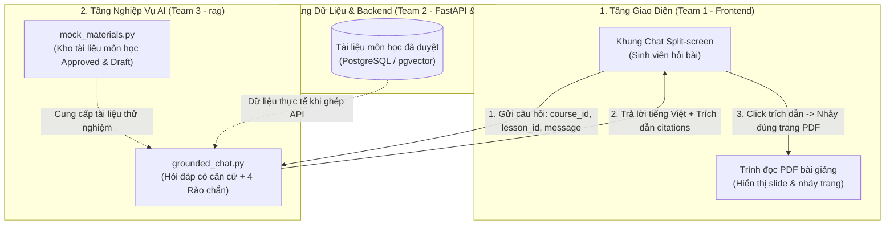
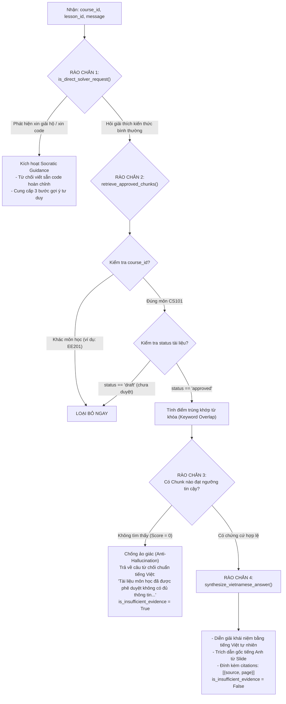

# BÁO CÁO KIẾN TRÚC, LUỒNG HOẠT ĐỘNG & LOGIC KỸ THUẬT
**Module:** Grounded Chat RAG (Hỏi Đáp Có Căn Cứ & 4 Rào Chắn Sư Phạm)  
**Phụ trách:** Thành viên B — Team 3 (AI & Quality)  
**Dự án:** CECS AI Learning Hub — VinUniversity CECS  
**Ngày hoàn thành:** Day 02 (15/09/2026)  
**Thư mục mã nguồn:** `rag/`

---

## 1. TỔNG QUAN HỆ THỐNG & TRỌNG TÂM THÀNH VIÊN B

Theo phân công tác chiến Day 02:
* **Thành viên A:** Phụ trách `GenQuiz` (sinh đề 3 dạng: single choice, multiple choice, short answer từ slide).
* **Thành viên B (Chúng ta):** Phụ trách độc lập **`Grounded Chat (RAG)`** — xây dựng trợ lý học tập có căn cứ, đảm bảo 4 rào chắn bảo vệ, trích dẫn chính xác số trang slide để sinh viên đối chiếu.
*(Phần Phân tích Năng lực Mạnh/Yếu sẽ được cả 2 thành viên kết hợp thực hiện sau khi luồng Quiz của thành viên A hoàn tất).*

---

## 2. SƠ ĐỒ KIẾN TRÚC & LUỒNG DỮ LIỆU TỔNG THỂ



---

## 3. PHÂN TÍCH CHUYÊN SÂU 4 RÀO CHẮN BẢO VỆ (`grounded_chat.py`)

Khi sinh viên gửi câu hỏi vào hệ thống, hàm `answer_grounded_chat()` sẽ thực thi dây chuyền an ninh 4 lớp:



### Chi tiết từng rào chắn:

#### 🛡️ Rào chắn 1: Định hướng Socratic ("Tutor, Not Solver")
* **Mục đích:** Ngăn chặn việc sinh viên lạm dụng AI để giải bài tập hộ hoặc chép code.
* **Cơ chế:** Quét regex phát hiện các cụm từ: `giải hộ bài`, `viết hộ code`, `làm giúp`, `solve my homework`.
* **Phản hồi:** Từ chối trực tiếp một cách lịch sự, thay vào đó cung cấp 3 bước gợi ý tư duy:
  1. Xác định kiểu dữ liệu của biến.
  2. Kiểm tra yêu cầu cấp phát bộ nhớ động trên heap.
  3. Hướng dẫn viết mã giả (pseudocode) để cùng phân tích lỗi.

#### 🛡️ Rào chắn 2: Cô lập Môn học & Trạng thái Phê duyệt Học liệu
* **Mục đích:** Bảo mật học liệu, ngăn chặn rò rỉ tài liệu nháp hoặc tài liệu giữa các lớp học khác nhau.
* **Cơ chế:**
  * Bắt buộc khớp `mat["course_id"] == course_id`. Tài liệu môn khác (như `EE201 - Điện trở Ohm`) bị loại bỏ 100%.
  * Bắt buộc `mat["status"] == "approved"`. Tài liệu đang ở trạng thái `draft` (như slide `Lecture03_Draft_Structs.pdf`) dù có chứa câu trả lời vẫn bị **chặn đứng**.

#### 🛡️ Rào chắn 3: Chống Ảo giác khi Thiếu Bằng chứng (Anti-Hallucination)
* **Mục đích:** Đảm bảo tính trung thực học thuật, không để AI tự ý bịa thông tin ngoài bài giảng.
* **Cơ chế:** Nếu không tìm thấy trang tài liệu nào trong môn học đạt ngưỡng tin cậy, hệ thống ngắt luồng và trả về câu chuẩn tiếng Việt:
  > *"Tài liệu môn học đã được phê duyệt không có đủ thông tin để trả lời câu hỏi này."*
  > `is_insufficient_evidence: True`, `citations: []`.

#### 🛡️ Rào chắn 4: Tổng hợp Chuẩn hóa & Trích dẫn Số trang (Grounded Synthesis)
* **Mục đích:** Tạo trải nghiệm đọc tốt nhất cho sinh viên bằng tiếng Việt nhưng vẫn đối chiếu nguyên tác bài giảng tiếng Anh tại VinUni.
* **Cơ chế:**
  * Hàm `synthesize_vietnamese_answer()` giải thích bản chất kiến thức sang tiếng Việt tự nhiên.
  * Xuất ra danh sách `citations` chứa chính xác tên file và số trang (`page`) để Frontend kích hoạt tính năng **nhấp chuột nhảy thẳng đến trang PDF tương ứng**.

---

## 4. HỢP ĐỒNG GIAO DIỆN (API CONTRACTS) & HƯỚNG DẪN TÍCH HỢP

### 4.1 Dành cho Team 2 (Backend/FastAPI)

Team 2 có thể import trực tiếp hàm vào route FastAPI:

```python
from fastapi import APIRouter
from rag import answer_grounded_chat

router = APIRouter(prefix="/api/ai", tags=["AI Chat"])

@router.post("/chat")
async def chat_endpoint(payload: ChatRequest):
    return answer_grounded_chat(
        course_id=payload.course_id,
        lesson_id=payload.lesson_id,
        message=payload.message
    )
```

#### Cấu trúc JSON API Chat:
* **Request:**
  ```json
  {
    "course_id": "CS101",
    "lesson_id": "lec_02",
    "message": "Kích thước của con trỏ trên hệ thống 64-bit là bao nhiêu bytes?"
  }
  ```
* **Response (Thành công):**
  ```json
  {
    "answer": "Dựa trên tài liệu chính thức [Lecture02_Pointers.pdf, Trang 15]:\nTrên các hệ thống máy tính kiến trúc 64-bit hiện đại...",
    "citations": [
      {"source": "Lecture02_Pointers.pdf", "page": 15},
      {"source": "Lecture02_Pointers.pdf", "page": 18}
    ],
    "is_insufficient_evidence": false
  }
  ```
* **Response (Khi hỏi ngoài lề):**
  ```json
  {
    "answer": "Tài liệu môn học đã được phê duyệt không có đủ thông tin để trả lời câu hỏi này.",
    "citations": [],
    "is_insufficient_evidence": true
  }
  ```

### 4.2 Dành cho Team 1 (Frontend/Next.js)
1. **Hiển thị Chat:** Render trường `answer`. Nếu `is_insufficient_evidence == true`, có thể hiển thị biểu tượng thông báo xám.
2. **Kích hoạt tương tác trích dẫn (Citations Click):**
   * Lặp qua mảng `citations`. Mỗi mục render thành một badge bấm được: `[Lecture02_Pointers.pdf, Trang 15]`.
   * Bắt sự kiện `onClick` $\rightarrow$ gọi hàm điều khiển PDF Viewer: `pdfViewerRef.current.goToPage(page)`.

---

## 5. HƯỚNG DẪN KIỂM THỬ & CHẠY THỬ NGHIỆM

| Lệnh thực thi | Mục đích | Kết quả mong đợi |
| :--- | :--- | :--- |
| `python rag/chat_cli.py` | Chat tương tác trực tiếp qua dòng lệnh | Nhập câu hỏi bất kỳ $\rightarrow$ AI trả lời tiếng Việt có citations hoặc từ chối chuẩn. |
| `python rag/demo.py` | Chạy kịch bản Demo tự động 4 tình huống | Chạy tuần tự 4 kịch bản (Approved, Thiếu chứng cứ, Chặn Draft, Chặn Môn khác, Socratic). |
| `python rag/test_rag.py` | Chạy bộ kiểm thử tự động (Unit Tests) | `Ran 5 tests in 0.001s — OK` (Đạt 100% tiêu chuẩn chất lượng). |
