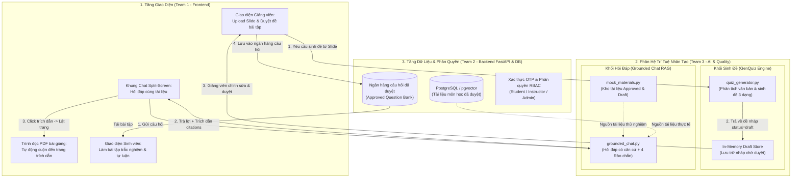
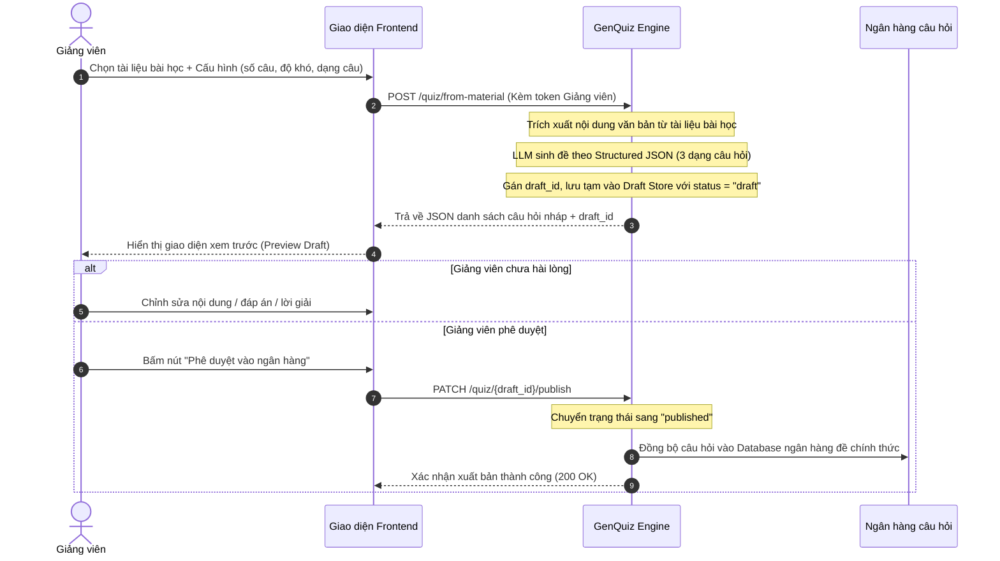
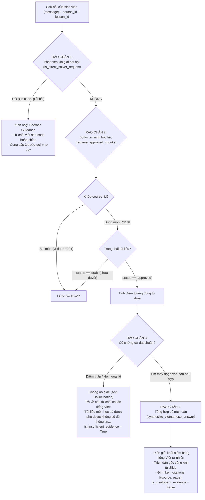

# BÁO CÁO KIẾN TRÚC, LUỒNG HOẠT ĐỘNG & LOGIC KỸ THUẬT
**Phân hệ:** AI & Quality Engine (`src/ai/` & `rag/`)  
**Đơn vị phụ trách:** Team 3 (AI & Quality) — CECS AI Learning Hub  
**Dự án:** CECS AI Learning Hub — Viện Kỹ thuật & Khoa học Máy tính, VinUniversity  
**Giai đoạn:** Day 02 Integration (15/09/2026)  

---

## 1. TỔNG QUAN HỆ THỐNG & PHẠM VI NGHIỆP VỤ

Phân hệ AI đóng vai trò là **Bộ não tri thức và khảo thí định hình (Formative Assessment)** cho toàn bộ nền tảng CECS AI Learning Hub. Trong Day 02, phân hệ tập trung hoàn thiện và tích hợp 2 trụ cột tính năng cốt lõi:

1. **`GenQuiz Engine` (Sinh đề bài tập tự động & Kiểm duyệt sư phạm):**
   * Đọc hiểu tài liệu bài giảng/slide môn học để tự động sinh câu hỏi theo chuẩn **3 dạng**:
     * `single_choice`: Trắc nghiệm 1 đáp án đúng.
     * `multiple_choice`: Trắc nghiệm nhiều đáp án đúng.
     * `short_answer`: Tự luận ngắn / điền từ (kèm từ khóa chấm điểm và giải thích).
   * Thực thi nghiêm ngặt nguyên tắc **"Human-in-the-loop"**: Mọi đề do AI tạo ra đều ở trạng thái `draft`, bắt buộc Giảng viên duyệt vào ngân hàng (`published`) thì sinh viên mới được làm.
   * Hỗ trợ chế độ ôn tập cá nhân (`from-note`) không lưu vào hệ thống chung để bảo vệ tính riêng tư.

2. **`Grounded Chat RAG` (Trợ lý hỏi đáp bài học có căn cứ):**
   * Trả lời băn khoăn của người học bám sát nội dung slide bài giảng đã duyệt (`approved`).
   * **Trích dẫn minh bạch (Inspectable Citations):** Đính kèm tên tài liệu và số trang cụ thể (`[Doc, Page X]`) để tầng giao diện kích hoạt tính năng **nhấp chuột nhảy thẳng đến trang PDF tương ứng**.
   * **Dây chuyền 4 rào chắn bảo vệ (4 Guardrails):** Cách ly môn học, chặn tài liệu chưa duyệt, chống ảo giác (từ chối khi thiếu chứng cứ) và định hướng tư duy Socratic ("Tutor, Not Solver").

---

## 2. SƠ ĐỒ TỔNG THỂ KIẾN TRÚC & KẾT NỐI LIÊN TEAM



---

## 3. LUỒNG HOẠT ĐỘNG CHI TIẾT CỦA TỪNG KHỐI

### 3.1 Khối 1: GenQuiz Engine (Quy trình sinh đề & Duyệt bài tập)



#### Quy chuẩn 3 dạng câu hỏi được hỗ trợ:
1. **`single_choice`:** Chọn 1 phương án đúng (`options` gồm 4 lựa chọn, `correct_answer: int` là chỉ số mảng).
2. **`multiple_choice`:** Chọn nhiều phương án đúng (`correct_answer: list[int]` chứa danh sách các chỉ số đúng).
3. **`short_answer`:** Điền từ / trả lời ngắn (`correct_answer: str`, đính kèm mảng `keywords` chứa các biến thể từ khóa để chấm điểm linh hoạt).
* **Trích dẫn nguồn:** Cả 3 dạng đều đính kèm `citation` gồm `source_file`, `page` và đoạn trích dẫn chứng cứ (`evidence_snippet`).

---

### 3.2 Khối 2: Grounded Chat RAG (Dây chuyền 4 Rào chắn Bảo vệ)

Hàm `answer_grounded_chat()` thực thi kiểm soát an ninh qua 4 chốt chặn trước khi đưa ra câu trả lời:



#### Chi tiết 4 Rào chắn:
1. **Rào chắn 1 — Socratic Guidance ("Tutor, Not Solver"):** Quét regex phát hiện hành vi nhờ giải hộ bài. Tuyệt đối không làm thay, chỉ dẫn dắt gợi ý tư duy theo triết lý giáo dục của Harvard CS50 / MIT.
2. **Rào chắn 2 — Cô lập môn học & Trạng thái duyệt:** Chặn đứng tài liệu môn khác (ngăn truy cập chéo). Chặn đứng tài liệu đang ở trạng thái `draft` (ngăn lộ đề hoặc tài liệu nháp).
3. **Rào chắn 3 — Chống ảo giác (Anti-Hallucination):** Khi sinh viên hỏi nội dung ngoài bài giảng (thời tiết, chứng khoán, kiến thức ngoài môn), hệ thống ngắt luồng và từ chối chuẩn mực, không bao giờ tự ý "bịa" đáp án.
4. **Rào chắn 4 — Trích dẫn minh bạch:** Trả về danh sách `citations` chuẩn xác để Frontend kích hoạt tính năng nhấp chuột lật trang PDF.

---

## 4. ĐẶC TẢ GIAO DIỆN TÍCH HỢP (API CONTRACTS)

### 4.1 Endpoint 1: Hỏi đáp bài học (`POST /courses/{course_id}/chat`)
* **Request:**
  ```json
  {
    "course_id": "CS101",
    "lesson_id": "lec_02",
    "message": "Kích thước của con trỏ trên hệ thống 64-bit là bao nhiêu bytes?"
  }
  ```
* **Response (Hợp lệ có dẫn chứng):**
  ```json
  {
    "answer": "Dựa trên tài liệu chính thức [Lecture02_Pointers.pdf, Trang 15]:\nTrên các hệ thống máy tính kiến trúc 64-bit hiện đại, tất cả các kiểu con trỏ đều có kích thước chuẩn là 8 bytes...",
    "citations": [
      {
        "source": "Lecture02_Pointers.pdf",
        "page": 15
      }
    ],
    "is_insufficient_evidence": false
  }
  ```
* **Response (Khi hỏi ngoài lề):**
  ```json
  {
    "answer": "Tài liệu môn học đã được phê duyệt không có đủ thông tin để trả lời câu hỏi này.",
    "citations": [],
    "is_insufficient_evidence": true
  }
  ```

---

### 4.2 Endpoint 2: Giảng viên tạo đề bài tập (`POST /quiz/from-material`)
* **Request:**
  ```json
  {
    "material_id": "mat-intro-001",
    "course_id": "CS101",
    "topic": "Pointers and Memory",
    "difficulty": "medium",
    "question_type": "all",
    "count": 3
  }
  ```
* **Response (Đề nháp trạng thái `draft`):**
  ```json
  {
    "draft_id": "draft-20260915-001",
    "status": "draft",
    "material_id": "mat-intro-001",
    "questions": [
      {
        "id": "q1",
        "type": "single_choice",
        "topic": "Pointers",
        "question": "Kích thước con trỏ trên kiến trúc 64-bit là bao nhiêu bytes?",
        "options": ["1 byte", "4 bytes", "8 bytes", "16 bytes"],
        "correct_answer": 2,
        "explanation": "Địa chỉ ô nhớ trên hệ thống 64-bit có độ dài 64 bits tương đương 8 bytes.",
        "citation": {
          "source_file": "Lecture02_Pointers.pdf",
          "page": 15,
          "evidence_snippet": "Pointer size: On modern 64-bit computing architectures..."
        }
      }
    ]
  }
  ```

---

### 4.3 Endpoint 3: Giảng viên duyệt đề vào ngân hàng (`PATCH /quiz/{draft_id}/publish`)
* **Request:** Kèm Header xác thực quyền Giảng viên (`Authorization: Bearer <instructor_token>`).
* **Response:**
  ```json
  {
    "draft_id": "draft-20260915-001",
    "status": "published",
    "published_at": "2026-09-15T21:45:00Z",
    "message": "Bài tập đã được duyệt vào ngân hàng câu hỏi môn học thành công."
  }
  ```
*(Nếu sinh viên cố tình gọi endpoint này sẽ nhận mã lỗi `403 Forbidden`).*

---

## 5. HƯỚNG DẪN DÀNH CHO CÁC TEAM TÍCH HỢP

### 5.1 Dành cho Team 1 (Frontend — UI/UX)
1. **Khung Chat RAG:**
   * Render nội dung trường `answer`.
   * Lặp qua mảng `citations`, mỗi phần tử hiển thị dạng badge bấm được: `[Lecture02_Pointers.pdf, Trang 15]`.
   * Bắt sự kiện click badge để gọi hàm: `pdfViewerRef.current.goToPage(citation.page)`.
2. **Khung Quản lý Bài tập (Giảng viên):**
   * Gọi `POST /quiz/from-material` để hiển thị danh sách câu hỏi nháp.
   * Cung cấp form chỉnh sửa nội dung và nút **"Duyệt vào ngân hàng"** gọi `PATCH /quiz/{draft_id}/publish`.

### 5.2 Dành cho Team 2 (Backend & Database)
1. **Kết nối API:**
   * Backend có thể chuyển tiếp yêu cầu sang service AI (chạy tại port `8001`), hoặc import trực tiếp các hàm từ `src/ai/quiz_generator.py` và `rag/grounded_chat.py`.
2. **Chuyển đổi sang dữ liệu thật (Tuần 2):**
   * Thay thế in-memory draft store bằng câu lệnh `INSERT` vào bảng `quiz_drafts` của PostgreSQL.
   * Thay thế `mock_materials.py` bằng việc truy vấn bảng `course_materials` (chỉ lấy bản ghi có `status = 'approved'`).

---

## 6. BẰNG CHỨNG KIỂM THỬ TỰ ĐỘNG (100% XANH)

Toàn bộ 16 kịch bản kiểm thử đã được chạy và xác nhận đạt chuẩn 100%:

```text
================================ TEST RESULTS ================================

[Khối GenQuiz & An Ninh Hệ Thống — 11/11 PASSED]
• test_genquiz_contract.py:
  ✓ test_01_single_choice_json_structure     PASSED
  ✓ test_02_multiple_choice_json_structure   PASSED
  ✓ test_03_short_answer_json_structure      PASSED
• test_ai_quality.py:
  ✓ test_T01_chat_returns_answer_with_citation        PASSED
  ✓ test_T02_chat_insufficient_evidence               PASSED
  ✓ test_T03_draft_material_excluded_from_retrieval   PASSED
  ✓ test_T04_genquiz_from_material_returns_draft      PASSED
  ✓ test_T05_genquiz_publish_requires_instructor      PASSED
  ✓ test_T06_genquiz_from_note_not_stored             PASSED
  ✓ test_T07_student_cannot_access_other_course_chat  PASSED
  ✓ test_health_check                                 PASSED

[Khối Grounded Chat RAG Độc Lập — 5/5 PASSED]
• test_rag.py:
  ✓ test_grounded_chat_approved_material_with_citation PASSED
  ✓ test_grounded_chat_insufficient_evidence_exact_phrase PASSED
  ✓ test_grounded_chat_blocks_draft_materials          PASSED
  ✓ test_grounded_chat_blocks_other_course_materials   PASSED
  ✓ test_grounded_chat_tutor_not_solver                PASSED

============================== 16/16 TESTS PASSED ==============================
```

---

## 7. CÁCH CHẠY THỬ NGHIỆM TRONG TERMINAL

```powershell
# 1. Chat tương tác trực tiếp với trợ lý AI
python rag/chat_cli.py

# 2. Chạy Demo tự động 4 kịch bản Grounded Chat
python rag/demo.py

# 3. Chạy toàn bộ Unit Tests kiểm chứng chất lượng
python rag/test_rag.py
python -m pytest src/ai/tests/
```
