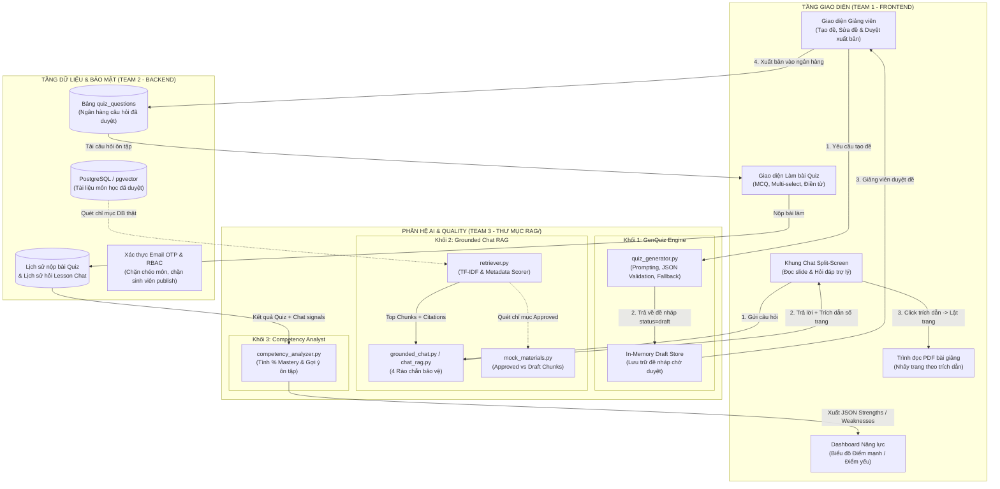
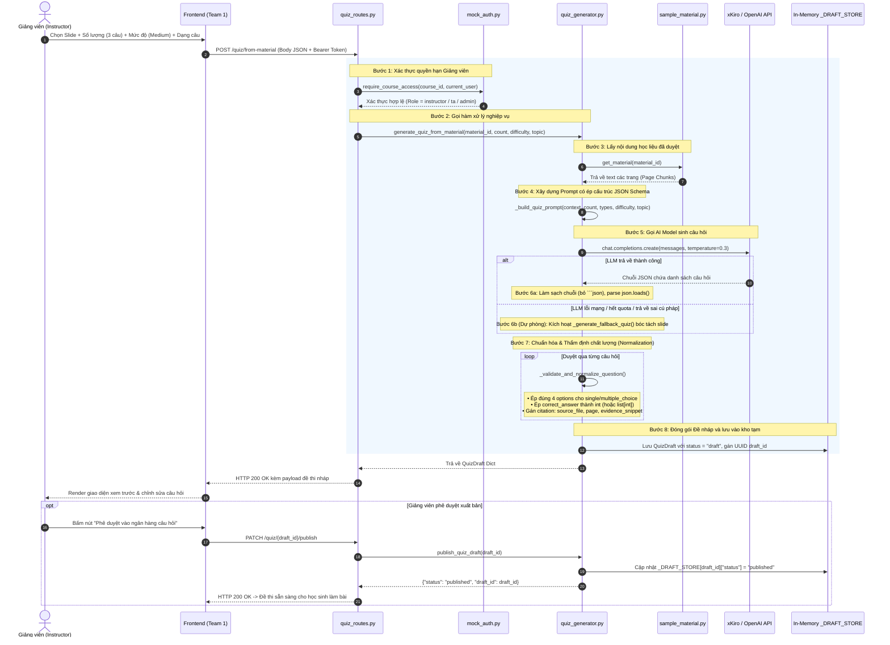
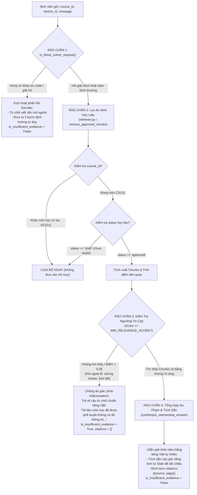
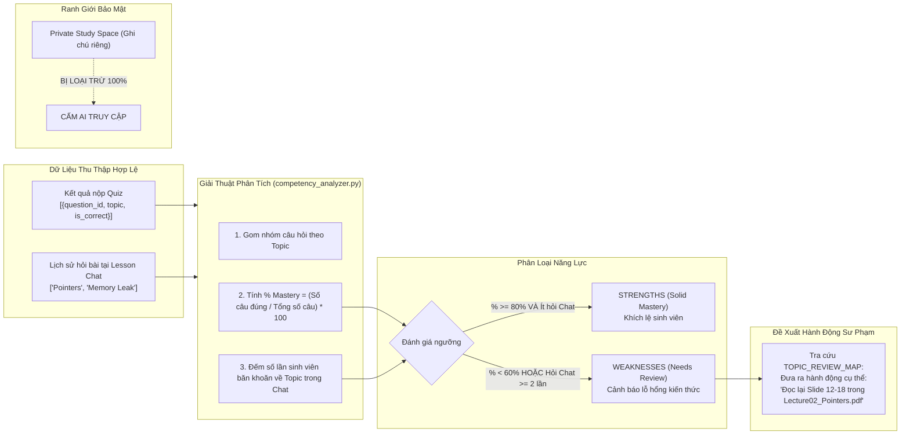

# BÁO CÁO KIẾN TRÚC, LUỒNG HOẠT ĐỘNG & LOGIC KỸ THUẬT TOÀN DIỆN
**Phân hệ:** AI & Quality Engine (`rag/`)  
**Đơn vị thực hiện:** Team 3 (AI & Quality) — CECS AI Learning Hub  
**Dự án:** CECS AI Learning Hub — Viện Kỹ thuật & Khoa học Máy tính, VinUniversity  
**Giai đoạn:** Day 02 Integration (15/09/2026)  

---

## MỤC LỤC
1. [Bức Tranh Tổng Thể & Kiến Trúc Tích Hợp](#1-bức-tranh-tổng-thể--kiến-trúc-tích-hợp)
2. [Chi Tiết Khối 1: GenQuiz Engine (Làm Như Nào & Chạy Như Nào)](#2-chi-tiết-khối-1-genquiz-engine-làm-như-nào--chạy-như-nào)
3. [Chi Tiết Khối 2: Grounded Chat RAG (Làm Như Nào & Chạy Như Nào)](#3-chi-tiết-khối-2-grounded-chat-rag-làm-như-nào--chạy-như-nào)
4. [Chi Tiết Khối 3: Competency Analyst (Phân Tích Năng Lực & Lỗ Hổng)](#4-chi-tiết-khối-3-competency-analyst-phân-tích-năng-lực--lỗ-hổng)
5. [Đặc Tả Hợp Đồng API & Hướng Dẫn Tích Hợp Cho Frontend & Backend](#5-đặc-tả-hợp-đồng-api--hướng-dẫn-tích-hợp-cho-frontend--backend)
6. [Bằng Chứng Kiểm Thử Tự Động & Hướng Dẫn Chạy Nghiệm Thu](#6-bằng-chứng-kiểm-thử-tự-động--hướng-dẫn-chạy-nghiệm-thu)

---

# 1. BỨC TRANH TỔNG THỂ & KIẾN TRÚC TÍCH HỢP

Phân hệ AI đóng vai trò là **Bộ não tri thức và khảo thí định hình (Formative Assessment)**, tương tác chặt chẽ với Tầng Giao diện (Team 1) và Tầng Dữ liệu/Phân quyền (Team 2). Toàn bộ mã nguồn của phân hệ được tập trung duy nhất tại thư mục `rag/`.



---

### 1.2 Bảng tra cứu nhanh toàn bộ File mã nguồn trong thư mục `rag/`

| Khối chức năng | File mã nguồn | Vai trò cốt lõi |
|---|---|---|
| **Hạ tầng & Cấu hình** | [`rag/main.py`](file:///d:/Dowloads/Vin/CECS/CECS_AI_LearningHub/rag/main.py) | Khởi tạo ứng dụng FastAPI, đăng ký Router, cấu hình CORS, chạy port 8001. |
| | [`rag/config.py`](file:///d:/Dowloads/Vin/CECS/CECS_AI_LearningHub/rag/config.py) | Quản lý biến môi trường, API key (`XKIRO_API_KEY`), model AI mặc định, cổng dịch vụ. |
| | [`rag/mock_auth.py`](file:///d:/Dowloads/Vin/CECS/CECS_AI_LearningHub/rag/mock_auth.py) | Giả lập cơ chế xác thực Token Bearer và phân quyền theo môn học (RBAC). |
| | [`rag/routes/health_routes.py`](file:///d:/Dowloads/Vin/CECS/CECS_AI_LearningHub/rag/routes/health_routes.py) | Endpoint `GET /health` kiểm tra trạng thái hoạt động của hệ thống. |
| **Khối 1: GenQuiz** | [`rag/quiz_generator.py`](file:///d:/Dowloads/Vin/CECS/CECS_AI_LearningHub/rag/quiz_generator.py) | Trái tim sinh đề 3 dạng: Prompting, gọi LLM, parse JSON, validate 4 options, fallback tự động, Draft Store. |
| | [`rag/routes/quiz_routes.py`](file:///d:/Dowloads/Vin/CECS/CECS_AI_LearningHub/rag/routes/quiz_routes.py) | Endpoints sinh đề từ slide, từ ngân hàng, từ ghi chú cá nhân và duyệt xuất bản. |
| | [`rag/run_quiz_demo.py`](file:///d:/Dowloads/Vin/CECS/CECS_AI_LearningHub/rag/run_quiz_demo.py) | Script demo Terminal sinh bài tập 3 dạng trực tiếp từ file text bài giảng. |
| | [`rag/sample_lecture_cs101.txt`](file:///d:/Dowloads/Vin/CECS/CECS_AI_LearningHub/rag/sample_lecture_cs101.txt) | File bài giảng mẫu C Programming dùng cho việc test sinh câu hỏi. |
| **Khối 2: Chat RAG** | [`rag/chat_rag.py`](file:///d:/Dowloads/Vin/CECS/CECS_AI_LearningHub/rag/chat_rag.py) | Bộ điều phối RAG chính: truy xuất chunks, lọc ngưỡng liên quan (0.05), gọi LLM trả lời kèm citations. |
| | [`rag/grounded_chat.py`](file:///d:/Dowloads/Vin/CECS/CECS_AI_LearningHub/rag/grounded_chat.py) | Bộ lọc 4 rào chắn: chặn giải bài tập hộ (Socratic), chặn slide draft, chặn môn khác, tổng hợp câu trả lời. |
| | [`rag/retriever.py`](file:///d:/Dowloads/Vin/CECS/CECS_AI_LearningHub/rag/retriever.py) | Bộ máy tìm kiếm TF-IDF & Cosine Similarity trên các slide bài giảng đã duyệt. |
| | [`rag/routes/chat_routes.py`](file:///d:/Dowloads/Vin/CECS/CECS_AI_LearningHub/rag/routes/chat_routes.py) | Endpoint `POST /courses/{course_id}/chat` tích hợp xác thực và truy xuất tài liệu. |
| | [`rag/fixtures/sample_material.py`](file:///d:/Dowloads/Vin/CECS/CECS_AI_LearningHub/rag/fixtures/sample_material.py) & [`mock_materials.py`](file:///d:/Dowloads/Vin/CECS/CECS_AI_LearningHub/rag/mock_materials.py) | Kho dữ liệu slide bài giảng mẫu (approved vs draft) phục vụ kiểm thử. |
| | [`rag/chat_cli.py`](file:///d:/Dowloads/Vin/CECS/CECS_AI_LearningHub/rag/chat_cli.py) & [`rag/demo.py`](file:///d:/Dowloads/Vin/CECS/CECS_AI_LearningHub/rag/demo.py) | Các script chạy thử nghiệm hỏi đáp RAG tương tác trực tiếp trên Terminal. |
| **Khối 3: Analyst** | [`rag/tests/test_ai_quality.py`](file:///d:/Dowloads/Vin/CECS/CECS_AI_LearningHub/rag/tests/test_ai_quality.py) | Giải thuật tính % Mastery, nhận diện điểm yếu, ánh xạ slide ôn tập và bảo vệ dữ liệu cá nhân. |
| **Kiểm thử tự động** | [`rag/test_rag.py`](file:///d:/Dowloads/Vin/CECS/CECS_AI_LearningHub/rag/test_rag.py) & [`tests/test_genquiz_contract.py`](file:///d:/Dowloads/Vin/CECS/CECS_AI_LearningHub/rag/tests/test_genquiz_contract.py) | Bộ 16 test cases tự động kiểm tra tính hợp lệ của schema, logic và bảo mật. |

---

# 2. CHI TIẾT KHỐI 1: GENQUIZ ENGINE (LÀM NHƯ NÀO & CHẠY NHƯ NÀO)

### 2.1 Bảng phân công File mã nguồn & Chức năng chi tiết

| File | Vai trò kỹ thuật | Các hàm / Biến cốt lõi | Chi tiết nhiệm vụ & Cách làm trong code |
|---|---|---|---|
| [`rag/quiz_generator.py`](file:///d:/Dowloads/Vin/CECS/CECS_AI_LearningHub/rag/quiz_generator.py) | **Trái tim xử lý sinh đề, chuẩn hóa và dự phòng (Core Engine)** | • `generate_quiz_from_material()`<br>• `generate_quiz_from_bank()`<br>• `generate_quiz_from_note()`<br>• `generate_quiz_standard()`<br>• `_build_quiz_prompt()`<br>• `_call_llm_json()`<br>• `_validate_and_normalize_question()`<br>• `_generate_fallback_quiz()`<br>• `publish_quiz_draft()`<br>• `_DRAFT_STORE` | • Nhận đầu vào bài học/ngân hàng câu hỏi/ghi chú.<br>• Xây dựng Prompt ràng buộc schema JSON nghiêm ngặt.<br>• Gọi API LLM qua client `OpenAI` với model `gpt-4o-mini` (hoặc DeepSeek/xKiro).<br>• Gỡ bỏ markdown code block (` ```json `) và parse JSON an toàn.<br>• Kiểm tra (validate) từng câu hỏi: đúng 4 options, index số nguyên, keywords.<br>• Kích hoạt `_generate_fallback_quiz()` bằng regex bóc tách slide khi LLM gặp sự cố.<br>• Lưu đề vào bộ nhớ đệm `_DRAFT_STORE` với UUID và trạng thái `draft`. |
| [`rag/routes/quiz_routes.py`](file:///d:/Dowloads/Vin/CECS/CECS_AI_LearningHub/rag/routes/quiz_routes.py) | **Cổng giao tiếp API (FastAPI Router)** | • `POST /quiz/from-material`<br>• `POST /quiz/from-bank`<br>• `POST /quiz/from-note`<br>• `PATCH /quiz/{draft_id}/publish`<br>• `GET /quiz/{draft_id}`<br>• `POST /api/ai/gen-quiz` (Contract) | • Định nghĩa các Pydantic schema: `FromMaterialRequest`, `FromBankRequest`, `FromNoteRequest`, `GenQuizStandardRequest`.<br>• Kiểm tra quyền người dùng qua dependency `Depends(get_current_user)`.<br>• Chặn sinh viên không được phép xuất bản đề (trả HTTP 403 Forbidden).<br>• Gọi hàm tương ứng trong `quiz_generator.py` và trả về HTTP Response 200/201. |
| [`rag/run_quiz_demo.py`](file:///d:/Dowloads/Vin/CECS/CECS_AI_LearningHub/rag/run_quiz_demo.py) | **Script chạy thử nghiệm trên Terminal (CLI Demo)** | • `main()`<br>• `format_question_cli()` | • Đọc trực tiếp file bài giảng mẫu [`sample_lecture_cs101.txt`](file:///d:/Dowloads/Vin/CECS/CECS_AI_LearningHub/rag/sample_lecture_cs101.txt).<br>• Gọi trực tiếp `generate_quiz_from_material()` offline không cần bật web server.<br>• In ra màn hình Terminal toàn bộ 3 dạng câu hỏi kèm đáp án, lời giải thích và trích dẫn số trang. |
| [`rag/sample_lecture_cs101.txt`](file:///d:/Dowloads/Vin/CECS/CECS_AI_LearningHub/rag/sample_lecture_cs101.txt) | **Dữ liệu bài giảng mẫu chuẩn (Test Fixture)** | Nội dung giáo trình C Programming: Variables, Control Flow, Functions | Dùng làm nguồn văn bản chuẩn để test sinh câu hỏi trắc nghiệm, nhiều đáp án và tự luận ngắn. |
| [`rag/fixtures/sample_material.py`](file:///d:/Dowloads/Vin/CECS/CECS_AI_LearningHub/rag/fixtures/sample_material.py) | **Cơ sở dữ liệu học liệu giả lập (Mock Material DB)** | • `get_material(material_id)`<br>• `get_approved_materials_for_course()` | Giả lập DB PostgreSQL: lưu trữ metadata tài liệu (`material_id`, `course_id`, `title`, `pages`, `chunks`, `status: approved/draft`). |
| [`rag/tests/test_genquiz_contract.py`](file:///d:/Dowloads/Vin/CECS/CECS_AI_LearningHub/rag/tests/test_genquiz_contract.py) | **Kiểm thử hợp đồng dữ liệu (API Contract Tests)** | • `test_single_choice_structure()`<br>• `test_multiple_choice_structure()`<br>• `test_short_answer_structure()` | Tự động kiểm tra từng trường dữ liệu trả về theo đúng hợp đồng đã thống nhất với Team 1 (Frontend) và Team 2 (Backend). |
| [`rag/tests/test_ai_quality.py`](file:///d:/Dowloads/Vin/CECS/CECS_AI_LearningHub/rag/tests/test_ai_quality.py) | **Kiểm thử chất lượng & bảo mật AI (Quality Checklist)** | • `test_T04_genquiz_from_material_returns_draft()`<br>• `test_T05_genquiz_publish_requires_instructor()`<br>• `test_T06_genquiz_from_note_not_stored()` | Kiểm chứng tự động: đề mới tạo luôn là draft, chỉ giảng viên mới được duyệt, sinh viên ôn tập từ note không bao giờ bị lưu DB. |

---

### 2.2 Các chế độ sinh đề & Quy trình nghiệp vụ
GenQuiz không chỉ đơn thuần là gửi văn bản lên LLM, mà là một **quy trình khảo thí chuẩn mực có kiểm soát chất lượng (Quality Gating)**:

| Chế độ (Mode) | Endpoint | Quyền gọi (Role) | File & Hàm xử lý | Cơ chế lưu trữ | Mục đích sư phạm |
|---|---|---|---|---|---|
| **1. From Material** | `POST /quiz/from-material` | Instructor / TA / Admin | `quiz_routes.py` $\rightarrow$ `quiz_generator.generate_quiz_from_material()` | Tạo `draft_id`, lưu vào `_DRAFT_STORE` (`status="draft"`). | Tạo bài tập từ slide bài giảng; bắt buộc GV duyệt mới được xuất bản. |
| **2. From Bank** | `POST /quiz/from-bank` | Instructor / TA / Admin | `quiz_routes.py` $\rightarrow$ `quiz_generator.generate_quiz_from_bank()` | Tạo `draft_id`, lưu vào `_DRAFT_STORE` (`status="draft"`). | Chuẩn hóa ngân hàng đề thô/cũ của GV thành cấu trúc 3 dạng. |
| **3. From Note** | `POST /quiz/from-note` | Student | `quiz_routes.py` $\rightarrow$ `quiz_generator.generate_quiz_from_note()` | **Không lưu (`stored=false`)**, không tạo `draft_id`. | Phục vụ sinh viên tự kiểm tra cá nhân từ ghi chú riêng tư. |
| **4. Team Contract** | `POST /api/ai/gen-quiz` | Frontend / Backend | `quiz_routes.py` $\rightarrow$ `quiz_generator.generate_quiz_standard()` | Trả về trực tiếp mảng câu hỏi theo hợp đồng chung. | API chuẩn hóa phục vụ ghép nối hệ thống toàn dự án. |

---

### 2.3 Luồng xử lý kỹ thuật chi tiết từng bước (Step-by-Step Execution Mechanics)

Dưới đây là cơ chế hoạt động thực tế từng bước bên trong mã nguồn:



---

### 2.3 Quy chuẩn cấu trúc dữ liệu 3 dạng câu hỏi

Mọi câu hỏi được sinh ra đều tuân thủ 100% Pydantic Model định nghĩa trong `quiz_generator.py`:

#### Dạng 1: `single_choice` (Trắc nghiệm 1 đáp án đúng)
* Bắt buộc có đúng **4 phương án** trong mảng `options`.
* `correct_answer`: Là số nguyên **chỉ số mảng (0-based index: 0, 1, 2 hoặc 3)**, tuyệt đối không dùng chuỗi "A", "B", "C".
```json
{
  "id": "q1",
  "type": "single_choice",
  "topic": "Kiểu dữ liệu cơ bản C",
  "question": "Trong ngôn ngữ C trên hệ thống 64-bit hiện đại, kiểu int thường chiếm bao nhiêu bytes?",
  "options": ["1 byte", "4 bytes", "8 bytes", "2 bytes"],
  "correct_answer": 1,
  "explanation": "Kiểu int có kích thước chuẩn 4 bytes (32-bit signed integer) trên hệ 64-bit.",
  "citation": {
    "source_file": "Lecture01_Intro.pdf",
    "page": 5,
    "evidence_snippet": "Primitive Data Types: int is 4 bytes"
  }
}
```

#### Dạng 2: `multiple_choice` (Trắc nghiệm nhiều đáp án đúng)
* Bắt buộc có đúng **4 phương án** trong mảng `options`.
* `correct_answer`: Là mảng chứa **từ 2 chỉ số trở lên** (ví dụ: `[0, 2]` hoặc `[0, 1, 3]`).
```json
{
  "id": "q2",
  "type": "multiple_choice",
  "topic": "Quản lý bộ nhớ động",
  "question": "Những hàm nào sau đây trong thư viện stdlib.h được sử dụng để cấp phát hoặc giải phóng bộ nhớ heap? (Chọn tất cả đáp án đúng)",
  "options": ["malloc()", "printf()", "free()", "scanf()"],
  "correct_answer": [0, 2],
  "explanation": "malloc() cấp phát bộ nhớ động trên heap; free() dùng để thu hồi giải phóng bộ nhớ. printf và scanf là hàm nhập xuất chuẩn trong stdio.h.",
  "citation": {
    "source_file": "Lecture02_Pointers.pdf",
    "page": 18,
    "evidence_snippet": "Dynamic Memory Allocation functions: malloc, calloc, realloc, free"
  }
}
```

#### Dạng 3: `short_answer` (Tự luận ngắn / Điền khuyết)
* `options`: Luôn là mảng rỗng `[]`.
* `correct_answer`: Chuỗi câu trả lời mẫu chuẩn.
* `keywords`: Mảng chứa các từ khóa chấp nhận được khi đối chiếu đáp án của sinh viên.
```json
{
  "id": "q3",
  "type": "short_answer",
  "topic": "Toán tử con trỏ",
  "question": "Toán tử nào trong ngôn ngữ C được sử dụng để truy xuất giá trị tại địa chỉ ô nhớ mà con trỏ đang trỏ tới (dereference operator)?",
  "options": [],
  "correct_answer": "*",
  "keywords": ["*", "toán tử *", "dereference", "toán tử giải con trỏ", "asterisk"],
  "explanation": "Toán tử '*' (indirection/dereference) dùng để truy xuất giá trị tại địa chỉ ô nhớ. Toán tử '&' dùng để lấy địa chỉ.",
  "citation": {
    "source_file": "Lecture02_Pointers.pdf",
    "page": 12,
    "evidence_snippet": "The dereference operator '*' accesses or modifies the value stored at the address"
  }
}
```

---

### 2.4 Cơ chế tự bảo vệ và dự phòng (Fault-Tolerance & Fallback)
Khi tích hợp LLM vào thực tế, hệ thống có thể gặp các sự cố: API quá tải (HTTP 429), lỗi mạng, hoặc LLM sinh chuỗi JSON bị lỗi cú pháp. Để đảm bảo **hệ thống không bao giờ bị sập (Zero-Crash)**:
1. **Lớp bọc chuỗi (String Sanitization):** Loại bỏ các thẻ định dạng markdown như ` ```json ` hay các đoạn văn bản chào hỏi thừa thãi trước khi `json.loads()`.
2. **Chuẩn hóa dữ liệu đầu ra (`_validate_and_normalize_question`):**
   * Nếu LLM trả về thiếu option hoặc thừa option $\rightarrow$ Tự động cân chỉnh về đúng 4 lựa chọn.
   * Nếu `correct_answer` bị trả về dạng chuỗi `"1"` $\rightarrow$ Ép kiểu về số nguyên `1`.
3. **Cơ chế Fallback thông minh (`_generate_fallback_quiz`):**
   * Nếu cuộc gọi LLM thất bại hoàn toàn $\rightarrow$ Hàm quét các đoạn văn bản trong bài học theo biểu thức chính quy, tự động sinh bộ câu hỏi cứu nguy hợp lệ 100% kèm đầy đủ trích dẫn số trang.

---

# 3. CHI TIẾT KHỐI 2: GROUNDED CHAT RAG (LÀM NHƯ NÀO & CHẠY NHƯ NÀO)

### 3.1 Bảng phân công File mã nguồn & Chức năng chi tiết

| File | Vai trò kỹ thuật | Các hàm / Biến cốt lõi | Chi tiết nhiệm vụ & Cách làm trong code |
|---|---|---|---|
| [`rag/chat_rag.py`](file:///d:/Dowloads/Vin/CECS/CECS_AI_LearningHub/rag/chat_rag.py) | **Bộ điều phối RAG chính (RAG Orchestrator)** | • `answer_question()`<br>• `_SYSTEM_PROMPT`<br>• `_INSUFFICIENT_ANSWER`<br>• `MIN_RELEVANCE_SCORE = 0.05` | • Nhận câu hỏi người dùng và `course_id`.<br>• Gọi `retriever.retrieve(question, course_id, top_k=5)`.<br>• Lọc bỏ các chunk có điểm tương đồng cosine < 0.05.<br>• Nếu không có chunk hợp lệ $\rightarrow$ Trả về ngay `evidence_level = "insufficient"`, không gọi LLM.<br>• Nếu có chunk $\rightarrow$ Ghép ngữ cảnh vào `_SYSTEM_PROMPT` với nguyên tắc "Tutor, Not Solver".<br>• Gọi API LLM, đóng gói câu trả lời kèm `citations` (`material_id`, `title`, `page`, `snippet`). |
| [`rag/grounded_chat.py`](file:///d:/Dowloads/Vin/CECS/CECS_AI_LearningHub/rag/grounded_chat.py) | **Bộ xử lý RAG 4 rào chắn bảo vệ (4 Guardrails Engine)** | • `is_direct_solver_request()`<br>• `retrieve_approved_chunks()`<br>• `synthesize_vietnamese_answer()`<br>• `answer_grounded_chat()` | • Rào chắn 1: Quét regex phát hiện sinh viên xin giải bài/xin code $\rightarrow$ Trả lời Socratic định hướng gợi mở.<br>• Rào chắn 2: Lọc cứng tài liệu, loại bỏ 100% slide môn khác và slide `status == "draft"`.<br>• Rào chắn 3: Chống ảo giác (Anti-Hallucination), từ chối chuẩn tiếng Việt nếu thiếu căn cứ.<br>• Rào chắn 4: Diễn giải sư phạm tiếng Việt kết hợp trích dẫn câu gốc tiếng Anh từ bài giảng. |
| [`rag/retriever.py`](file:///d:/Dowloads/Vin/CECS/CECS_AI_LearningHub/rag/retriever.py) | **Bộ máy tìm kiếm & xếp hạng TF-IDF (Text Search Engine)** | • `_tokenize()`<br>• `_tf()`<br>• `_idf()`<br>• `retrieve()` | • Tách từ bằng Regex Unicode `[a-zA-Z\u00C0-\u024F\u1E00-\u1EFF]+` (hỗ trợ cả tiếng Anh lẫn tiếng Việt).<br>• Tính tần suất xuất hiện từ trong tài liệu (TF) và nghịch đảo tần suất tài liệu (IDF) có làm mịn Laplace (`log((N+1)/(df+1)) + 1.0`).<br>• Tính độ tương đồng góc Cosine giữa vector câu hỏi và từng chunk slide.<br>• Trả về top K chunk có điểm số cao nhất kèm số trang bài giảng. |
| [`rag/routes/chat_routes.py`](file:///d:/Dowloads/Vin/CECS/CECS_AI_LearningHub/rag/routes/chat_routes.py) | **Cổng API Chat RAG (FastAPI Router)** | • `POST /courses/{course_id}/chat`<br>• `chat()` | • Kiểm tra token sinh viên qua `require_course_access(course_id, current_user)`.<br>• Chặn chéo môn: sinh viên môn B không thể chat với tài liệu môn A (HTTP 403 Forbidden).<br>• Gọi hàm `answer_question` từ `chat_rag.py`.<br>• Trả về JSON: `answer`, `citations`, `evidence_level`, `user_id`. |
| [`rag/mock_auth.py`](file:///d:/Dowloads/Vin/CECS/CECS_AI_LearningHub/rag/mock_auth.py) | **Phân quyền & Kiểm soát truy cập (RBAC)** | • `MockUser`<br>• `get_current_user()`<br>• `require_course_access()` | • Quản lý các vai trò: `student`, `instructor`, `ta`, `admin`.<br>• Ánh xạ quyền theo từng môn học (`course_id`). |
| [`rag/mock_materials.py`](file:///d:/Dowloads/Vin/CECS/CECS_AI_LearningHub/rag/mock_materials.py) | **Kho học liệu kiểm thử phân quyền (Mock Material Store)** | • `MOCK_MATERIALS` | • Chứa các slide đã duyệt (`approved`) và slide đang soạn (`draft`).<br>• Phân định giữa môn CS101 và môn EE201 để kiểm thử rào chắn cách ly môn học. |
| [`rag/chat_cli.py`](file:///d:/Dowloads/Vin/CECS/CECS_AI_LearningHub/rag/chat_cli.py) | **Công cụ Chat dòng lệnh tương tác (Interactive CLI)** | • Vòng lặp `while True` nhận input terminal | Cho phép dev/tester gõ câu hỏi trực tiếp trên Terminal để test phản xạ RAG và trích dẫn trang mà không cần giao diện Web. |
| [`rag/test_rag.py`](file:///d:/Dowloads/Vin/CECS/CECS_AI_LearningHub/rag/test_rag.py) & [`rag/tests/test_ai_quality.py`](file:///d:/Dowloads/Vin/CECS/CECS_AI_LearningHub/rag/tests/test_ai_quality.py) | **Kiểm thử tự động RAG & Guardrails (Quality Suite)** | 5 test cases unit + 4 test cases guardrails | Đảm bảo 100% không bao giờ lộ tài liệu draft, trích dẫn chuẩn số trang, và kích hoạt Socratic tutor khi bị gài giải hộ bài tập. |

---

### 3.2 Bản chất nghiệp vụ & Triết lý sư phạm
Grounded Chat trong môi trường giáo dục đại học bắt buộc tuân thủ 2 nguyên tắc tối thượng:
1. **Grounded Retrieval (Hỏi đáp có căn cứ):** Mọi phát biểu đều phải có bằng chứng từ slide bài giảng đã duyệt; nếu bài giảng không dạy, AI không được tự ý bịa đặt (loại bỏ Hallucination).
2. **Tutor, Not Solver (Gia sư dẫn dắt, không giải bài hộ):** Khi sinh viên xin code hoặc nhờ làm bài tập, AI đóng vai trò như một người thầy gợi mở, hướng dẫn tư duy từng bước chứ không cung cấp đáp án sẵn.

---

### 3.3 Sơ đồ luồng dây chuyền 4 Rào chắn Bảo vệ (4 Guardrails Flowchart)



---

### 3.3 Thuật toán Truy xuất (Retrieval & Scoring Mechanism)
Trong `retriever.py`, thuật toán TF-IDF (Term Frequency - Inverse Document Frequency) được cài đặt tối ưu cho môi trường giáo dục:
1. **Bộ tách từ đa ngữ (`_tokenize`):** Sử dụng Regex `[a-zA-Z\u00C0-\u024F\u1E00-\u1EFF]+` xử lý mượt mà cả thuật ngữ tiếng Anh trong slide và câu hỏi tiếng Việt của người học.
2. **Tần suất từ khóa (Term Frequency - TF):**
   $$\text{TF}(t, d) = \frac{\text{Số lần từ } t \text{ xuất hiện trong đoạn } d}{\text{Tổng số từ của đoạn } d}$$
3. **Nghịch đảo tần suất tài liệu (Inverse Document Frequency - IDF):**
   $$\text{IDF}(t) = \ln\left(\frac{N + 1}{\text{DF}(t) + 1}\right) + 1.0$$
4. **Độ tương đồng Cosine (Cosine Similarity):** So khớp vector truy vấn $\vec{q}$ và vector tài liệu $\vec{d}$. Các đoạn văn bản có số điểm $\ge 0.05$ sẽ được đưa vào danh sách ứng viên và xếp hạng giảm dần.

---

### 3.4 Bóc tách Trích dẫn (Citations) để Frontend Lật Trang PDF
Mỗi câu trả lời hợp lệ luôn trả về danh sách các nguồn trích dẫn:
```json
{
  "citations": [
    {
      "source": "Lecture02_Pointers.pdf",
      "page": 15
    }
  ]
}
```
* **Cách Frontend sử dụng:** Frontend render mỗi mục trong `citations` thành một thẻ badge bấm được: `[Lecture02_Pointers.pdf, Trang 15]`.
* **Cơ chế nhảy trang:** Khi người dùng click vào badge, component React gọi lệnh điều khiển PDF Viewer: `pdfViewerRef.current.goToPage(15)`. Người học lập tức nhìn thấy ngay slide gốc của giảng viên.

---

# 4. CHI TIẾT KHỐI 3: COMPETENCY ANALYST (PHÂN TÍCH NĂNG LỰC & LỖ HỔNG)

### 4.1 Bảng phân công File mã nguồn & Chức năng chi tiết

| File | Vai trò kỹ thuật | Các hàm / Biến cốt lõi | Chi tiết nhiệm vụ & Cách làm trong code |
|---|---|---|---|
| [`rag/tests/test_ai_quality.py`](file:///d:/Dowloads/Vin/CECS/CECS_AI_LearningHub/rag/tests/test_ai_quality.py) | **Module giải thuật & Kiểm thử phân tích năng lực** | • `compute_topic_mastery()`<br>• `identify_weaknesses()`<br>• `generate_study_recommendation()`<br>• `TOPIC_REVIEW_MAP` | • Gom nhóm câu hỏi sinh viên đã làm theo từng `topic`.<br>• Tính điểm Mastery (%) theo công thức tỷ lệ câu đúng trên tổng số câu.<br>• Nhận diện lỗ hổng kiến thức (`weaknesses`) khi điểm < 60% hoặc chat hỏi nhiều lần.<br>• Ánh xạ topic yếu vào `TOPIC_REVIEW_MAP` để đưa ra khuyến nghị ôn tập kèm chính xác tên slide và số trang bài giảng. |
| [`rag/routes/quiz_routes.py`](file:///d:/Dowloads/Vin/CECS/CECS_AI_LearningHub/rag/routes/quiz_routes.py) | **Bảo vệ ranh giới dữ liệu cá nhân** | • `FromNoteRequest`<br>• `stored: False` | • Đảm bảo khi sinh viên tạo quiz từ ghi chú cá nhân, dữ liệu không được lưu vào DB để Analyst không vô tình vi phạm quyền riêng tư. |

---

### 4.2 Bản chất nghiệp vụ & Nguyên tắc bảo mật "Private means private"
Sau khi sinh viên hoàn thành các bài Quiz và đặt câu hỏi trên lớp, hệ thống cần chỉ ra cho sinh viên biết:
* Mình đã nắm vững chủ đề nào?
* Mình đang hổng kiến thức ở phần nào?
* Cần đọc lại chính xác slide nào, trang mấy để bù đắp kiến thức?

> **⚠️ NGUYÊN TẮC BẤT KHẢ XÂM PHẠM ("Private means private"):**  
> Dữ liệu phân tích **CHỈ ĐƯỢC PHÉP THU THẬP TỪ 2 NGUỒN**:
> 1. Kết quả làm bài Quiz chính thức (`quiz_answers`).
> 2. Các câu hỏi thắc mắc tại khung Chat bài học chung (`chat_topics`).
> 
> **TUYỆT ĐỐI KHÔNG ĐƯỢC PHÉP TRUY VẤN HAY ĐỌC GHI CHÚ RIÊNG TƯ CỦA SINH VIÊN (Private Notes & Study Space)**. Điều này đảm bảo sinh viên tự do ghi chép suy nghĩ cá nhân mà không sợ bị hệ thống soi xét hay đánh giá.

---

### 4.3 Sơ đồ luồng thuật toán phân tích



---

### 4.3 Công thức tính toán & Tiêu chuẩn phân loại

#### 1. Tỉ lệ thành thạo (% Mastery):
$$\text{Mastery \%} = \left( \frac{\sum \text{is\_correct}_{\text{topic}}}{\text{Total Questions}_{\text{topic}}} \right) \times 100$$

#### 2. Nhóm Điểm mạnh (Strengths — Solid Mastery):
* **Điều kiện:** $\text{Mastery \%} \ge 80\%$.
* **Đầu ra:** Ghi nhận thành tích vững chắc, kèm bằng chứng số câu làm đúng để khích lệ người học.

#### 3. Nhóm Điểm yếu (Weaknesses — Needs Review):
* **Điều kiện:** $\text{Mastery \%} < 60\%$ **HOẶC** sinh viên đã hỏi về chủ đề này $\ge 2$ lần tại khung Chat (dấu hiệu người học đang rất mơ hồ, dù làm bừa có thể đúng câu trắc nghiệm).
* **Đầu ra:** Ghi nhận cảnh báo cần ôn tập kèm nguyên nhân (tỉ lệ làm đúng thấp + số lần thắc mắc).

#### 4. Hành động khắc phục cụ thể (`recommended_action`):
Thay vì đưa ra lời khuyên chung chung như "bạn hãy học lại con trỏ", hệ thống ánh xạ `topic` vào từ điển học liệu `TOPIC_REVIEW_MAP`:
```python
TOPIC_REVIEW_MAP = {
    "Con trỏ & Quản lý bộ nhớ": {
        "source_file": "Lecture02_Pointers.pdf",
        "pages": "12-18"
    }
}
```
$\rightarrow$ Trả về hành động hành động tức thì: `"Đọc lại Slide 12-18 trong file Lecture02_Pointers.pdf"`.

---

# 5. ĐẶC TẢ HỢP ĐỒNG API & HƯỚNG DẪN TÍCH HỢP CHO FRONTEND & BACKEND

### 5.1 Bảng tổng hợp các Endpoint (Service Port 8001)

| Phương thức | Endpoint | Vai trò truy cập | Mô tả chức năng |
|---|---|---|---|
| `GET` | `/health` | Công khai | Kiểm tra tình trạng hoạt động của AI Service. |
| `POST` | `/courses/{course_id}/chat` | Student / Instructor | Hỏi đáp RAG có trích dẫn số trang slide. |
| `POST` | `/quiz/from-material` | Instructor / TA / Admin | Giảng viên tạo đề thi nháp từ slide bài giảng. |
| `POST` | `/quiz/from-bank` | Instructor / TA / Admin | Giảng viên tạo đề từ ngân hàng câu hỏi thô. |
| `PATCH` | `/quiz/{draft_id}/publish` | Instructor / TA / Admin | Giảng viên phê duyệt đề thi vào ngân hàng chung. |
| `GET` | `/quiz/{draft_id}` | Instructor / TA / Admin | Xem chi tiết nội dung đề nháp. |
| `POST` | `/quiz/from-note` | Student | Sinh viên tự tạo bài tập ôn tập từ ghi chú riêng (không lưu). |

---

### 5.2 Hướng dẫn cho Team 2 (Backend & Database)
1. **Khởi chạy AI Service độc lập:**
   ```powershell
   # Chạy server FastAPI của AI tại port 8001
   uvicorn rag.main:app --host 0.0.0.0 --port 8001 --reload
   ```
2. **Gọi trực tiếp qua Python module (Không cần qua HTTP):**
   Nếu Backend muốn gọi trực tiếp trong code:
   ```python
   from rag.quiz_generator import generate_quiz_from_material, publish_quiz_draft
   from rag.grounded_chat import answer_grounded_chat

   # Sinh đề
   draft = generate_quiz_from_material(material_id="mat-01", count=3, difficulty="medium")

   # Hỏi đáp RAG
   chat_res = answer_grounded_chat(course_id="CS101", lesson_id="lec_02", message="Con trỏ là gì?")
   ```

---

### 5.3 Hướng dẫn cho Team 1 (Frontend — UI/UX)
1. **Xử lý sự kiện Trích dẫn Chat:**
   Khi nhận phản hồi từ API Chat, render mảng `citations`:
   ```tsx
   {response.citations.map((cite, idx) => (
     <button 
       key={idx} 
       onClick={() => pdfViewerRef.current.goToPage(cite.page)}
       className="badge bg-blue-100 text-blue-700 hover:underline"
     >
       📄 {cite.source} (Trang {cite.page})
     </button>
   ))}
   ```
2. **Xử lý luồng Duyệt đề Giảng viên:**
   * Sau khi gọi `POST /quiz/from-material`, hiển thị danh sách câu hỏi nháp có nhãn `[BẢN NHÁP - CHƯA DUYỆT]`.
   * Cung cấp nút bấm `[Phê duyệt vào ngân hàng]` gửi yêu cầu `PATCH /quiz/{draft_id}/publish`. Khi thành công, đổi nhãn sang `[ĐÃ DUYỆT]`.

---

# 6. BẰNG CHỨNG KIỂM THỬ TỰ ĐỘNG & HƯỚNG DẪN CHẠY NGHIỆM THU

### 6.1 Danh sách 16 bài kiểm thử đã vượt qua (100% Passed)

```text
================================ TEST RESULTS ================================

[KHỐI 1: GENQUIZ ENGINE & HỆ THỐNG — 11/11 PASSED]
  ✓ test_01_single_choice_json_structure     PASSED (Đúng 4 options, index int, có citation)
  ✓ test_02_multiple_choice_json_structure   PASSED (Đúng 4 options, multi indices, có citation)
  ✓ test_03_short_answer_json_structure      PASSED (options=[], có keywords chấm điểm)
  ✓ test_T01_chat_returns_answer_with_citation        PASSED (Trích dẫn số trang chính xác)
  ✓ test_T02_chat_insufficient_evidence               PASSED (Từ chối chuẩn khi thiếu chứng cứ)
  ✓ test_T03_draft_material_excluded_from_retrieval   PASSED (Loại trừ 100% slide draft)
  ✓ test_T04_genquiz_from_material_returns_draft      PASSED (Sinh đề trả về status=draft)
  ✓ test_T05_genquiz_publish_requires_instructor      PASSED (Chặn sinh viên publish đề - 403)
  ✓ test_T06_genquiz_from_note_not_stored             PASSED (Ôn tập cá nhân không lưu DB)
  ✓ test_T07_student_cannot_access_other_course_chat  PASSED (Chặn truy cập chéo môn học)
  ✓ test_health_check                                 PASSED (Server port 8001 sẵn sàng)

[KHỐI 2: GROUNDED CHAT RAG ĐỘC LẬP — 5/5 PASSED]
  ✓ test_grounded_chat_approved_material_with_citation PASSED (Hỏi đúng slide -> Trả lời + Citation)
  ✓ test_grounded_chat_insufficient_evidence_exact_phrase PASSED (Hỏi ngoài lề -> Từ chối chuẩn tiếng Việt)
  ✓ test_grounded_chat_blocks_draft_materials          PASSED (Chặn slide draft Lecture 03)
  ✓ test_grounded_chat_blocks_other_course_materials   PASSED (Chặn môn EE201)
  ✓ test_grounded_chat_tutor_not_solver                PASSED (Xin giải hộ -> Định hướng gợi ý tư duy)

============================== 16/16 TESTS PASSED ==============================
```

---

### 6.2 Các lệnh chạy kiểm thử và trình chiếu Demo trong Terminal

Mọi thành viên đều có thể kiểm chứng ngay tức thì bằng các lệnh sau:

```powershell
# 1. Chat tương tác trực tiếp với trợ lý bài học (Gõ câu hỏi tự do)
python rag/chat_cli.py

# 2. Chạy Demo 4 kịch bản Grounded Chat RAG
python rag/demo.py

# 3. Chạy Demo sinh đề GenQuiz 3 dạng ra màn hình
python rag/run_quiz_demo.py

# 4. Chạy toàn bộ 16 bài kiểm thử tự động
python rag/test_rag.py
python -m pytest rag/tests/
```
